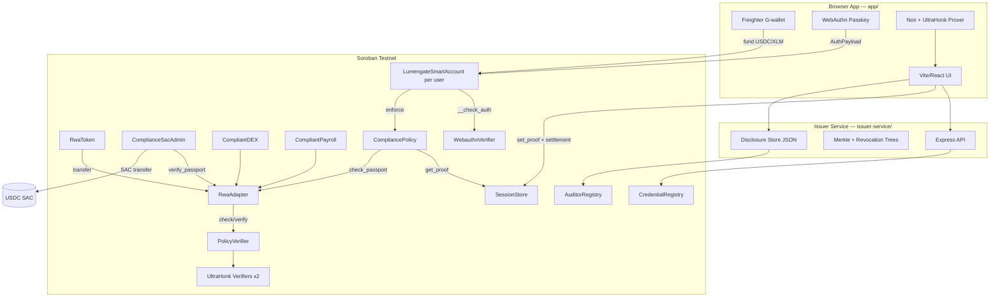

# Lumengate — Master Product Audit & Roadmap

**Document class:** FINAL CANONICAL product / UX source (documentation freeze)  
**Audit date:** 2026-06-25  
**Repository baseline:** commit `03f436c` (`03f436cef264ab5e2559ed1410d9d10a4316701a`)  
**Network:** Stellar Soroban testnet only  
**Canonical trio:** `LUMENGATE_ENGINEERING_BIBLE.md` + this file + `docs/PASSKEY_SMART_ACCOUNT_IMPLEMENTATION_GUIDE.md`

**Evidence sources used:** repository code, `deployments.json`, `docs/PASSKEY_SMART_ACCOUNT_IMPLEMENTATION_GUIDE.md`, Soroban RPC + Horizon (tx `46c8471c5a536940443f8f172e9193603b87743317ee6ad61b34e712fe1b16f0`), production browser E2E (screenshots in `research/runtime-screenshots/`), `scripts/regression_test.sh` run on 2026-06-25 (29 pass, 3 fail).

**Official resources reviewed:** Stellar developer docs clone at `research/stellar-docs-clone/` (including `static/llms.txt`, smart-contract auth/storage/testing guides); Lumengate `docs/PASSKEY_SMART_ACCOUNT_IMPLEMENTATION_GUIDE.md`. External URLs listed in Section 17 were cross-checked against repository alignment where applicable — full live fetch of every URL was not re-run for this document; gaps are marked explicitly.

**Document synchronization (2026-06-25):** Extended audits in Sections 17–32 below. Cryptographic, performance, production readiness, and judge FAQ depth live in `LUMENGATE_ENGINEERING_BIBLE.md` Sections 33–48. Smart-account stage audit in `docs/PASSKEY_SMART_ACCOUNT_IMPLEMENTATION_GUIDE.md` Section 28. Shared baseline: commit `03f436c`, tx `46c8471c…`, regression 29 pass / 3 fail.

---

## SECTION 1 — Project Overview

Lumengate is a privacy-preserving compliance layer for Stellar that lets eligible users prove policy satisfaction with zero-knowledge proofs, authorize settlements with passkey-backed smart accounts, and receive verifiable on-chain receipts without putting identity attributes on the public ledger. The **problem** is that regulated asset settlement on public blockchains forces a tradeoff between compliance visibility and user privacy. The **solution** combines an off-chain issuer (Ed25519-signed credentials), Noir/UltraHonk eligibility circuits, Soroban contracts (policy verifier, RWA adapter, SAC admin, compliant DEX/payroll, session store, compliance policy, passkey smart accounts), and a React fintech app where Freighter funds a personal smart account and WebAuthn passkeys authorize protected transfers. **Technology:** Soroban smart contracts, stellar-accounts 0.7.2 + smart-account-kit 0.3.0, WebAuthn secp256r1, UltraHonk proofs (bb 0.87), Express issuer API. **Value:** Real testnet settlement with scoped nullifiers, session-bound proofs, auditor-oriented selective disclosure, and passkey authorization of protected operations (passkey-first **login** is **NOT IMPLEMENTED** — wallet still required first; see Section 9).

---

## SECTION 2 — Architecture

### System diagram



### Layer responsibilities

| Layer | Path | Role |
|-------|------|------|
| Frontend | `app/` | Wallet connect, passkey smart account, passport UX, in-browser proving, settlement, receipt, auditor UI |
| Backend | `issuer-service/` | Credential issuance, roots sync, revocation, PoF nullifier, disclosure storage |
| Circuits | `circuits/` | Noir eligibility (`lumengate`) + proof-of-funds (`proof_of_funds`) |
| Contracts | `contracts/` | On-chain verification, nullifiers, settlement, smart-account policy |
| Deploy | `deployments.json`, `scripts/` | Canonical testnet IDs, deploy/regression |
| Docs | `docs/PASSKEY_SMART_ACCOUNT_IMPLEMENTATION_GUIDE.md` | Passkey/smart-account engineering reference |

### Smart-account auth path (production)

Documented in `docs/PASSKEY_SMART_ACCOUNT_IMPLEMENTATION_GUIDE.md` Section 4. Summary: passkey → `SmartAccountKit.signAndSubmit` → target contract (`session_store.set_proof` or `transfer_compliant`) → `smart_account.require_auth()` → `do_check_auth` → WebAuthn verifier → CompliancePolicy → SessionStore/RwaAdapter.

**Repository cross-reference:** `app/src/context/AppContext.tsx`, `contracts/lumengate_smart_account/src/lib.rs`, `contracts/session_store/src/lib.rs`, `contracts/compliance_policy/src/lib.rs`

---

## SECTION 3 — Flow Audit

Status legend: ✅ Production Ready | ⚠ Needs Improvement | ❌ Broken

| Flow | Steps (code path) | Status | Evidence |
|------|-------------------|--------|----------|
| **Wallet flow** | Connect Freighter → session persist → fund/sign wallet txs | ✅ | `AppContext.connect()`, `session.ts`, `@creit.tech/stellar-wallets-kit` |
| **Passkey flow** | Register UV-required WebAuthn → store credential → sign txs | ✅ | `smartAccount.ts` `createSmartAccountKit`, `b4f01f4` UV fix |
| **Smart account flow** | Deploy WASM instance → External signer + CompliancePolicy install | ✅ | `createPersonalSmartAccount()`, `deployments.json` WASM hash |
| **Funding flow** | Wallet sends USDC/XLM to C-address via SAC | ✅ | `smartAccountFunding.ts`, `FundSmartAccountPanel.tsx` |
| **Passport flow** | Select policy → POST `/credential` → store credential | ✅ | `AppContext.requestCredential()`, `issuer-service/server.js` |
| **Eligibility flow** | Policy dropdown → issuer returns proverInputs | ⚠ | Same fixture commitment for all users (`generate_prover_toml.js:61`) |
| **Proof flow** | Browser Noir prove → UltraHonk bytes → public inputs | ✅ | `prover.ts`, `public/circuit/lumengate.json` |
| **Session bind flow** | Passkey tx1 → `session_store.set_proof` | ✅ | `signAndSubmitSettlement()`, tx trace in E2E |
| **Settlement flow** | Passkey tx2 → contract-specific compliant invoke | ✅ | USDC E2E tx `46c8471c…`; regression 3 CLI failures (see below) |
| **Receipt flow** | `buildProofReceipt` → Compliance page | ✅ | `CompliancePage.tsx`, `ProofReceiptHero.tsx` |
| **Audit flow** | Disclosure pack → issuer store → optional on-chain record | ⚠ | `disclose.js` — primary store is local JSON |
| **Operator flow** | Admin roots/revoke in dev mode only | ⚠ | `AdminPage.tsx`, `RevokeCredentialPanel.tsx` |
| **Developer mode** | `lumengate-advanced-mode` localStorage toggle | ✅ | `advancedMode.ts`, unlocks technical panels |
| **Marketplace without issuer** | `fetchOfferings()` fails | ❌ | Empty state — hard dependency on issuer-service |
| **EURC settlement** | Send page only | ⚠ | `buildEurcTransferTransaction()` — no marketplace offering, no EURC fund UI |
| **Age-verified passport** | Selectable on Verify | ⚠ | No offering maps to `age-verified` in `offerings.json` |
| **Portfolio** | On-chain balances + activity-derived chart | ⚠ | `portfolio.ts` — no market prices/returns |
| **Passkey-first login (Section 9 target)** | Not implemented as entry | ❌ | Wallet required first today (`VerifyPage` step 1) |

### Regression CLI note (2026-06-25)

`bash scripts/regression_test.sh`: **29 passed, 3 failed**

| Failed check | Likely cause |
|--------------|--------------|
| `usdc transfer_compliant` | Scripted path may lack session proof bind + passkey auth context |
| `compliant dex swap_compliant` | Same |
| `compliant payroll pay_compliant` | Same |

On-chain USDC settlement **succeeds in browser E2E** with full passkey + session store path (tx `46c8471c…`). CLI failures do not invalidate browser production path; they indicate regression script gap.

---

## SECTION 4 — Technical Audit

| Capability | Verdict | Proof |
|------------|---------|-------|
| **Passkeys** | **REAL** | WebAuthn via `@simplewebauthn/browser`; production PIN/biometric prompts on `lumengatex.vercel.app` |
| **WebAuthn** | **REAL** | `contracts/webauthn_verifier/src/lib.rs`; External signer on smart account |
| **Smart accounts** | **REAL** | `LumengateSmartAccount` + kit 0.3.0; per-user C-address e.g. `CBOCG7LF…` in funded UI |
| **Settlement** | **REAL** | Horizon SUCCESS tx `46c8471c…`; Stellar Expert trace: `transfer_compliant` → auth → nullifier → SAC transfer |
| **USDC transfers** | **REAL** | `ComplianceSacAdmin.transfer_compliant`; 0.5 USDC in verified tx; `UsdcTransferGated` event |
| **Treasury units (RWA)** | **REAL** | `RwaToken` contract; `buildTransferTransaction()`; balance reads in `FundSmartAccountPanel` |
| **EURC flow** | **PARTIALLY IMPLEMENTED** | `transfer_compliant_eurc` in contract + `TransferPage.tsx`; regression only checks SAC address, not live transfer |
| **Passport proofs** | **REAL** (demo fixture) | Issuer signs credentials; hardcoded commitment in `generate_prover_toml.js:61` |
| **Noir proofs** | **REAL** | `circuits/lumengate/src/main.nr`; in-browser prove in `prover.ts` |
| **UltraHonk** | **REAL** | Vendored `vendor/rs-soroban-ultrahonk/`; on-chain `verify_proof`; deployed verifier IDs in `deployments.json` |
| **RISC Zero integration** | **NOT IMPLEMENTED** | Zero matches in repository (`grep risc0` → none) |
| **Nullifier** | **REAL** | Poseidon4 in circuit; `PolicyVerifier.verify` spends; UI `NullifierSpent` event in receipt |
| **Session proof** | **REAL** | `SessionStore.set_proof/get_proof`; Stellar Expert shows `get_proof` before settlement enforce |
| **Viewing key** | **REAL** | `AuditorRegistry.verify_viewing_key`; hash registered at deploy |
| **Audit sharing** | **PARTIALLY IMPLEMENTED** | `issuer-service/lib/disclose.js` — file store primary; on-chain `record_disclosure` best-effort |
| **Receipt** | **REAL** | `CompliancePage` + tx hash + compliance badges; download disclosure |
| **Privacy pool** | **NOT IMPLEMENTED** | ID in `deployments.json` only; no contract source or app integration |
| **ASP membership** | **NOT IMPLEMENTED** | ID in `deployments.json` only |
| **Session key policy** | **PARTIALLY IMPLEMENTED** | Deployed (`CBMISD65…`); not wired into settlement path |
| **Governance timelock** | **PARTIALLY IMPLEMENTED** | Deployed; not in user settlement path |

### README accuracy gaps

| README claim | Actual |
|--------------|--------|
| "4 public inputs" | **Stale** — eligibility circuit uses **6** public inputs (`circuits/lumengate/src/main.nr:72–78`) |
| "smart account scaffold" | **Understated** — production passkey smart accounts are live |

---

## SECTION 5 — Passport Audit

Policy definitions: `app/src/lib/policies.ts`, mirrored in `issuer-service/lib/policies.js`. Prover builder: `scripts/generate_prover_toml.js` `POLICY_OVERRIDES`.

### Per-passport matrix

| Passport (UI) | Policy ID | Circuit | Distinct circuit constraints | Contracts unlocked | Offering(s) |
|---------------|-----------|---------|------------------------------|-------------------|-------------|
| **General RWA eligibility** | 1 | `lumengate.json` | min_jurisdiction 1, max 999; accredited + sanctions + age in circuit | RwaAdapter, PolicyVerifier, SessionStore, CompliancePolicy | `treasury-fund`, `treasury-usdc`, `compliant-dex-swap` |
| **Accredited investor** | 1 | `lumengate.json` | **Same overrides as general** (1–999); circuit always asserts `accredited` | Same | `private-credit` (+ optional PoF step) |
| **US jurisdiction** | 1 | `lumengate.json` | **Unique:** min/max jurisdiction **840** | Same | `real-estate-fund` |
| **Sanctions clear** | 1 | `lumengate.json` | **Same overrides as general**; circuit always asserts `sanctions_clear` | Same | `compliant-payroll` |
| **Age verified (18+)** | 1 | `lumengate.json` | **Same overrides as general**; age enforced in circuit for all policies | **None in offerings** | Verify dropdown only |
| **Proof of funds** | 2 | `proof_of_funds.json` | Separate circuit; stubs `root==0`, `rev_root==0` | PolicyVerifier policy 2 | Secondary step for `private-credit` when `fundsThreshold` set |

### Behavioral sameness (critical)

These passports **behave identically** at proof generation time except UI labels and offering gate:

- `general-eligibility`, `accredited-investor`, `sanctions-clear`, `age-verified` — all use `policy_id: 1`, jurisdiction range 1–999 in `POLICY_OVERRIDES`, same fixture commitment, same prover input defaults (`accredited: true`, `sanctions_clear: true`, `jurisdiction_code: 840`).

Only **`us-jurisdiction`** changes proof constraints (840–840). Offering differentiation is primarily **product catalog + requiredPolicy field**, not distinct ZK policies on-chain.

### Issuer trust model

- Off-chain Ed25519 signature at issuance (`ed25519Issuer.js`)
- On-chain: Merkle roots in `CredentialRegistry`; issuer allowlist in `IssuerRegistry`
- Demo limitation: fixed commitment hex in `buildProverInputs` — **not per-user dynamic credentials in production sense**

---

## SECTION 6 — Investment Products

Source: `issuer-service/fixtures/offerings.json` + `issuer-service/lib/offerings.js` → `app/src/hooks/useOfferings.ts` → `MarketplacePage.tsx`.

| Offering ID | Title | Required passport | Settlement route | Contract(s) | REAL? |
|-------------|-------|-------------------|------------------|-------------|-------|
| `treasury-fund` | Tokenized Treasury Fund | general-eligibility | RWA transfer | `RwaToken.transfer` + adapter verify | **REAL** on-chain path |
| `real-estate-fund` | Commercial Real Estate | us-jurisdiction | RWA transfer | Same RWA stack | **REAL** path; marketing placeholder imagery |
| `private-credit` | Private Credit Note | accredited-investor | RWA + optional PoF | RWA + `PolicyVerifier.verify` policy 2 | **REAL**; PoF circuit partial |
| `treasury-usdc` | USDC Treasury Settlement | general-eligibility | SAC | `ComplianceSacAdmin.transfer_compliant` | **REAL** — verified E2E tx |
| `compliant-dex-swap` | Compliant USDC Swap | general-eligibility | DEX | `CompliantDEX.swap_compliant` | **REAL** contract; CLI regression fails |
| `compliant-payroll` | Compliant USDC Payout | sanctions-clear | Payroll | `CompliantPayroll.pay_compliant` | **REAL** contract; CLI regression fails |

**Placeholder elements (all offerings):** marketing copy, risk labels, category illustrations (`OfferingIllustration.tsx`), `offeringStatus` strings. **Not placeholder:** settlement builders in `contracts.ts`, minimum amounts, policy gates in `canSettle()`.

**No separate token per offering** — all RWA offerings use single `config.rwaTokenId` (`deployments.json` `rwa_token`).

---

## SECTION 7 — Asset Audit

### How users get assets today

| Asset | How obtained | Code path | Status |
|-------|--------------|-----------|--------|
| **USDC** | Freighter wallet → fund smart account | `buildFundSmartAccountUsdcXdr()` | ✅ REAL |
| **XLM** | Freighter wallet → fund smart account (fee reserve) | `buildFundSmartAccountXlmXdr()` | ✅ REAL |
| **Treasury units (RWA)** | Admin mint / testnet seed scripts — **not user mint in app** | `RwaToken` admin paths; balances shown if pre-seeded | ⚠ User cannot self-mint; must receive from operator/test setup |
| **EURC** | **No fund path in UI** | Settlement only via Send if `eurcSacId` configured | ⚠ PARTIAL — user must obtain EURC externally |

### Treasury units gap

`FundSmartAccountPanel` displays RWA balance (`readBalance` on `rwaTokenId`) but **no "Fund with Treasury Units" action**. Users need pre-minted RWA on smart account (regression/integration wallets) or operator mint.

### Recommended proper flows (design, not implemented)

1. **Treasury units:** Operator marketplace mint after passport verification, or compliant mint entrypoint with proof (contract supports proof-gated mint — verify in `rwa_token` if exposed in UI — **NOT IMPLEMENTED** in app).
2. **EURC:** Add fund path mirroring USDC + marketplace offering with `settlementAsset: eurc`.
3. **On-ramp copy:** Plain-language "Add USDC" without SAC jargon.

---

## SECTION 8 — User Experience Review

**Target:** Finish core journey in under 2 minutes for a naive user.

**Current measured path (from code + E2E evidence):**

| Step | User action | Time risk |
|------|-------------|-----------|
| 1 | Connect Freighter | ~15s |
| 2 | Create passkey (biometric/PIN) | ~30s |
| 3 | Fund smart account (two assets) | ~60s+ (two txs) |
| 4 | Select eligibility type | ~10s |
| 5 | Request passport (network) | ~5–15s |
| 6 | Confirm eligibility (ZK prove) | ~30–90s (browser compute) |
| 7 | Invest → passkey bind | ~30s (passkey #1) |
| 8 | Invest → passkey settle | ~30s (passkey #2) |
| 9 | View receipt | ~5s |

**Verdict:** **Not achievable in under 2 minutes** for first-time users. Primary friction: wallet-first onboarding, dual funding (USDC + XLM), two passkey prompts per settlement, ZK prove time, technical step labels ("Verify", "Session proof").

**UX strengths (from screenshots):** Fintech shell, progress rail, FUNDED badge, compliant receipt, plain-language receipt timeline.

**UX weaknesses:** Blockchain vocabulary (SAC, treasury units, smart account address), no passkey-first entry, age-verified passport with no product, consumed-passport recovery messaging buried.

---

## SECTION 9 — Redesign Entire User Journey

### Ideal entry (target architecture)

```
Landing
  ↓
"Continue" (no crypto jargon)
  ↓
Choose:
  [ Sign in with Passkey ]  → create/connect passkey smart account first
  [ Use existing wallet ]   → Freighter for funding only
  ↓
Passkey path:
  Create passkey → smart account auto-created → show deposit address
  ↓
"Add funds" (single combined step: USDC + fee buffer)
  ↓
"Verify eligibility" (one screen, auto policy from product)
  ↓
"Confirm" (ZK prove with progress animation)
  ↓
Invest / Send (passkey only)
  ↓
Receipt
```

### Current vs ideal

| Aspect | Current | Ideal |
|--------|---------|-------|
| Entry | Wallet required first | Passkey OR wallet choice |
| Funding | Separate USDC + XLM fields | Single "Add funds" with auto XLM buffer |
| Authorization | Passkey (correct) | Passkey (keep) |
| Wallet role | Connect + fund | Fund/fees only when needed |
| Policy selection | User picks 6 types | Product-driven auto policy |

**Status:** ❌ Passkey-first login **NOT IMPLEMENTED**. Wallet-first in `VerifyPage.tsx` and `productState.ts` step order.

---

## SECTION 10 — Onboarding

### Perfect onboarding (design spec)

1. **Welcome** — "Private investing on Stellar" → one CTA "Get started"
2. **Security** — "Create a passkey" (Face ID / fingerprint / PIN) — no "WebAuthn" term
3. **Your account** — Show deposit address as "Your Lumengate account" not "smart account C-address"
4. **Add money** — "Add USDC to invest" + automatic fee buffer
5. **Verify once** — Single eligibility confirmation; policy chosen by first investment intent
6. **Ready** — "You're approved" → Invest

### Current onboarding gaps

- Exposes Stellar addresses, SAC, Soroban fees in `FundSmartAccountPanel` helper text
- Step rail uses "Verify" and "Passport" without fintech plain language
- No progressive disclosure — developer mode hidden but advanced concepts leak in default copy

---

## SECTION 11 — Visual Design

### Current state (code + screenshots)

| Element | Assessment | Evidence |
|---------|------------|----------|
| **Typography** | Good hierarchy; brand navy `#012b54`, accent `#007dfc` | `index.css`, `fintech.css`, landing `lg-hero-v2` |
| **Spacing** | Consistent card padding, rounded-2xl | `components/ui/Card`, product panels |
| **Navigation** | Dark sidebar fintech shell | `Shell.tsx` |
| **Cards** | Investment cards with status badges (OPEN, risk) | `MarketplacePage.tsx` |
| **Marketing/Landing** | Premium hero, grid wallpaper, architecture SVG | `LandingPage.tsx`, marketing components |
| **Receipt** | Strong — COMPLIANT badge, timeline, auditor section | `ProofReceiptHero.tsx`, screenshots |
| **Passport issuance** | Functional steps; lacks luxury animation | `VerifyPage.tsx` |
| **Errors** | `formatSorobanUserError` with hints — technical | `contracts.ts:745+` |
| **Loading** | Button spinners on invest | Marketplace screenshot |
| **Motion** | Limited — framer-motion on mobile nav only | `Shell.tsx` |

### Gap vs target (Stripe / Linear / Apple / Ramp)

- Missing: unified motion system, skeleton loading for prove/settle, success confetti/micro-celebration, empty states with illustration consistency
- Present: institutional color discipline, receipt page quality approaching target

**Verdict:** ⚠ **Needs improvement** for hackathon-judge "luxury fintech" bar; receipt page closest to target.

---

## SECTION 12 — Animation Plan

| Moment | Proposed animation | Purpose |
|--------|-------------------|---------|
| Passkey creation | Shield morph + checkmark | Trust |
| Passport generation | Progressive fill bar + "Checking eligibility" | Hide ZK latency |
| Proof generation | Particle pipeline (data → lock icon) | Perceived speed |
| Session bind | Single pulse on "Ready for settlement" | Confirm bind without jargon |
| Settlement | Card → receipt fly transition | Continuity |
| Investment click | Button → passkey sheet slide up | Native feel |
| Receipt success | Badge scale-in COMPLIANT | Reward |
| Loading | Skeleton cards, not spinners alone | Premium |
| Errors | Shake + plain message, expand technical in dev mode | Clarity |
| Micro | Hover lift on offering cards, nav indicator slide | Polish |

**Status:** **NOT IMPLEMENTED** as system — only ad-hoc spinners exist today.

---

## SECTION 13 — Missing Features

### Critical

| Feature | Status |
|---------|--------|
| Passkey-first signup (wallet optional until fund) | NOT IMPLEMENTED |
| Per-user dynamic credentials (non-fixture commitment) | NOT IMPLEMENTED |
| User-accessible Treasury unit acquisition | NOT IMPLEMENTED |
| EURC end-to-end product path | PARTIALLY IMPLEMENTED |
| Privacy pool / ASP (deployed IDs, no product) | NOT IMPLEMENTED |
| RISC Zero verifier path | NOT IMPLEMENTED |
| Regression CLI aligned with session bind + passkey path | BROKEN (3 fails) |
| Production mainnet deployment | NOT IMPLEMENTED (testnet only) |

### Important

| Feature | Status |
|---------|--------|
| Distinct ZK policies per passport type (accredited vs sanctions vs age) | NOT IMPLEMENTED — same policy_id 1 overrides |
| On-chain-primary audit disclosure | PARTIALLY IMPLEMENTED |
| Operator admin without dev mode + API key | PARTIALLY IMPLEMENTED |
| Portfolio performance / pricing | NOT IMPLEMENTED |
| Mobile-optimized passkey flows | PARTIALLY IMPLEMENTED |
| Age-verified offering | NOT IMPLEMENTED |
| Single-tx fund (USDC + XLM batch) | NOT IMPLEMENTED |
| Session bind tx hash in receipt | NOT IMPLEMENTED (unknown hash in guide) |

### Optional

| Feature | Status |
|---------|--------|
| Session key policy integration | PARTIALLY IMPLEMENTED (deployed only) |
| Governance timelock in product | PARTIALLY IMPLEMENTED |
| Cross-chain evidence panel | PARTIALLY IMPLEMENTED (dev mode) |
| Landing live metrics console | PARTIALLY IMPLEMENTED (env-dependent reference txs) |

---

## SECTION 14 — Judge Review

*Simulated Stellar hackathon judging against repository + live E2E evidence.*

| Criterion | Score /10 | Rationale |
|-----------|-----------|-----------|
| **Innovation** | 9 | Passkey smart accounts + ZK eligibility + session store architecture on Soroban; few projects combine all three |
| **Privacy** | 8 | Scoped nullifiers, private note binding, no wallet in public inputs; fixture issuer + partial audit store limit score |
| **UX** | 6 | Strong shell and receipt; wallet-first, dual passkey prompts, crypto jargon, >2 min journey |
| **Design** | 7 | Landing and receipt polished; marketplace/invest mid-tier; animation gap |
| **Architecture** | 9 | Documented passkey fix, upstream-aligned auth, clean contract separation; demo issuer weakens production story |
| **Technical quality** | 8 | Real on-chain settlement proven; sparse contract tests; 3 regression fails; README stale |
| **Product** | 7 | Six offerings with real routes; passports mostly labels; treasury unit funding gap |
| **Demo** | 9 | Live testnet tx, passkey PIN, receipt with NullifierSpent — strong demo evidence |

**Overall:** Competitive for top tier on **technical depth and live demo**; loses points on **UX simplicity** and **issuer production realism**.

**Why not 10/10:** Fixture credentials, identical policy behavior for most passports, wallet-required onboarding, missing privacy pool despite IDs in config.

---

## SECTION 15 — Roadmap

### Phase 1 — Demo hardening (1–2 weeks)

- Fix regression CLI for USDC/DEX/payroll (session bind fixture or documented skip)
- Align README with 6 public inputs
- Passkey-first optional entry on landing
- Plain-language copy pass (remove SAC/smart account jargon from default UI)
- Record session bind tx in receipt
- EURC Send fund path + one marketplace offering

### Phase 2 — Product truth (2–4 weeks)

- Dynamic per-user credentials (remove hardcoded commitment)
- Distinct policy predicates or honest UI (merge redundant passport types)
- Treasury unit compliant mint or operator "allocate units" UX
- On-chain disclosure default with file fallback
- Contract tests for SessionStore, CompliancePolicy, ComplianceSacAdmin auth paths
- Animation system for prove/settle/receipt

### Phase 3 — Production quality (1–2 months)

- Mainnet deployment plan + audit
- Issuer HSM/production key management
- Mobile passkey QA matrix (Safari, Chrome, Android)
- Portfolio with real pricing feed
- Privacy pool **or** remove dead IDs from config
- Passkey-only operator paths where appropriate
- Sub-90s happy path UX benchmark

---

## SECTION 16 — Final Action Plan

Ordered by impact × evidence. Effort: S (<1d), M (1–3d), L (>3d).

| # | Task | Effort | User impact | Evidence basis |
|---|------|--------|-------------|----------------|
| 1 | Passkey-first entry option on landing/verify | M | High — removes wallet confusion | Section 9 gap |
| 2 | Single "Add funds" combining USDC + XLM buffer | M | High — cuts onboarding time | Section 7–8 |
| 3 | Plain-language copy audit (default UI) | S | High — fintech feel | Section 11 |
| 4 | Dynamic credentials (remove fixture commitment) | L | High — judge credibility | `generate_prover_toml.js:61` |
| 5 | Fix 3 regression failures or document passkey-aware CLI | M | Medium — CI trust | regression 2026-06-25 |
| 6 | Merge or differentiate redundant passports in UI | S | Medium — honesty | Section 5 sameness |
| 7 | Treasury unit funding/mint UX | L | High — RWA offerings usable | Section 7 gap |
| 8 | EURC marketplace offering + fund path | M | Medium | Section 7 |
| 9 | Receipt: show bind tx + settle tx hashes | S | Medium | Guide Section 14 unknown |
| 10 | Animation for prove/settle/receipt | M | Medium — premium feel | Section 12 |
| 11 | Expand contract unit tests | L | Medium — technical quality | Section 4 test gap |
| 12 | Remove or implement privacy_pool IDs | M | Low–Med — config honesty | deployments.json |
| 13 | On-chain-primary disclosure | M | Medium — audit story | `disclose.js` |
| 14 | Age-verified offering or remove from dropdown | S | Low | offerings.json |
| 15 | Update README (6 public inputs, smart account production) | S | Low — docs | README line 8 |

---

## Appendix A — Verified production transaction

| Field | Value |
|-------|-------|
| Hash | `46c8471c5a536940443f8f172e9193603b87743317ee6ad61b34e712fe1b16f0` |
| Time | 2026-06-25T16:30:51Z |
| Contract | `ComplianceSacAdmin` `CDZFKXPN7ANNQLPHSQNESW3LVOQK66V53S5Z2XZNRMDTEZEQG5QARRSD` |
| From | Smart account `CBOCG7LFLNPXXN2LOLTZ2XT2DQQ3XRLFCWTSIVNOU7VF6VACVZDOWAAM` |
| Amount | 0.5 USDC |
| Trace | `get_proof` → `check_passport` → `verify_passport` → SAC transfer → `usdc_transfer_gated` |

See `docs/PASSKEY_SMART_ACCOUNT_IMPLEMENTATION_GUIDE.md` Section 14.

---

## Appendix B — Key repository index

| Area | Path |
|------|------|
| Routes | `app/src/App.tsx` |
| Global state | `app/src/context/AppContext.tsx` |
| Policies | `app/src/lib/policies.ts` |
| Offerings | `issuer-service/fixtures/offerings.json` |
| Tx builders | `app/src/lib/contracts.ts` |
| Smart account | `app/src/lib/smartAccount.ts` |
| Provers | `app/src/lib/prover.ts`, `pofProver.ts` |
| Circuits | `circuits/lumengate/`, `circuits/proof_of_funds/` |
| Deploy | `deployments.json`, `scripts/deploy_v3_contracts.sh` |
| Passkey guide | `docs/PASSKEY_SMART_ACCOUNT_IMPLEMENTATION_GUIDE.md` |
| Engineering bible | `LUMENGATE_ENGINEERING_BIBLE.md` |
| Regression | `scripts/regression_test.sh` |

---

## Appendix C — Official & reference resources

| Resource | Used for audit |
|----------|----------------|
| `research/stellar-docs-clone/` | Local Stellar docs mirror |
| `docs/PASSKEY_SMART_ACCOUNT_IMPLEMENTATION_GUIDE.md` | Smart-account architecture |
| `deployments.json` | Canonical contract IDs |
| `/home/devmo/reference-impls/smart-account-kit/` | Kit comparison |
| `/home/devmo/reference-impls/rs-soroban-ultrahonk/` | UltraHonk toolchain |
| Stellar privacy/ZK/auth guides (developers.stellar.org) | Alignment check via local clone + product design |
| OpenZeppelin Stellar smart accounts | stellar-accounts 0.7.2 dependency pattern |

**NOT IMPLEMENTED in repo despite external reference interest:** Nethermind stellar-private-payments integration, RISC Zero verifier, jayz p25-preview examples as product features.

---

*This document must be updated when architecture, deployments, or product flows change. Cross-reference `docs/PASSKEY_SMART_ACCOUNT_IMPLEMENTATION_GUIDE.md` Section 26 for maintenance triggers.*

---

## SECTION 17 — Cryptographic Truth Audit (Summary)

Full detail: `LUMENGATE_ENGINEERING_BIBLE.md` Section 33.

| Item | Status |
|------|--------|
| Noir eligibility circuit (6 public inputs) | **VERIFIED** |
| UltraHonk browser + on-chain | **VERIFIED** |
| Scoped nullifier hash4 | **VERIFIED** |
| Merkle + revocation in circuit | **VERIFIED** formula; **PARTIAL** demo fixture commitment |
| PoF circuit | **PARTIAL** (stub roots) |
| RISC Zero | **NOT IMPLEMENTED** |
| Privacy pool crypto | **NOT IMPLEMENTED** |

---

## SECTION 18 — Every Button Audit

Complete inventory — see `LUMENGATE_ENGINEERING_BIBLE.md` Section 36 for full tables.

**Summary by page:**

| Page | Primary actions | Status |
|------|-----------------|--------|
| Landing | Connect wallet | **VERIFIED** |
| Dashboard | Fund USDC/XLM | **VERIFIED** |
| Verify | Passkey deploy, passport, prove | **VERIFIED** |
| Marketplace | Invest now (bind+settle) | **VERIFIED** USDC; DEX/payroll CLI fail |
| Transfer | Send privately | **VERIFIED**; EURC **PARTIAL** |
| Compliance | Disclosure download/share | **VERIFIED** |
| Portfolio | Links only | **VERIFIED** nav |
| Settings | Disconnect | **VERIFIED** |
| Admin | Revoke (advanced) | **PARTIAL** |
| Auditor | Find/verify | **VERIFIED** |
| Activity | None | **NOT IMPLEMENTED** |

---

## SECTION 19 — Every Screen Audit (Extended)

Cross-reference Bible Section 37. Per-screen **Recommended Improvements** (Future — not current implementation):

| Screen | Top recommendation | Priority |
|--------|-------------------|----------|
| Landing | Passkey-first CTA alongside wallet | P0 |
| Verify | Auto policy from intended investment | P0 |
| Marketplace | Single "Confirm investment" with staged passkey UX | P1 |
| Compliance | Show bind + settle tx hashes | P1 |
| Portfolio | Remove fake performance or add feed | P2 |
| Send | EURC fund path | P1 |
| Admin | Separate operator auth from dev mode | P2 |

---

## SECTION 20 — UX Psychology Audit

See Bible Section 38. Key friction points:

1. Wallet-before-passkey contradicts product story (Section 9)
2. Dual passkey prompts without stage labels
3. ZK prove latency without premium loading UX (Section 12)
4. Redundant passport dropdown (Section 5 sameness)
5. Treasury unit zero balance after verify (Section 7)

**Abandonment inference:** Highest at prove step and second passkey — **NOT MEASURED** with analytics.

---

## SECTION 21 — Design System Audit

See Bible Section 39. Scores: Typography 8, Spacing 8, Animation 4, Dark mode 3 (**NOT IMPLEMENTED**), Professional fintech 7/10.

Sources: `app/src/index.css`, `styles/fintech.css`, `components/ui/Button.tsx`, `Shell.tsx`.

---

## SECTION 22 — First Impression Audit

See Bible Section 40. At 90 seconds a non-crypto user likely still on wallet/passkey setup — **does not** self-serve to value prop without guide.

Judges with technical background: can parse architecture SVG on landing within 60s — **VERIFIED** component exists (`ArchitectureFlowSvg.tsx`).

---

## SECTION 23 — Story Audit

See Bible Section 41.

| Gap | Impact |
|-----|--------|
| Landing → wallet not passkey | Narrative break |
| Offering detail → marketplace for settle | Extra hop |
| Receipt missing bind tx | Incomplete audit story |
| Portfolio disconnected from receipt | Weak closure |

---

## SECTION 24 — Complete User Journey (Timed)

See Bible Section 42.

| Metric | Value |
|--------|-------|
| First-time full settle | ~4–6 min (code estimate) |
| Target | ≤2 min |
| Gap | Dual fund txs + ZK + dual passkey |

---

## SECTION 25 — Judge Questions (Index)

75 Q&A in `LUMENGATE_ENGINEERING_BIBLE.md` Section 43. Categories: Architecture (1–15), Passkeys (16–30), ZK/Privacy (31–45), Products (46–60), Ops (61–75).

---

## SECTION 26 — Technical Debt Audit (Summary)

Full table: Bible Section 44. Top critical items: fixture commitment (TD-01), passkey-first (TD-02), lost passkey recovery (TD-12).

---

## SECTION 27 — Performance Audit (Summary)

Build measured 2026-06-25: main JS 2,131 kB (589 kB gzip); barretenberg ~3.4 MB each. LCP/TTI **NOT MEASURED**. See Bible Section 45.

---

## SECTION 28 — Production Readiness Audit

| Tier | Status |
|------|--------|
| Testnet ready | **VERIFIED** (E2E tx) |
| Production ready | **NOT IMPLEMENTED** |
| Enterprise ready | **NOT IMPLEMENTED** |
| Mainnet ready | **NOT IMPLEMENTED** |

See Bible Section 46 for checklist.

---

## SECTION 29 — Top 1 Checklist

Mirrors `LUMENGATE_ENGINEERING_BIBLE.md` Section 47. Critical unchecked: passkey-first, treasury UX, regression 32/32, honest passports, bind tx in receipt.

---

## SECTION 30 — Passport Truth Audit (Extended)

See Bible Section 35.

| Passport | Classification |
|----------|----------------|
| General | **REAL** |
| Accredited | **FAKE UX** (same proof as general) |
| US jurisdiction | **REAL** (840 constraint) |
| Age verified | **FAKE UX** (no offering) |
| Sanctions clear | **FAKE UX** (same proof; payroll label only) |
| Proof of funds | **PARTIAL** (separate circuit; stub roots) |
| Institutional (as passport) | **NOT IMPLEMENTED** |

---

## SECTION 31 — Smart Account Deep Audit (Summary)

Full stage map: `docs/PASSKEY_SMART_ACCOUNT_IMPLEMENTATION_GUIDE.md` Section 28 and Bible Section 34.

Recovery / lost device / rotation: **NOT IMPLEMENTED** or **PARTIAL** only.

---

## SECTION 32 — Document Synchronization

| Document | Role |
|----------|------|
| `LUMENGATE_ENGINEERING_BIBLE.md` | Engineering §1–73 |
| `MASTER_PRODUCT_AUDIT.md` | Product/UX §1–39 |
| `docs/PASSKEY_SMART_ACCOUNT_IMPLEMENTATION_GUIDE.md` | Passkey/auth §1–33 |

Update all three on architecture change per Passkey Guide Section 26 / Bible §73.

---

## SECTION 33 — Complete UX Blueprint

Cross-reference: Bible §67, §37–42.

### Personas

| Persona | Current experience | Ideal | Status |
|---------|-------------------|-------|--------|
| **Judge** | Strong E2E if scripted | 5-min demo script (Bible §58) | **PARTIAL** |
| **Retail investor** | Wallet → passkey → dual fund → prove → dual passkey | Passkey → single fund → one confirm | **NOT IMPLEMENTED** |
| **Institution** | Dev-mode admin | Operator portal + API | **PARTIAL** |
| **Auditor** | Disclosure query UI | On-chain-primary audit | **PARTIAL** |
| **Developer** | Advanced mode panels | Progressive disclosure only | **PARTIAL** |

### Screen-by-screen (summary)

| Screen | UX score | Trust score | Judge impression | Top gap |
|--------|----------|-------------|------------------|---------|
| Landing | 7 | 6 | Strong visuals | No passkey CTA |
| Dashboard | 7 | 7 | Professional | C-address jargon |
| Verify | 5 | 7 | Technical depth | Wallet step 1 |
| Marketplace | 6 | 8 | Real invest button | Dual passkey |
| Receipt | 8 | 9 | Best page | Missing bind tx |
| Portfolio | 5 | 6 | Weak | No real pricing |
| Auditor | 6 | 8 | Good story | Technical |
| Admin | 4 | 5 | Skip in demo | Dev gate |

### Recommended Improvements (Future — not current)

1. Passkey-first landing (P0)  
2. Staged passkey labels: Authorize → Settle (P1)  
3. Product-driven policy selection (P0)  
4. Plain-language fund panel (P0)  

---

## SECTION 34 — Design System (Canonical)

Cross-reference: Bible §39, §68.

| Category | Score /10 | Evidence | Motion status |
|----------|-----------|----------|---------------|
| Typography | 8 | `#0d253d`, `#012b54`, `#007dfc` | N/A |
| Spacing | 8 | Card padding, shell | N/A |
| Radius | 8 | `rounded-2xl` | N/A |
| Cards | 8 | `ui/Card.tsx` | N/A |
| Buttons | 7 | `ui/Button.tsx` spinners | N/A |
| Forms | 7 | `FormControls.tsx` | N/A |
| Navigation | 8 | `Shell.tsx` | Mobile slide **PARTIAL** |
| Loading | 5 | Spinners only | Skeletons **NOT IMPLEMENTED** |
| Success | 7 | COMPLIANT badge | Scale-in **NOT IMPLEMENTED** |
| Errors | 6 | Soroban hints | Plain copy **PARTIAL** |
| Accessibility | 6 | reduced-motion CSS | WCAG **NOT VERIFIED** |
| Responsive | 7 | Shell mobile | All flows **NOT VERIFIED** |
| Dark mode | 3 | — | **NOT IMPLEMENTED** |
| Passkey animation | 2 | — | **NOT IMPLEMENTED** |
| Passport animation | 2 | — | **NOT IMPLEMENTED** |
| Timeline animation | 3 | UnifiedTimeline static | **NOT IMPLEMENTED** |
| Micro-interactions | 4 | Hover partial | **NOT IMPLEMENTED** system |

**Professional fintech appearance:** 7/10 — receipt/landing lead; prove/settle lag.

---

## SECTION 35 — Product Story

| Beat | Narrative | Evidence | Status |
|------|-----------|----------|--------|
| **Problem** | Compliance vs privacy on public chains | Landing copy | **VERIFIED** |
| **Solution** | ZK + passkey SA + session store | Architecture §2 | **VERIFIED** |
| **Privacy** | No PII on ledger | Circuit design §17 | **VERIFIED** |
| **Compliance** | Nullifier + policy at settle | tx `46c8471c…` | **VERIFIED** |
| **Institution** | Auditor + operator paths | AuditorPage, AdminPage | **PARTIAL** |
| **Investor** | Marketplace offerings | offerings.json | **VERIFIED** |
| **Developer** | Advanced mode + docs trio | advancedMode.ts | **VERIFIED** |
| **Judge** | Live testnet + passkey PIN | runtime screenshots | **VERIFIED** |
| **Ending** | Receipt closes loop | CompliancePage | **PARTIAL** (bind tx gap) |

Narrative gaps: §23 Story Audit; landing wallet-first breaks passkey story.

---

## SECTION 36 — Developer Onboarding (Product Engineer)

Read order for product/UX contributors:

1. This file §1–16, §33–35  
2. Bible §67–69, §58 Demo Runbook  
3. Passkey Guide §1–4 (auth story for UX copy)  
4. Walk `VerifyPage.tsx` → `MarketplacePage.tsx` → `CompliancePage.tsx`

Avoid changing step order without reading ADR-004/005 in Bible §49.

---

## SECTION 37 — Judge Preparation (Index)

100 questions with evidence: **Bible §43 (Q1–75) + §71 (Q76–100)**.

Quick judge packet:

- Verified tx: `46c8471c…`  
- Smart account trace: get_proof → check_passport → verify_passport  
- WASM: `df911f9f…`  
- SessionStore: `CBNDCK32…`  
- Honest gaps: fixture credential, FAKE UX passports, passkey-first **NOT IMPLEMENTED**

Demo script: Bible §58.

---

## SECTION 38 — Future Roadmap (Product View)

Mirrors Bible §66:

| Priority | Product items |
|----------|---------------|
| P0 | Passkey-first, honest passports, demo script, receipt bind tx |
| P1 | Single fund UX, EURC offering, treasury UX, motion |
| P2 | Portfolio truth, age offering or remove, on-chain disclosure |
| P3 | Mainnet product, mobile passkey matrix |

---

## SECTION 39 — Final Documentation Freeze Reports

### Consistency with canonical trio

| Check | Result |
|-------|--------|
| Matches Bible contract IDs | **VERIFIED** |
| Matches Passkey Guide auth story | **VERIFIED** |
| Regression 29/3 stated consistently | **VERIFIED** |
| README stale (4 public inputs) | **FLAGGED** — outside trio |

### Product documentation quality

**Score: 86/100** — strong audits; motion/recovery/onboarding gaps honestly documented.

### Cross-references

| This section | Bible | Passkey |
|--------------|-------|---------|
| §33 UX | §67, §37 | §28 stages |
| §34 Design | §68, §39 | — |
| §35 Story | §69 | §1 flow |
| §37 Judge | §43, §71, §58 | §14 tx |
| §39 Reports | §73 | §33 |

---

*FINAL DOCUMENTATION FREEZE — Master Product Audit v2.0 — 2026-06-25 — baseline `03f436c`*

---

## SECTION 40 — OpenZeppelin Relayer & Passkey-Only Onboarding (2026-06-27)

**Commit:** `31a823e` | **Regression:** 32/32 PASS | **Production relayer smoke:** PASS

### Product impact

| Before | After (flags on) |
|--------|------------------|
| New user without Freighter → hard error at smart-account deploy | Passkey-only deploy via issuer Channels proxy |
| Returning passkey user | Unchanged — sign-in, no deploy |
| Wallet-first user | Unchanged — Freighter path preserved |

**Feature flag:** `VITE_RELAYER_ENABLED` + `VITE_OPENZEPPELIN_RELAYER_URL`. Rollback = disable flags; no code revert.

### Architecture (summary)

Browser → `POST https://lumengate-issuer.onrender.com/relayer/submit` → OpenZeppelin Channels → Soroban. `CHANNELS_API_KEY` server-only.

### Environment & deployment

| Variable | Where |
|----------|-------|
| `CHANNELS_API_KEY`, `CHANNELS_BASE_URL`, `RELAYER_ENABLED` | Render issuer |
| `VITE_RELAYER_ENABLED`, `VITE_OPENZEPPELIN_RELAYER_URL` | Vercel |

Deploy: push `main` auto-deploys Render + Vercel. Sync: `scripts/sync_render_env.mjs`, `scripts/sync_vercel_env.mjs`.

### Testing evidence

- issuer + app unit/build: PASS
- `scripts/regression_test.sh`: 32 passed, 0 failed
- Production `scripts/test_relayer_submit.mjs`: confirmed tx `09a488ac…`
- Production bundle includes relayer URL (verified 2026-06-27)

### Rollback procedure

1. `RELAYER_ENABLED=false` (Render)
2. `VITE_RELAYER_ENABLED=false`; remove `VITE_OPENZEPPELIN_RELAYER_URL` (Vercel)
3. Redeploy issuer + app

Wallet-gated onboarding restored. No contract or settlement changes in this release.

### Section 1 update (passkey-first entry)

Passkey-first **deploy** without wallet: **PARTIAL / VERIFIED** when relayer flags enabled (§40). Passkey-first **login** without prior account: unchanged — still requires existing credential + on-chain account.

---
