# Lumengate

**Privacy-preserving compliance for Stellar.**

Lumengate lets users prove financial eligibility with zero-knowledge proofs, authorize settlement through passkey smart accounts, and move EURC into shielded confidential balances—without putting identity attributes on the public ledger.

| | |
|---|---|
| **Network** | Stellar Soroban testnet only (not mainnet) |
| **Frontend** | [lumengatex.vercel.app](https://lumengatex.vercel.app) |
| **Issuer API** | [lumengate-issuer.onrender.com](https://lumengate-issuer.onrender.com) |

Repository statistics (verify locally): `git rev-list --count HEAD` commits · `find contracts -path '*/src/lib.rs' \| wc -l` Soroban contracts · `grep -E 'app\.(get\|post)\(' issuer-service/server.js \| wc -l` HTTP routes · `find app/src/components -name '*.tsx' \| wc -l` React components.

---

## What problem Lumengate solves

Regulated settlement requires proving eligibility—accreditation, sanctions clearance, jurisdiction, age—before moving value. Putting those attributes on-chain permanently links identity to every transaction.

Lumengate separates **what must be proven** (scoped nullifier + policy compliance on-chain) from **what must stay private** (raw eligibility inputs, confidential EURC amounts, receipt details by default).

### Why existing approaches fail here

| Approach | Gap |
|----------|-----|
| Public wallet + compliance memo | Identity and policy attributes leak |
| Custodial server keys | Not passkey-first; user does not control authorization |
| One ZK proof forever | Nullifier replay requires per-asset scoped proofs |
| Passkey on every operation | Unacceptable UX for shield → merge → send sequences |
| RPC-only confidential balance | New accounts miss event history; infinite “Syncing…” states |

---

## Why Lumengate

### Why zero-knowledge

Eligibility attributes stay in Noir private inputs. On-chain public inputs are Merkle roots, policy ID, asset ID, action ID, and nullifier—provably linked to issuer credentials without revealing PII.

### Why Stellar

Soroban smart accounts provide programmable `__check_auth`. Stellar Asset Contracts (USDC/EURC SAC) integrate with compliance wrappers. Confidential Token Developer Preview adds Pedersen-commitment EURC with UltraHonk verification.

### Why smart accounts

Compliant settlement requires passkey signer + compliance policy + session-bound proof + optional delegated session—all inside `__check_auth`. A `G…` wallet cannot enforce this; a `C…` LumengateSmartAccount can.

### Why passkeys

WebAuthn provides phishing-resistant, device-bound authentication without seed phrases. Lumengate uses secp256r1 passkeys as OpenZeppelin External verifiers on the smart account.

### Why 7-day sessions

Binding eligibility and installing a delegated Ed25519 signer lets shield, merge, send, and marketplace settlement reuse session signatures without repeated Face ID / PIN prompts. Sessions expire at ledger TTL; users can revoke locally.

### Why confidential tokens

Public EURC and USDC amounts are visible on-chain. Stellar Confidential Tokens (Developer Preview) wrap SAC EURC and SAC USDC in Pedersen commitments—amounts hidden, counterparties remain public addresses, auditors receive selective disclosure via viewing keys. Both wrappers share the same `ConfidentialAssetConfig` client code and `LumengateConfidentialToken` / `LumengateConfidentialPolicy` contracts, selected by `assetKey` (`eurc` | `usdc`) rather than by duplicated implementations.

### Why a passport

A one-time issuer-signed credential plus a browser-generated zero-knowledge proof lets a user prove accreditation, sanctions clearance, jurisdiction, and age **once**, then reuse that eligibility across every asset scope (RWA, USDC, EURC) without re-submitting personal data or re-running KYC per transaction. The passport never leaves the browser as raw attributes—only a Merkle-anchored commitment and a scoped nullifier reach the chain.

### Why compliance is enforced on-chain, not by policy documents

`CompliancePolicy` and `LumengateConfidentialPolicy` read a session-bound proof from `SessionStore` on **every** smart-account authorization (public settlement, marketplace investment, or confidential register/shield/transfer). An account cannot sign a compliant operation without a currently valid, scope-matched proof—compliance is a contract invariant, not a UI checkbox that a client could skip.

### Why a marketplace instead of a generic wallet

Regulated assets need per-offering eligibility gating, not just a working transfer function. `MarketplacePage` is a proof-gated settlement router: it checks smart account, credential, policy match, session status, and minimum balance before ever building a transaction, then routes to the correct compliant contract (`RwaToken`, `ComplianceSacAdmin`, `CompliantDex`, or `CompliantPayroll`) for that specific offering.

### Why every settlement produces a receipt

Institutional settlement requires an audit trail without exposing counterparties' full transaction history. `buildProofReceipt()` seals proof roots, nullifier reference, policy ID, and on-chain evidence into a single record immediately after settlement—so a compliance team has something concrete to review the moment a transfer completes, not something reconstructed later from raw ledger data.

### Why an auditor portal instead of blanket chain access

Auditors should be able to verify a specific disclosure without being handed a wallet's full history or a user's private eligibility inputs. `AuditorPage` accepts a viewing key scoped to one receipt; `verifyAuditorInput()` checks the disclosure pack, public inputs, and nullifier client-side, and `CtAuditorPanel` can decrypt one confidential transfer amount when the auditor key matches the on-chain `ConfidentialAuditorContract`—nothing broader is exposed.

### Why selective disclosure instead of full transparency or full secrecy

Full transparency leaks identity and amounts to anyone watching the ledger; full secrecy is unauditable. Selective disclosure lets the settling party generate a `lgvk_`-prefixed viewing key per receipt and hand it only to the auditor who needs it—compliance review stays possible without making every private balance and counterparty public by default.

---

## Overall architecture

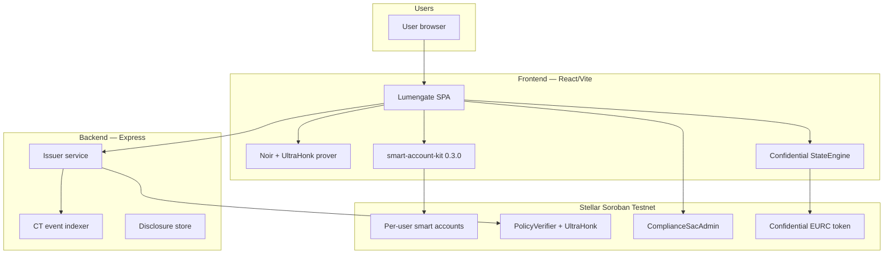

---

## Complete user journey

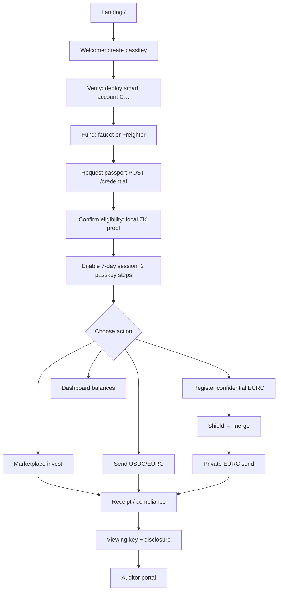

A new user on testnet typically: **Welcome → Verify (account + passport + proof + session) → Home (CT register + shield) → Send (confidential) → Receipts (viewing key) → Auditor**.

---

## Verified user journeys

Every journey below runs on the deployed testnet contracts and issuer service listed in this document. Each maps to the code paths detailed in [Product walkthrough by area](#product-walkthrough-by-area) below — this section is the scannable index; that section is the implementation depth.

1. **Identity → Marketplace → Settlement → Receipt → Viewing key → Auditor.** Passkey registration deploys a `LumengateSmartAccount` (`/app/welcome`) → passport request (`POST /credential`) → local UltraHonk proof generation → 7-day session bind → browse `/app/marketplace` → `canSettle()` gates → settlement via the offering's route contract → `recordTransferTx()` builds a receipt → optional viewing key → `/app/auditor` verifies the disclosure pack.
2. **Public settlement.** Session-signed USDC or EURC transfer through `ComplianceSacAdmin.transfer_compliant` / `transfer_compliant_eurc`, gated by `PolicyVerifier.verify_passport` on asset-scoped nullifiers (USDC=2, EURC=3).
3. **Confidential EURC.** Register (`registerConfidentialAccount({ assetKey: 'eurc' })`) → shield public EURC → merge → private `confidential_transfer` → receipt shows "Shielded amount" → optional viewing key → auditor decrypt via `ConfidentialAuditorContract`.
4. **Confidential USDC.** Identical lifecycle to EURC through the generic `ConfidentialAssetConfig` (`assetKey: 'usdc'`), using the independently deployed USDC confidential stack (`deployments.json` → `confidential_tokens.usdc`, token `CBIGJFIRVZRNUJ45TN5EMLMMIBJY4GHELFLVYCJ4HUZLWUWA2VSSWOWF`).
5. **Marketplace investment.** `useOfferings()` loads issuer fixtures (`issuer-service/fixtures/offerings.json`: treasury, real-estate, private-credit categories) → `MarketplacePage.handleSettle()` resolves the correct contract by `settlementRoute` (`dex`, `payroll`, `sac`, or default RWA).
6. **Treasury purchase.** RWA-scoped proof + `RwaToken.transfer` through `RwaAdapter.verify_passport`, or SAC-routed USDC/EURC treasury settlement offerings (`ComplianceSacAdmin`).
7. **Receipt lifecycle.** Settlement tx confirmed → proof archived to session storage → nullifier marked consumed → `buildProofReceipt()` fetches chain events → `/app/compliance` renders the receipt and timeline on mount.
8. **Selective disclosure.** From a sealed receipt, `generateViewingKey()` creates an `lgvk_`-prefixed key → `buildDisclosure()` packs claims → `POST /disclose/store` indexes the pack by `SHA-256(viewing_key)`.
9. **Auditor verification.** Auditor enters a viewing key at `/app/auditor` → `POST /disclose` returns the stored pack → `verifyAuditorInput()` validates disclosure JSON, public inputs hex, or nullifier modes → `CtAuditorPanel` optionally decrypts one confidential transfer amount.
10. **Private compliance flow (no personal data on-chain).** Across every journey above, the only data reaching Soroban is a Merkle root, policy ID, asset ID, action ID, and a scoped nullifier — accreditation status, sanctions result, jurisdiction, age, and (for confidential assets) the transfer amount stay off the public ledger by default.

---

## Product walkthrough by area

Each feature below describes what the user sees and how the implementation executes internally (frontend → issuer → contracts → storage).

### Passport (`/app/verify`)

**User flow:** Create passkey smart account → fund → request passport → confirm eligibility proof → enable 7-day session.

**Internal execution:**

1. **Credential request** — `AppContext.requestCredential()` calls issuer `POST /registry/sync-root` then `POST /credential`. Issuer (`credentialCommitment.js`) builds a Merkle commitment from `walletField` + policy, syncs `CredentialRegistry.set_root`, returns signed credential JSON + `proverInputs` for Noir.
2. **Proof generation** — `confirmPassportEligibility()` in `prover.ts` loads `app/public/circuit/lumengate.json`, executes witness with scoped nullifier (`assetScope.ts`: RWA=1, USDC=2, EURC=3), generates 14592-byte UltraHonk proof with keccak transcript via `@aztec/bb.js`.
3. **Session bind** — `enableLumengateSession()` first submits `SessionStore.set_proof` (passkey-signed), then `add_context_rule` with delegated Ed25519 signer (`LUMENGATE_SESSION_DAYS = 7`). `CompliancePolicy.enforce` reads bound proof via `get_proof` on every subsequent smart-account auth.

**UI:** `PassportRequestProgress`, `PassportScopePanel`, `PasskeyAuthorizePanel`, `StageProgress`.

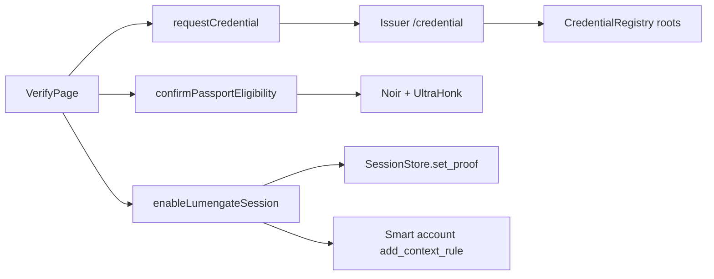

### Compliance and receipts (`/app/compliance`)

**User flow:** After settlement, view proof receipt, activity timeline, generate viewing key, export disclosure pack.

**Internal execution:**

1. **Settlement hook** — `recordTransferTx()` in `AppContext` archives the active proof bundle, marks nullifier consumed in local lifecycle state, stores tx hash.
2. **Receipt build** — `buildProofReceipt()` in `proofReceipt.ts` fetches Soroban meta via `events.ts`, assembles version-2 receipt with roots, nullifier hex, policy ID, and chain event evidence.
3. **Confidential privacy** — `ProofReceiptHero` checks `isConfidentialReceipt()`; when true, displays **“Shielded amount”** instead of plaintext (`transferResult.confidential`).
4. **Disclosure** — `generateViewingKey()` creates `lgvk_` prefix key; `buildDisclosure()` packs claims; `POST /disclose/store` indexes by SHA-256(viewing_key) in issuer JSON store.

**UI:** `ProofReceiptHero`, `UnifiedTimeline`, `CtDisclosurePanel`.

### Confidential assets — EURC and USDC (`/app/home` + `/app/send`)

Assets are selected through `ConfidentialAssetConfig` (`eurc` | `usdc`). Contract IDs load from `deployments.json` → `confidential_tokens` (EURC also mirrors legacy `confidential_token`).

**User flow (both assets):** Register → shield → merge → private send → receipt → viewing key → auditor → unshield.

**Internal execution:**

1. **Keys** — `getOrCreateCtKeys()` derives Grumpkin keypair per smart account + token wrapper; persisted at `lumengate:ct:keys:{account}:{tokenId}`.
2. **Register** — `registerConfidentialAccount({ assetKey })` … `initializeCtStateFromEvents(config, account, assetKey)`.
3. **Shield / merge / unshield** — `shieldConfidentialAsset`, `mergeConfidentialAsset`, `unshieldConfidentialAsset` with `assetKey`.
4. **Private send** — `executeConfidentialSettlement({ assetKey })`: hybrid indexer (`IssuerCtIndexerClient` with `?asset=`), auto-deposit/merge, transfer circuit, `confidential_transfer`.
5. **State sync** — `refreshConfidentialBalance(assetKey)` retries up to 15 times per asset if `!spendableSynced`.

**Testnet USDC CT stack** (verified `bash scripts/verify_confidential_token.sh`): token `CBIGJFIRVZRNUJ45TN5EMLMMIBJY4GHELFLVYCJ4HUZLWUWA2VSSWOWF`, underlying SAC `CBIELTK6YBZJU5UP2WWQEUCYKLPU6AUNZ2BQ4WWFEIE3USCIHMXQDAMA`.

**UI:** `ConfidentialBalancePanel`, `ConfidentialEurcShieldControls` (assetKey prop), automatic shield panel in Send for both EURC and USDC.

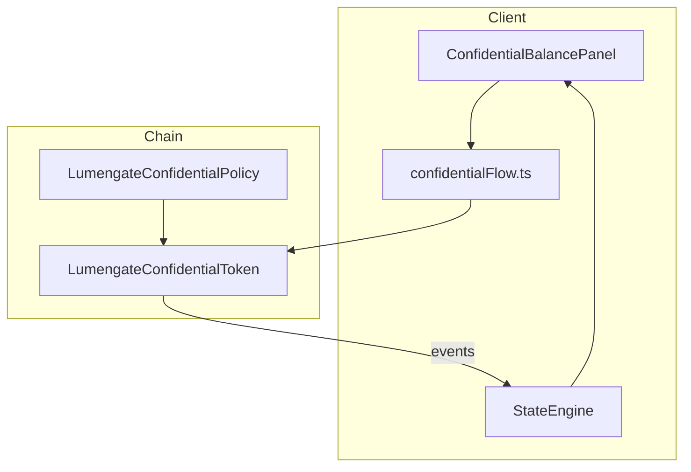

### Marketplace investment lifecycle (`/app/marketplace`)

The marketplace is not a separate on-chain venue—it is a **proof-gated settlement router** over existing compliant contracts. The full investment lifecycle:

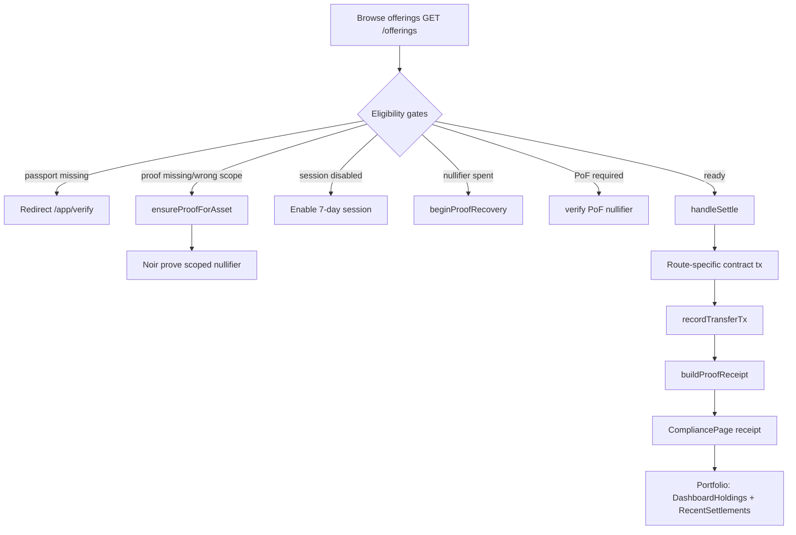

| Stage | What happens | Code |
|-------|--------------|------|
| **Browse** | `useOfferings()` fetches issuer fixtures enriched with env contract IDs; cards filtered by category | `MarketplacePage`, `MarketplaceProductCard` |
| **Eligibility** | `canSettle()` checks smart account, credential, policy match, session enabled, balance ≥ minimum, route config | `MarketplacePage` L280–358 |
| **Proof** | If no scoped proof for offering asset, `ensureProofForAsset()` generates asset-scoped UltraHonk proof (RWA/USDC/EURC) | `AppContext.ensureProofForAsset` |
| **Session** | `signAndSubmitSettlement()` requires active delegated session in localStorage; passkey not prompted | `smartAccount.ts` |
| **Settlement** | `handleSettle()` builds tx by route: `dex`→CompliantDex, `payroll`→CompliantPayroll, `usdc`/`eurc`→ComplianceSacAdmin, default→RwaToken | `MarketplacePage` L363+ |
| **Receipt** | `recordTransferTx()` archives proof, navigates `/app/compliance` | `AppContext` |
| **Portfolio** | Dashboard shows RWA/USDC balances via RPC; `RecentSettlements` and holdings widgets reflect settlement history | `DashboardPage`, `DashboardHoldings` |

**Settlement routes** (from `offering.settlementRoute`): `dex`, `payroll`, `sac` (USDC/EURC via ComplianceSacAdmin), default RWA path via `buildTransferTransaction`.

### Auditor (`/app/auditor`)

**User flow:** Enter viewing key from receipt → verify disclosure pack → optional CT decrypt.

**Internal execution:** `POST /disclose` returns stored pack keyed by viewing key hash. `verifyAuditorInput()` in `auditor.ts` validates disclosure JSON, public inputs hex, or nullifier modes client-side. `CtAuditorPanel` uses `confidentialToken/auditor/decrypt.ts` for CT transfer amount recovery when auditor key matches on-chain `ConfidentialAuditorContract`.

**UI:** `AuditorPage`, `AuditorWorkflow`, `CtAuditorPanel`.

### Receipt generation (cross-cutting)

Every settlement path converges on the same receipt pipeline:

1. Tx confirmed → `recordTransferTx(transferResult)`
2. Proof archived to `settlementProofArchive` in session storage
3. Active proof cleared; `consumedTxHash` set
4. `buildProofReceipt()` queries chain events + nullifier spent status
5. Compliance page auto-refreshes receipt on mount

Timeline steps: passport received → eligibility confirmed → session bound → settlement → viewing key optional.

---

## Smart Account flow

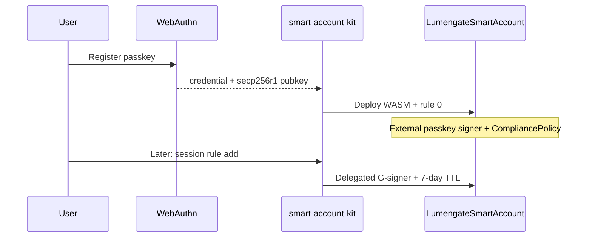

**Contract:** `contracts/lumengate_smart_account/src/lib.rs`  
**WASM hash:** `deployments.json` → `lumengate_smart_account_wasm_hash`  
**Client:** `app/src/lib/smartAccount.ts`

Each user receives a unique `C…` instance deployed by smart-account-kit. Constructor installs context rule 0 with passkey External signer + `CompliancePolicy` map. Session rule adds delegated Ed25519 G-signer with 7-day ledger TTL (`LUMENGATE_SESSION_LEDGERS`). Subsequent settlement uses `submitWithLumengateSession` — delegated key signs `AuthPayload` without WebAuthn.

---

## Passkey flow

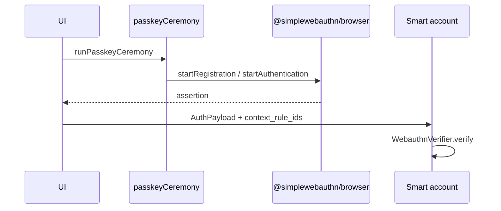

**Requirements:** `userVerification: 'required'`. Ceremonies serialized—never nest WebAuthn inside kit `signAndSubmit`.

---

## Passport flow

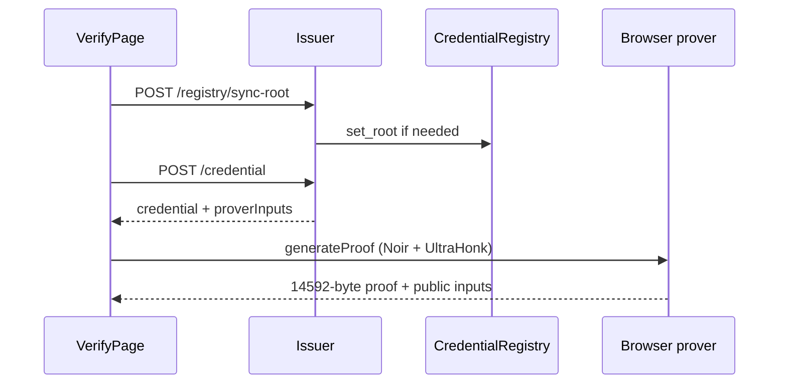

**Circuits:** `circuits/lumengate` (policy 1), scoped nullifiers per asset in `assetScope.ts`.

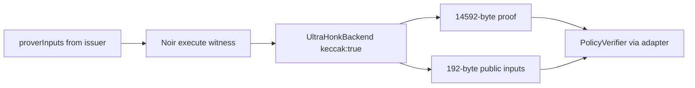

---

## Session flow

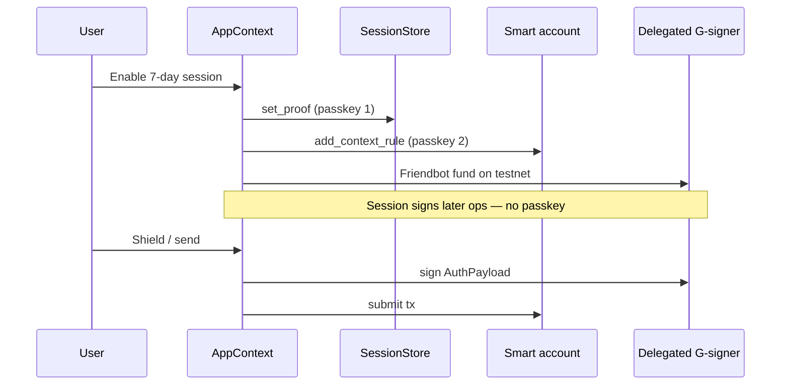

**Critical order:** bind proof before install rule (`CompliancePolicy.enforce` requires bound proof except for `set_proof`).

---

## Marketplace flow

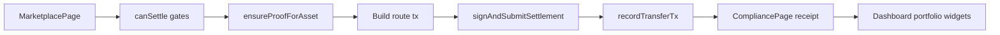

**Routes:** `dex`, `payroll`, `usdc`, `eurc`, `rwa` — resolved in `MarketplacePage.handleSettle` via `resolveMarketplaceAction`.

---

## Public settlement flow

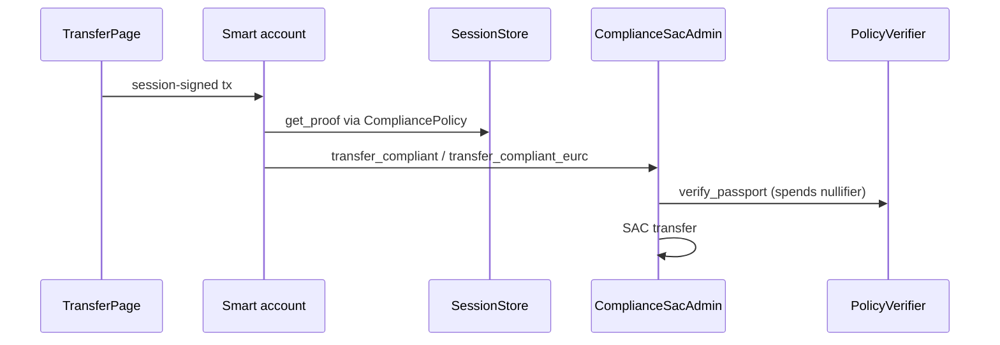

USDC uses asset_id=2; EURC public path uses asset_id=3.

---

## Confidential Token flow

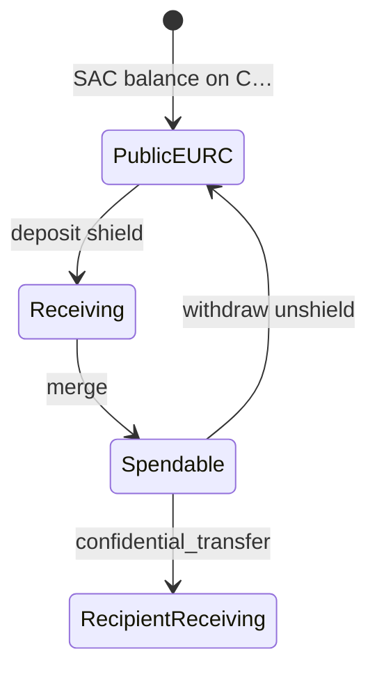

---

## Shield flow

| Step | On-chain | Client |
|------|----------|--------|
| 1 | `register` if needed | UltraHonk register proof |
| 2 | `deposit` | waitUntilVerified receiving |
| 3 | `merge` | waitUntilVerified spendable |
| 4 | verify | spendable ≥ amount |

UI: 7-stage `CT_ACTION_STAGES` progress in `ConfidentialBalancePanel`.

---

## Merge flow

Requires `receiving > 0` and verified receiving commitment. Single `merge` tx. Updates spendable opening via event replay or optimistic sync.

---

## Private transfer flow

Requires: session enabled, sender registered, recipient registered (`readCtRegistered`), spendable synced. Auto-deposit and auto-merge if balance shortfall. `confidential_transfer` + transfer circuit proof.

---

## Receipt flow

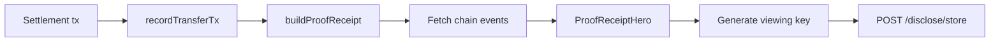

Confidential receipts hide amount in UI (`ProofReceiptHero` → “Shielded amount”).

---

## Auditor flow

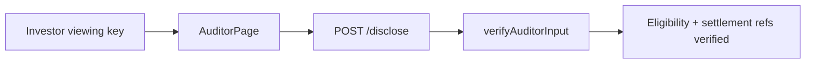

Optional: `CtAuditorPanel` for confidential transfer decrypt.

---

## Backend architecture

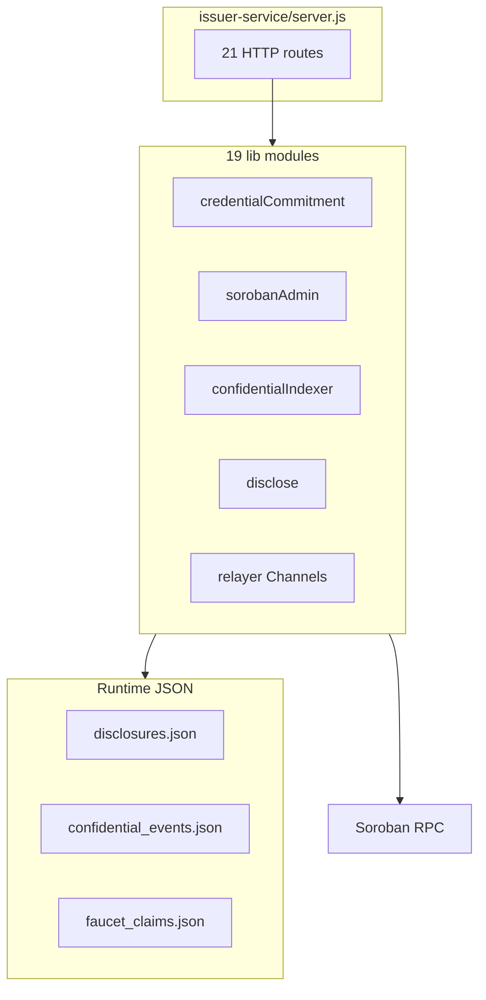

**Deployment:** Render (`render.yaml`, service `lumengate-issuer`).

---

## Contract architecture

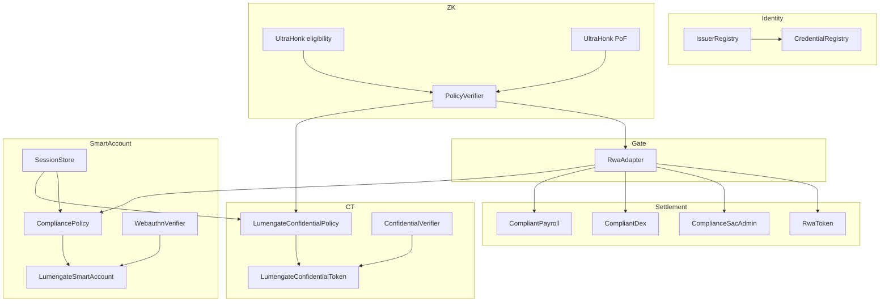

---

## Data flow

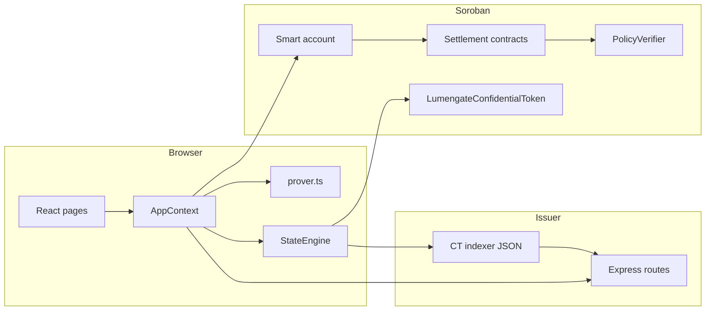

---

## Smart contracts (testnet)

All contract IDs live in `deployments.json` at repository root. The subsections below describe each deployed Soroban crate referenced by the application. Three additional contracts (`privacy_pool`, `asp_membership`, `privacy_pool_verifier`) are recorded in `deployments.json` but have **no references** in `app/src` or `issuer-service` source.

### IssuerRegistry

| Field | Detail |
|-------|--------|
| **Address** | `CBOG4MRPEGNFZJJ5QKYOTYPJMDYGZ5E5OOOE3CZKQWADEOK4U6AR36WY` |
| **Purpose** | Maintain the allowlist of Ed25519 credential issuers authorized to update Merkle roots. |
| **Responsibilities** | Register issuer IDs with 64-byte pubkeys; revoke issuers; answer authorization queries. |
| **Public methods** | `add_issuer`, `revoke_issuer`, `is_authorized`, `get_pubkey` |
| **Called by** | Admin (deploy scripts); `CredentialRegistry.authorize_issuer` reads via registry link |
| **Dependents** | `CredentialRegistry` stores issuer registry address at construct time |
| **Protocol role** | Root-of-trust for off-chain credential signatures before they affect on-chain roots |
| **Security role** | Prevents unauthorized root updates; duplicate issuer IDs panic (test: `duplicate_issuer_rejected`) |
| **Frontend pages** | None directly; enforced when issuer syncs roots during passport request |

### CredentialRegistry

| Field | Detail |
|-------|--------|
| **Address** | `CBRAQMKRX3ACWU3R4MZ6HQLFZSCY5BJGALI5AQE27NGKDHCGUSXK7U7F` |
| **Purpose** | Store global Merkle roots: credential tree, revocation tree, note tree. |
| **Responsibilities** | Authorized issuers call `set_root`, `set_revocation_root`, `set_note_root`; expose `get_roots`. |
| **Public methods** | `authorize_issuer`, `set_root`, `set_revocation_root`, `set_note_root`, `get_roots`, `get_issuer_registry` |
| **Called by** | Issuer admin key via `issuer-service/lib/onChainRoots.js`, `noteMerkle.js`, `revoke.js` |
| **Dependents** | ZK prover reads roots into witness; `PolicyVerifier` validates proofs against registered policies |
| **Protocol role** | On-chain anchor for eligibility Merkle membership |
| **Security role** | Only authorized issuers may mutate roots; prover rejects stale roots |
| **Frontend pages** | `/app/verify` (passport request waits for `waitForCredentialRootsReady`) |

### PolicyVerifier

| Field | Detail |
|-------|--------|
| **Address** | `CBSWGZFEPQXU2OQGTBACBFZ6UP2SXNKDJAIDMFJE245R3AXOMHXXI5TA` |
| **Purpose** | Route UltraHonk proofs to external verifier contracts; track nullifier anti-replay. |
| **Responsibilities** | Register policy→verifier mappings; verify/check/validate proofs; record scoped nullifier spends. |
| **Public methods** | `register_policy`, `get_verifier`, `verify`, `check`, `validate`, `verify_vec`, `verify_and_record`, `is_nullifier_spent`, `is_scoped_nullifier_spent`, `set_eligible`, `is_eligible` |
| **Called by** | `RwaAdapter`, `LumengateConfidentialPolicy` (via `validate`); settlement paths use adapter modes |
| **Dependents** | `RwaAdapter`, `LumengateConfidentialPolicy`; UltraHonk verifier contracts at `ultrahonk_verifier_eligibility` and `ultrahonk_verifier_pof` |
| **Protocol role** | Central ZK verification and nullifier ledger |
| **Security role** | `verify` spends nullifiers; `check`/`validate` do not; 14592-byte proof size enforced |
| **Frontend pages** | `/app/verify`, `/app/marketplace`, `/app/send` (via `readNullifierSpent`, `syncProofLifecycleOnChain`) |

### RwaAdapter

| Field | Detail |
|-------|--------|
| **Address** | `CACZ4O3EFBCNUXNSW5ZKPLUVMVU3PJZN4E243PG3I6A3PZP5YVGNDY3C` |
| **Purpose** | Normalize passport verification modes for settlement and smart-account policy checks. |
| **Responsibilities** | Forward proofs to `PolicyVerifier` with spend vs non-spend semantics. |
| **Public methods** | `set_verifier`, `verifier_address`, `verify_passport` (spends), `check_passport` (no spend), `verify`, `is_eligible`, `validate_passport` (ignores spent) |
| **Called by** | `ComplianceSacAdmin`, `CompliantDex`, `CompliantPayroll`, `RwaToken`, `CompliancePolicy.enforce` |
| **Dependents** | All compliant settlement contracts; `CompliancePolicy` on smart accounts |
| **Protocol role** | Single adapter surface for passport semantics |
| **Security role** | Separates session bind (`check_passport`) from settlement (`verify_passport`) |
| **Frontend pages** | All settlement pages indirectly via `contracts.ts` builders |

### RwaToken

| Field | Detail |
|-------|--------|
| **Address** | `CBVUK5UPY5Q3RNGD5ZOPB44FAOZUOJXJWGDAHQJBF3TD2P3XLBHXJR22` |
| **Purpose** | Proof-gated RWA ledger for marketplace default route. |
| **Responsibilities** | Mint/transfer with passport verification; admin freeze sanctioned holders. |
| **Public methods** | `freeze`, `is_frozen`, `mint`, `admin_mint`, `transfer`, `balance`, `set_verifier` |
| **Called by** | Smart account session signer via `buildTransferTransaction` |
| **Dependents** | Invokes configured verifier (`RwaAdapter.verify`) |
| **Protocol role** | Permissioned RWA settlement asset |
| **Security role** | Frozen holders cannot transfer; proof required on `transfer` |
| **Frontend pages** | `/app/marketplace`, `/app/home` (RWA balance), `/app/compliance` |

### ComplianceSacAdmin

| Field | Detail |
|-------|--------|
| **Address** | `CCKLOGDLPFJMFJIVW7DECC4IJGIGD3HLWF4BH4BMUER4REJTVKOHSHI6` |
| **Purpose** | Proof-gated USDC and EURC SAC transfers for public settlement paths. |
| **Responsibilities** | Verify passport via adapter; enforce asset_id in public inputs (USDC=2, EURC=3); transfer underlying SAC. |
| **Public methods** | `transfer_compliant`, `transfer_compliant_eurc`, `balance`, `sac_address`, `eurc_sac_address`, `adapter_address`, `set_adapter` |
| **Called by** | Smart account via `buildUsdcTransferTransaction`, `buildEurcTransferTransaction`, marketplace SAC route |
| **Dependents** | Underlying USDC SAC + EURC SAC (`eurc_sac`); `RwaAdapter` |
| **Protocol role** | Compliant public stablecoin rail |
| **Security role** | `from.require_auth()`; scoped asset_id validation; nullifier spent on verify path |
| **Frontend pages** | `/app/send`, `/app/marketplace` (USDC/EURC offerings) |

### CompliantDex

| Field | Detail |
|-------|--------|
| **Address** | `CAWAEZAEULQBHYH3VBVX6EUYIS7K43NN4YMZ4AMEBUC52XAGGKOUJEOH` |
| **Purpose** | Proof-gated USDC swap settlement for dex-route marketplace offerings. |
| **Responsibilities** | Validate proof + USDC asset scope; transfer USDC SAC to recipient; emit `CompliantSwap` event. |
| **Public methods** | `swap_compliant` |
| **Called by** | `buildSwapCompliantTransaction` from marketplace invest |
| **Dependents** | `RwaAdapter`, USDC SAC |
| **Protocol role** | DEX-style compliant settlement |
| **Security role** | Requires ASSET_USDC=2 and ACTION_SETTLEMENT=1 in public inputs |
| **Frontend pages** | `/app/marketplace` (offerings with `settlementRoute: 'dex'`) |

### CompliantPayroll

| Field | Detail |
|-------|--------|
| **Address** | `CBUCACQX2BBNHV3R4ERQMCQVBQQXM6DAPBPNOALDMFJRI3OTFM4L5EIZ` |
| **Purpose** | Proof-gated payroll-style USDC disbursement. |
| **Responsibilities** | Same verification pattern as CompliantDex with payroll semantics. |
| **Public methods** | `pay_compliant` |
| **Called by** | `buildPayCompliantTransaction` from marketplace invest |
| **Dependents** | `RwaAdapter`, USDC SAC |
| **Protocol role** | Payroll compliant settlement |
| **Security role** | Asset scope + nullifier spend via adapter |
| **Frontend pages** | `/app/marketplace` (offerings with `settlementRoute: 'payroll'`) |

### CompliancePolicy

| Field | Detail |
|-------|--------|
| **Address** | `CDAQ5KFAFAO5F33AD62V7RRJO2PDLXDKRPGLUZN72Z7KGDXWIEBBLJXF` |
| **Purpose** | OpenZeppelin `Policy` implementation gating smart-account `__check_auth`. |
| **Responsibilities** | On every auth (except `SessionStore.set_proof`), read bound proof and call `RwaAdapter.check_passport`. |
| **Public methods** | `Policy` trait: `install`, `uninstall`, `enforce` |
| **Called by** | Smart account runtime during `do_check_auth` |
| **Dependents** | Reads `SessionStore.get_proof`; calls `RwaAdapter` |
| **Protocol role** | Ensures smart account cannot sign settlement without bound eligibility proof |
| **Security role** | Bypass only for session-bind context (`is_session_bind_context`) |
| **Frontend pages** | `/app/verify` (session enable), all session-signed txs |

### SessionStore

| Field | Detail |
|-------|--------|
| **Address** | `CBNDCK32HPC5ADIYF7ZP4R4Q4PIXH3SFLITV66DXDIG4THYHWKO7IPAI` |
| **Purpose** | Persist bound UltraHonk proof per smart account address. |
| **Responsibilities** | Store proof bytes + public inputs; serve reads to CompliancePolicy and LumengateConfidentialPolicy. |
| **Public methods** | `set_proof`, `operator_set_proof`, `get_proof`, `get_bound_proof` |
| **Called by** | Passkey/smart account during session enable; `CompliancePolicy.enforce`; `LumengateConfidentialPolicy.is_authorized` |
| **Dependents** | `CompliancePolicy`, `LumengateConfidentialPolicy` |
| **Protocol role** | Session-scoped proof binding layer |
| **Security role** | `set_proof` requires smart-account auth; operator path for admin bind |
| **Frontend pages** | `/app/verify`, `/app/home` (CT register requires bound proof) |

### WebauthnVerifierContract

| Field | Detail |
|-------|--------|
| **Address** | `CAQK36HSHDHLH3XKAP6GTMPCPBFDP362A3V7XUEZRYKCD2LJBW76ACTH` |
| **Purpose** | Network-shared secp256r1 WebAuthn signature verification. |
| **Responsibilities** | Verify AuthPayload signatures; canonicalize passkey public keys. |
| **Public methods** | `Verifier` trait: `verify`, `canonicalize_key`, `batch_canonicalize_key` |
| **Called by** | Smart account `do_check_auth` for External passkey signers |
| **Dependents** | Every passkey smart account references this verifier ID |
| **Protocol role** | Passkey cryptography enforcement |
| **Security role** | UV required client-side; AuthPayload map order verified by `verify_passkey_auth_encoding.sh` |
| **Frontend pages** | `/app/welcome`, `/app/verify` (all passkey ceremonies) |

### SessionKeyPolicyContract

| Field | Detail |
|-------|--------|
| **Address** | `CBMISD65SUNFHDGKT4S3YJJ3INJQ3NRXOZGUDAG235JVQHKWYWWRWFJH` |
| **Purpose** | Reusable OpenZeppelin spending-limit policy (ledger window). |
| **Responsibilities** | Enforce per-context spending caps via `spending_limit` module. |
| **Public methods** | `Policy` trait: `install`, `uninstall`, `enforce`; `get_spending_limit_data`, `set_spending_limit` |
| **Called by** | Not wired into any current app session setup |
| **Dependents** | None in production app flows |
| **Protocol role** | Deployed, standalone OpenZeppelin spending-limit policy module; not attached to any Lumengate session context rule |
| **Security role** | Not part of the enforced session authorization path — session scope limits are currently enforced by `SessionStore` proof binding, not by this contract |
| **Frontend pages** | None (deployed only) |

### TimelockController

| Field | Detail |
|-------|--------|
| **Address** | `CC7NP3NISCNFNPUGWE6IZZFP4EPPIFX66HV45KNAW3IC3XJ2DK2W4P2I` |
| **Purpose** | OpenZeppelin governance timelock for admin operations. |
| **Responsibilities** | Delay sensitive admin upgrades per stellar-governance pattern. |
| **Public methods** | Timelock schedule/execute operations (OpenZeppelin trait surface) |
| **Called by** | Deploy/admin scripts for governance-gated changes |
| **Dependents** | Admin contracts may be owned by timelock |
| **Protocol role** | Upgrade safety |
| **Security role** | Time delay on privileged mutations |
| **Frontend pages** | `/app/admin` (operator revoke uses issuer API, not timelock directly) |

### AuditorRegistry

| Field | Detail |
|-------|--------|
| **Address** | `CAO7QJ26C2ZIZLACBLJSJ3BXIKYNE767P7KVFVMQRULR3Z7RAAPEDZ67` |
| **Purpose** | Register auditor viewing keys and optional on-chain disclosure records. |
| **Responsibilities** | Map auditor_id → viewing key hash; verify keys; record disclosures. |
| **Public methods** | `register_auditor`, `verify_viewing_key`, `is_registered`, `record_disclosure` |
| **Called by** | Issuer `disclose.js` for on-chain verification path |
| **Dependents** | Disclosure flow |
| **Protocol role** | Auditor identity anchor |
| **Security role** | Viewing key hash registration; optional on-chain audit trail |
| **Frontend pages** | `/app/auditor`, `/app/compliance` (viewing key generation) |

### ConfidentialVerifierContract

| Field | Detail |
|-------|--------|
| **Address** | `CDT6OHHRX2WK45A7RXAFCAA3ETOOYWD67N4XEUZN7BDRR7NOYSUNB2GO` |
| **Purpose** | Registry of UltraHonk verification keys for CT circuits. |
| **Responsibilities** | Store VK bytes per `CircuitType`; manager role updates keys. |
| **Public methods** | `register_verification_key`, `update_verification_key`, `get_verification_key` (trait) |
| **Called by** | `LumengateConfidentialToken` during register/transfer/withdraw proofs |
| **Dependents** | CT token invokes verifier on each ZK-gated operation |
| **Protocol role** | On-chain CT proof verification anchor |
| **Security role** | Manager-role gated VK updates |
| **Frontend pages** | `/app/home`, `/app/send` (indirect via CT flows) |

### ConfidentialAuditorContract

| Field | Detail |
|-------|--------|
| **Address** | `CCUMCSQOSLI2VHE4FIGYATSEPBUDMPFNDLUQH753HIOFKECH435QKNEW` |
| **Purpose** | Register Grumpkin auditor public keys for CT selective disclosure. |
| **Responsibilities** | `register_key`, `rotate_key` per auditor_id. |
| **Public methods** | `register_key`, `rotate_key`, `get_key` (trait) |
| **Called by** | Deploy scripts; CT register references auditor_id |
| **Dependents** | CT register proofs bind to auditor key |
| **Protocol role** | Institutional audit key management |
| **Security role** | Manager-role gated key rotation |
| **Frontend pages** | `/app/auditor` (`CtAuditorPanel`) |

### LumengateConfidentialPolicy

| Field | Detail |
|-------|--------|
| **Address** | `CBBGGAKMHHDQKLF2ER4HAB6ATIEGZZ75CNAADKQJRP6E34HMNQQ72274` |
| **Purpose** | CT compliance hook requiring bound passport proof before CT operations. |
| **Responsibilities** | Read `SessionStore.get_proof`; call `PolicyVerifier.validate` (non-spending). |
| **Public methods** | `Policy` trait: `is_authorized`; constructor stores config |
| **Called by** | `LumengateConfidentialToken` compliance hooks before register/deposit/transfer/withdraw |
| **Dependents** | `SessionStore`, CT-specific `policy_verifier` address in config |
| **Protocol role** | Links CT layer to passport compliance without spending eligibility nullifier |
| **Security role** | Unbound accounts return false (`ct_integration_test.sh` verifies) |
| **Frontend pages** | `/app/home`, `/app/send` |

### LumengateConfidentialToken

| Field | Detail |
|-------|--------|
| **Address** | `CD6GQ4ZMC3VOE4QZJY32IGXRNOESZGLCZDRLD2PNWZSMKLMH2XR3MLZ6` |
| **Purpose** | EURC confidential wrapper implementing Stellar Confidential Token Developer Preview. |
| **Responsibilities** | Pedersen commitments for spendable/receiving balances; ZK-gated lifecycle ops. |
| **Public methods** | `ConfidentialToken` trait: `register`, `deposit`, `merge`, `withdraw`, `confidential_transfer`, `confidential_balance`; `ConfidentialCompliance`: `freeze`, `unfreeze`, `set_compliance_config` |
| **Called by** | Smart account session signer via `confidentialToken/chain/contract.ts` |
| **Dependents** | Underlying EURC SAC; `ConfidentialVerifierContract`; `LumengateConfidentialPolicy`; `ConfidentialAuditorContract` |
| **Protocol role** | Private EURC amount layer over public SAC |
| **Security role** | UltraHonk proofs per operation; compliance policy gate; commitment verification client-side |
| **Frontend pages** | `/app/home`, `/app/send`, `/app/compliance` (shielded receipts) |

### LumengateSmartAccount

| Field | Detail |
|-------|--------|
| **WASM hash** | `df911f9fd998495cb41bd39f4254b70acfde8dc6e86f230fb139481e3247b969` (per-user contract instances) |
| **Purpose** | OpenZeppelin-compatible passkey smart account with Lumengate compliance policy. |
| **Responsibilities** | Context rules for passkey + delegated session signers; `__check_auth` enforcement. |
| **Public methods** | `__constructor`, `add_passkey`, `get_context_rules`, `bind_session_proof`; traits: `SmartAccount`, `CustomAccountInterface`, `ExecutionEntryPoint` |
| **Called by** | Browser via smart-account-kit; issuer admin for `add_passkey` |
| **Dependents** | `WebauthnVerifierContract`, `CompliancePolicy`, `SessionStore` referenced in constructor |
| **Protocol role** | User-controlled authorization hub for all compliant actions |
| **Security role** | Multi-signer context rules; policy enforcement on every auth |
| **Frontend pages** | `/app/welcome`, `/app/verify`, all settlement pages |

### UltraHonk verifier contracts (external)

| Contract | Address | Circuit |
|----------|---------|---------|
| Eligibility | `CCTUP5DJF6PJNH6SDDY6IVVOS2KKISRR2DDPKXCY5K6IYMKUEN4F7AII` | `circuits/lumengate` |
| Proof of funds | `CCYOYWPHJRJCTJYILSFPN2T472Y2HKWHQOQ5A2WD5REDHMNJOZINRNMJ` | `circuits/proof_of_funds` |

Registered in `PolicyVerifier.register_policy`; proofs are exactly **14592 bytes** with **192-byte** public inputs (6 × 32-byte fields).

---

## Every frontend page

| Route | Page | Purpose |
|-------|------|---------|
| `/` | Landing | Product introduction |
| `/app/welcome` | Welcome | Passkey create / sign-in |
| `/app/home` | Dashboard | Balances, CT panel, session, faucet |
| `/app/verify` | Verify | Account, passport, proof, session |
| `/app/marketplace` | Marketplace | Offerings + invest |
| `/app/marketplace/:id` | Offering detail | Single offering |
| `/app/send` | Send | Public + confidential EURC |
| `/app/compliance` | Receipts | Receipt, activity, disclosure |
| `/app/auditor` | Auditor | Viewing key verification |
| `/app/admin` | Admin | Operator revoke |
| `/app/settings` | Settings | Account settings |

93 React components across `app/src/components/` in directories: `product/` (33), `fintech/` (16), `marketing/` (14), `dashboard/` (6), `design/` (7), `education/` (5, including `education/diagrams/`), `ui/` (4), `layout/` (2), `send/` (2), `lumengate/` (2), `compliance/` (1), `marketplace/` (1).

---

## Every issuer API

| Method | Path | Purpose |
|--------|------|---------|
| GET | `/health` | Service health |
| GET/POST | `/relayer/*` | OpenZeppelin Channels proxy |
| GET/POST | `/faucet/*` | Testnet asset faucet |
| GET | `/roots` | Credential Merkle roots |
| GET | `/issuer`, `/issuer/:id` | Issuer metadata |
| POST | `/revoke` | Credential revocation |
| GET | `/policies` | 6 eligibility policies |
| GET | `/offerings`, `/offerings/:id` | Marketplace data |
| POST | `/registry/sync-root` | Sync eligibility root |
| POST | `/credential` | Issue passport |
| POST | `/smart-account/passkeys` | Admin passkey registration |
| POST | `/pof/nullifier` | Proof-of-funds helper |
| POST | `/disclose/store`, `/disclose` | Disclosure packs |
| GET | `/ct/deployments`, `/ct/events` | Confidential token indexer |
| POST | `/ct/sync` | Pull CT events from RPC |

---

## Test Coverage

All counts below were re-executed and reconfirmed on 2026-07-01 (consistent with [`docs/TEST_RESULTS.md`](docs/TEST_RESULTS.md), verified 2026-06-30). Reproduce with the commands in that file. **219** total passing tests across all suites, 0 failures.

**Prerequisites:** `.env` with testnet keys, `stellar` CLI, local issuer on port 3001 for API/CT integration scripts.

| Suite | Tests | Command |
|-------|------:|---------|
| **Rust contracts (total)** | **42** | `cargo test -p issuer-registry … -p confidential-auditor` |
| issuer-registry | 4 | `cargo test -p issuer-registry` |
| credential-registry | 3 | `cargo test -p credential-registry` |
| policy-verifier | 5 | `cargo test -p policy-verifier` |
| rwa-adapter | 2 | `cargo test -p rwa-adapter` |
| rwa-token | 4 | `cargo test -p rwa-token` |
| compliance-sac-admin | 3 | `cargo test -p compliance-sac-admin` |
| auditor-registry | 5 | `cargo test -p auditor-registry` |
| compliant-dex | 1 | `cargo test -p compliant-dex` |
| compliant-payroll | 1 | `cargo test -p compliant-payroll` |
| session-store | 5 | `cargo test -p session-store` |
| lumengate-confidential-token | 1 | `cargo test -p lumengate-confidential-token` |
| lumengate-confidential-policy | 2 | `cargo test -p lumengate-confidential-policy` |
| session-key-policy | 2 | `cargo test -p session-key-policy` |
| compliance-policy | 1 | `cargo test -p compliance-policy` |
| governance-timelock | 1 | `cargo test -p governance-timelock` |
| confidential-verifier | 1 | `cargo test -p confidential-verifier` |
| confidential-auditor | 1 | `cargo test -p confidential-auditor` |
| **UltraHonk verifier (total)** | **54** | `cargo test -p rs-soroban-ultrahonk -p ultrahonk_soroban_verifier` |
| rs-soroban-ultrahonk | 9 | `cargo test -p rs-soroban-ultrahonk` |
| ultrahonk_soroban_verifier | 45 | `cargo test -p ultrahonk_soroban_verifier` |
| **Integration (total)** | **78** | shell scripts below |
| Passkey AuthPayload encoding | 1 | `bash scripts/verify_passkey_auth_encoding.sh` |
| Confidential token stacks (EURC + USDC) | 16 | `bash scripts/verify_confidential_token.sh` |
| CT registration semantics | 2 | `bash scripts/ct_integration_test.sh` |
| Issuer API + disclosure + CT indexer | 18 | `ISSUER_URL=http://127.0.0.1:3001 bash scripts/api_integration_test.sh` |
| Testnet regression (compliance paths) | 34 | sync-root then `bash scripts/regression_test.sh` |
| CT hybrid sync + indexer routing | 7 | `ISSUER_SERVICE_URL=http://127.0.0.1:3001 node scripts/verify_ct_sync.mjs` |
| **Circuits** | **1** | `node scripts/test_prove_node.mjs 200` |
| **Backend** | **30** | `cd issuer-service && npm test` |
| **Frontend** | **14** | `cd app && npm test` |

### What each suite verifies

| Suite | Security / behavior validated |
|-------|----------------------------|
| issuer-registry | Add/revoke issuer; duplicate ID rejected; missing pubkey |
| credential-registry | Merkle roots; issuer registry wiring; default zero roots |
| policy-verifier | Eligibility flags; scoped nullifiers; unknown policy error |
| rwa-adapter | Verifier wiring; validate_passport failure without VK |
| rwa-token | Freeze; initial unfrozen; admin mint balance |
| compliance-sac-admin | USDC/EURC SAC + adapter address storage |
| auditor-registry | Viewing key register/verify; disclosure mismatch; duplicate rejected |
| compliant-dex / compliant-payroll | Constructor wiring to adapter + SAC |
| session-store | set_proof / operator_set_proof / overwrite / missing proof panic |
| session-key-policy | Spending limit install + update |
| lumengate-confidential-* | CT construct; policy rejects unbound account |
| compliance-policy / governance-timelock / confidential-* | Contract construction + role wiring |
| UltraHonk verifier | Malformed/mutated proof rejection; valid verify |
| Integration scripts | On-chain settlement, nullifier spend, CT policy, API disclosure, relayer/faucet/offering routes, passkey encoding, indexer routing |
| Circuits | 14592-byte UltraHonk proof + 6 public inputs from live credential |
| Backend | Policies, Poseidon fields, credential material, Ed25519 signing, revoke normalization, offerings enrichment, relayer XDR guardrails, rate limit, viewing-key hash |
| Frontend | Scoped nullifier derivation; asset/action proof matching; stroops parsing; credential nullifier matching |

Crates without Rust unit tests (`lumengate-smart-account`, `webauthn-verifier`) are covered by integration scripts above.

---

## Security

- **Nullifier anti-replay:** `PolicyVerifier.verify` spends scoped nullifiers on settlement
- **Session binding:** `CompliancePolicy` reads `SessionStore.get_proof` for all smart-account auth except `set_proof`
- **Passkey UV:** Required for WebAuthn (stellar-accounts 0.7.2)
- **AuthPayload:** Canonical ScVal map order verified by `scripts/verify_passkey_auth_encoding.sh`
- **Relayer:** Rate limited 30 requests/minute/IP
- **Revoke API:** Protected by `REVOKE_API_KEY`

**Limitations:** Testnet only. Session uses Default context rule (broader than per-contract `CallContract` rules). Local session revoke does not remove on-chain rules until ledger expiry. `SessionKeyPolicyContract` is deployed but not attached to session context rules in the current app.

### Threat summary

| Threat | Mitigation | Residual risk |
|--------|------------|---------------|
| Issuer key compromise | On-chain roots + ZK verify; revoke API | Bad credentials until revoked |
| Session key theft | 7-day ledger TTL; local revoke | Default context scope |
| Nullifier replay | `verify_passport` spends scoped nullifiers | User must renew passport after spend |
| CT sync gaps | Hybrid issuer indexer + `rebuildFromEvents` | RPC ~7-day event window |
| Passkey phishing | WebAuthn UV + RP ID binding | User must verify domain |

---

## Privacy

| Layer | Public ledger | Browser | Auditor (with viewing key) |
|-------|---------------|---------|----------------------------|
| Eligibility attributes | ZK public inputs only | Private prover inputs | Disclosure claims |
| Public settlement | Amount, from, to visible | Same | In disclosure pack |
| Confidential EURC | Pedersen commitments | Plaintext openings | CT decrypt + disclosure |
| Receipt default | N/A | Confidential amount hidden | Scoped read-only |

---

## Repository layout

```
Lumengate/
├── app/                    # React/Vite frontend (Vercel)
│   ├── src/pages/          # 13 route screens
│   ├── src/components/     # 93 UI components
│   ├── src/lib/            # 101 TypeScript modules + confidentialToken SDK
│   ├── src/context/        # AppContext orchestration
│   ├── e2e/                # 3 Playwright specs (25 runtime tests)
│   └── public/circuit/     # Noir JSON artifacts
├── issuer-service/         # Express API (Render)
├── contracts/              # 19 Soroban Rust crates
├── circuits/               # 2 Noir sources + 6 CT VK sets
├── scripts/                # Deploy, verify, regression (63 automation files)
├── vendor/                 # UltraHonk verifier, stellar-contracts refs
├── deployments.json        # Testnet contract IDs
└── docs/                   # Supplementary engineering history (this README is self-sufficient; docs/ is optional deep-dive/point-in-time material)
```

---

## Technology

| Layer | Technology |
|-------|------------|
| Frontend | React 18, Vite 5, TypeScript 5.6, Tailwind 3.4 |
| Chain SDK | `@stellar/stellar-sdk` 16.x |
| Smart accounts | OpenZeppelin stellar-accounts 0.7.2, smart-account-kit 0.3.0 |
| ZK | Noir 1.0.0-beta.9, `@aztec/bb.js` 0.87 UltraHonk (keccak transcript) |
| Passkeys | `@simplewebauthn/browser`, WebauthnVerifier contract |
| Backend | Node 20, Express |
| Contracts | soroban-sdk 26.0.1 |

---

## Installation and local development

### Prerequisites

- Node.js 20+
- Rust + `stellar` CLI
- `nargo` + `bb` for circuit builds
- Playwright deps: `npx playwright install-deps chromium`

### Issuer

```bash
cp issuer-service/.env.example issuer-service/.env
cd issuer-service && npm install && npm start
```

### Frontend

```bash
cp app/.env.example app/.env.local
cd app && npm install && npm run dev
```

Vite dev server sets COOP/COEP headers required for in-browser proving.

### Contracts

```bash
bash scripts/build_contracts.sh
bash scripts/build_circuit.sh
```

Contract IDs: copy from `deployments.json` into `app/.env.local` as `VITE_*` keys (for example `VITE_POLICY_VERIFIER_ID`, `VITE_COMPLIANCE_SAC_ADMIN_ID`, `VITE_CONFIDENTIAL_TOKEN_ID`). Issuer secrets go in `issuer-service/.env`. Template files: `.env.example`, `app/.env.example`, `issuer-service/.env.example`.

---

## Deployment

| Component | Platform | Configuration |
|-----------|----------|---------------|
| Frontend | Vercel | `app/vercel.json`, build `npm run build`, output `dist/` |
| Issuer | Render | `render.yaml`, health check `/health` |

After issuer or contract changes, redeploy both Render and Vercel. Set `VITE_PASSKEY_RP_ID` to production hostname.

```bash
node scripts/sync_vercel_env.mjs
node scripts/sync_render_env.mjs
```

---

## Official references

- [OpenZeppelin Stellar Smart Accounts](https://docs.openzeppelin.com/stellar-contracts/accounts/smart-account)
- [OpenZeppelin Context Rules](https://docs.openzeppelin.com/stellar-contracts/accounts/context-rules)
- [OpenZeppelin Authorization Flow](https://docs.openzeppelin.com/stellar-contracts/accounts/authorization-flow)
- [Stellar Confidential Tokens Developer Preview](https://stellar.org/blog/developers/developer-preview-confidential-tokens-on-stellar)
- [Stellar Smart Wallets](https://developers.stellar.org/docs/build/guides/contract-accounts/smart-wallets)
- [OpenZeppelin Stellar GitHub](https://github.com/OpenZeppelin/stellar-contracts)

---


