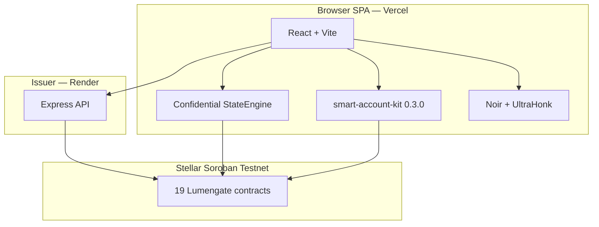

# Lumengate

Privacy-preserving compliance for Stellar. Prove eligibility with zero-knowledge proofs, authorize settlement with passkeys and smart accounts, and optionally shield EURC using Stellar Confidential Tokens.

**Network:** Stellar Soroban testnet only — not mainnet.

**Production:** [lumengatex.vercel.app](https://lumengatex.vercel.app) · Issuer API [lumengate-issuer.onrender.com](https://lumengate-issuer.onrender.com)

**Canonical documentation:** [`docs/LUMENGATE_MASTER_DOCUMENTATION.md`](docs/LUMENGATE_MASTER_DOCUMENTATION.md) — complete technical reference for the repository.

---

## What Lumengate Is

Lumengate is a full-stack application that lets users:

1. Create a **passkey-authorized smart account** (`C…` Soroban contract account)
2. Obtain a **Private Financial Passport** (issuer credential + browser-local UltraHonk proof)
3. Enable a **7-day delegated session** so repeated operations do not require passkey prompts
4. Settle **USDC, EURC, and RWA** under compliance policy with scoped nullifier anti-replay
5. Register, shield, merge, send, and unshield **confidential EURC** (Stellar Confidential Token Developer Preview)
6. Generate **receipts**, **viewing keys**, and **auditor disclosures** for regulated review

Settlement is signed by the smart account via WebAuthn or delegated session — not by a seed phrase wallet for compliant operations.

---

## Why It Exists

Regulated finance requires proof of eligibility. Publishing identity attributes on-chain destroys privacy. Lumengate separates:

| Proven on-chain | Kept private |
|-----------------|--------------|
| Scoped nullifier, policy ID, Merkle roots | Accreditation, jurisdiction, sanctions, age inputs |
| Public settlement amount, from, to (compliant path) | Eligibility attributes |
| Pedersen commitments (confidential EURC) | Plaintext private balances |

---

## Architecture



| Component | Technology | Host |
|-----------|------------|------|
| Frontend | React 18, Vite 5, TypeScript | Vercel |
| Issuer | Node 20, Express | Render |
| Contracts | Rust, soroban-sdk 26.0.1, stellar-accounts 0.7.2 | Stellar testnet |
| Proving | Noir 1.0.0-beta.9, bb.js 0.87.0 | Browser (COOP/COEP) |

Repository at commit `e423435`: **205** git commits, **19** Soroban contracts, **21** issuer HTTP routes, **13** frontend pages, **91** React components, **57** automation scripts, **1** CI workflow.

---

## Features (implemented)

### Zero-knowledge eligibility

- Noir circuits: `circuits/lumengate` (policy 1), `circuits/proof_of_funds` (policy 2)
- UltraHonk proofs generated in-browser; verified on `PolicyVerifier` via external Soroban verifiers
- Scoped nullifiers per asset: RWA (1), USDC (2), EURC (3)

### Smart accounts and passkeys

- Per-user `LumengateSmartAccount` deployed via OpenZeppelin `smart-account-kit`
- WebAuthn secp256r1 signer + `CompliancePolicy` on context rule 0
- AuthPayload with explicit `context_rule_ids` (verified by `scripts/verify_passkey_auth_encoding.sh`)

### 7-day sessions

- Delegated Ed25519 session signer installed as context rule
- Session signs shield, merge, confidential send, marketplace settlement without WebAuthn
- Enable requires two passkey approvals: bind session proof, then install session rule

### Confidential EURC

- Implements Stellar [Confidential Token Developer Preview](https://stellar.org/blog/developers/developer-preview-confidential-tokens-on-stellar)
- Shield, merge, private transfer, unshield with client-side StateEngine
- Hybrid sync: issuer `/ct/events` + Soroban RPC
- Receipts default to **"Shielded amount"** for privacy

### Compliance and audit

- Issuer-signed credentials with dynamic Merkle commitments
- Client-built proof receipts with on-chain event extraction (raw RPC parser for testnet)
- Viewing keys (`lgvk_…`) and disclosure packs stored via issuer API
- Auditor portal at `/app/auditor`

---

## Repository Layout

| Path | Contents |
|------|----------|
| `app/` | Vite/React frontend |
| `issuer-service/` | Express issuer API |
| `contracts/` | 19 Soroban Rust contracts |
| `circuits/` | Noir sources + confidential VK artifacts |
| `scripts/` | Deploy, verify, regression scripts |
| `vendor/rs-soroban-ultrahonk/` | UltraHonk Soroban verifier |
| `deployments.json` | Testnet contract addresses |
| `docs/` | Documentation — start with `LUMENGATE_MASTER_DOCUMENTATION.md` |

---

## Quick Start

### Prerequisites

- Node.js 20+
- Rust + `stellar` CLI (for contracts)
- `nargo` + `bb` (for circuit builds)
- Playwright deps for e2e: `npx playwright install-deps chromium`

### Issuer service

```bash
cp issuer-service/.env.example issuer-service/.env
cd issuer-service && npm install && npm start
```

### Frontend

```bash
cp app/.env.example app/.env.local
cd app && npm install && npm run dev
```

Vite dev server sets COOP/COEP headers (`app/vite.config.ts`) required for in-browser proving.

### Contracts and circuits

```bash
bash scripts/build_contracts.sh
bash scripts/build_circuit.sh
bash scripts/deploy_testnet.sh   # requires configured .env keys
```

---

## Deployment

| Service | Platform | Config |
|---------|----------|--------|
| Frontend | Vercel | `app/vercel.json`, `VITE_*` env vars |
| Issuer | Render | `render.yaml`, `issuer-service/` env |

Sync env to hosts:

```bash
node scripts/sync_vercel_env.mjs
node scripts/sync_render_env.mjs
```

Set `VITE_PASSKEY_RP_ID` to your production hostname. See [`docs/ENVIRONMENT.md`](docs/ENVIRONMENT.md).

---

## Testing

```bash
npm test                                          # TypeScript + issuer syntax
cd app && npm run build
bash scripts/verify_passkey_auth_encoding.sh      # AuthPayload simulation
node scripts/verify_ct_sync.mjs                   # CT indexer routing
cd app && npm run test:e2e                        # Playwright (25 tests, not in CI)
```

CI (`.github/workflows/ci.yml`): `npm test`, app build, passkey encoding verify, confidential token smoke (`continue-on-error`).

Manual acceptance checklist: `node scripts/ct_passkey_validation.mjs`

Full test enumeration: [`docs/FINAL_TEST_REPORT.md`](docs/FINAL_TEST_REPORT.md)

---

## Security

- Scoped nullifier anti-replay on settlement (`PolicyVerifier.verify`)
- Session proof binding required before policy enforcement (`SessionStore` + `CompliancePolicy`)
- WebAuthn user verification required (stellar-accounts 0.7.2)
- Revoke API protected by `REVOKE_API_KEY`
- Relayer rate-limited (30 requests/minute/IP)

**Limitations:** Testnet only. Session uses Default context rule (broader than per-contract `CallContract` rules). Session UI revoke clears local storage only; on-chain rules expire at ledger TTL.

Details: [`docs/LUMENGATE_MASTER_DOCUMENTATION.md`](docs/LUMENGATE_MASTER_DOCUMENTATION.md) §22–24.

---

## Privacy

- Eligibility attributes stay in ZK private inputs; on-chain public inputs are roots, policy ID, asset ID, action ID, nullifier
- Confidential EURC hides balances and transfer amounts via Pedersen commitments on-chain; plaintext openings remain in browser storage
- Receipts hide confidential amounts by default
- Selective disclosure via viewing keys — auditors verify claims without public identity linkage

---

## Documentation

| Document | Purpose |
|----------|---------|
| [**LUMENGATE_MASTER_DOCUMENTATION.md**](docs/LUMENGATE_MASTER_DOCUMENTATION.md) | **Start here** — complete technical reference |
| [PASSKEY_SMART_ACCOUNT_IMPLEMENTATION_GUIDE.md](docs/PASSKEY_SMART_ACCOUNT_IMPLEMENTATION_GUIDE.md) | Passkey sessions, context rules, bug catalog |
| [CONFIDENTIAL_TOKENS_ON_STELLAR.md](docs/CONFIDENTIAL_TOKENS_ON_STELLAR.md) | Confidential EURC vs Developer Preview |
| [FINAL_TEST_REPORT.md](docs/FINAL_TEST_REPORT.md) | Verified test enumeration |
| [PROJECT_HISTORY.md](docs/PROJECT_HISTORY.md) | Git milestones and fixes |
| [ENVIRONMENT.md](docs/ENVIRONMENT.md) | All environment variables |
| [ROOT_CAUSE_SYNC_REPORT.md](ROOT_CAUSE_SYNC_REPORT.md) | CT sync root-cause analysis |

Index: [`docs/README.md`](docs/README.md)

---

## Official References

- [OpenZeppelin Stellar Smart Accounts](https://docs.openzeppelin.com/stellar-contracts/accounts/smart-account)
- [OpenZeppelin Context Rules](https://docs.openzeppelin.com/stellar-contracts/accounts/context-rules)
- [Stellar Confidential Tokens Developer Preview](https://stellar.org/blog/developers/developer-preview-confidential-tokens-on-stellar)
- [Stellar Smart Wallets Guide](https://developers.stellar.org/docs/build/guides/contract-accounts/smart-wallets)

---

## License

No `LICENSE` file is present in this repository at commit `e423435`.
