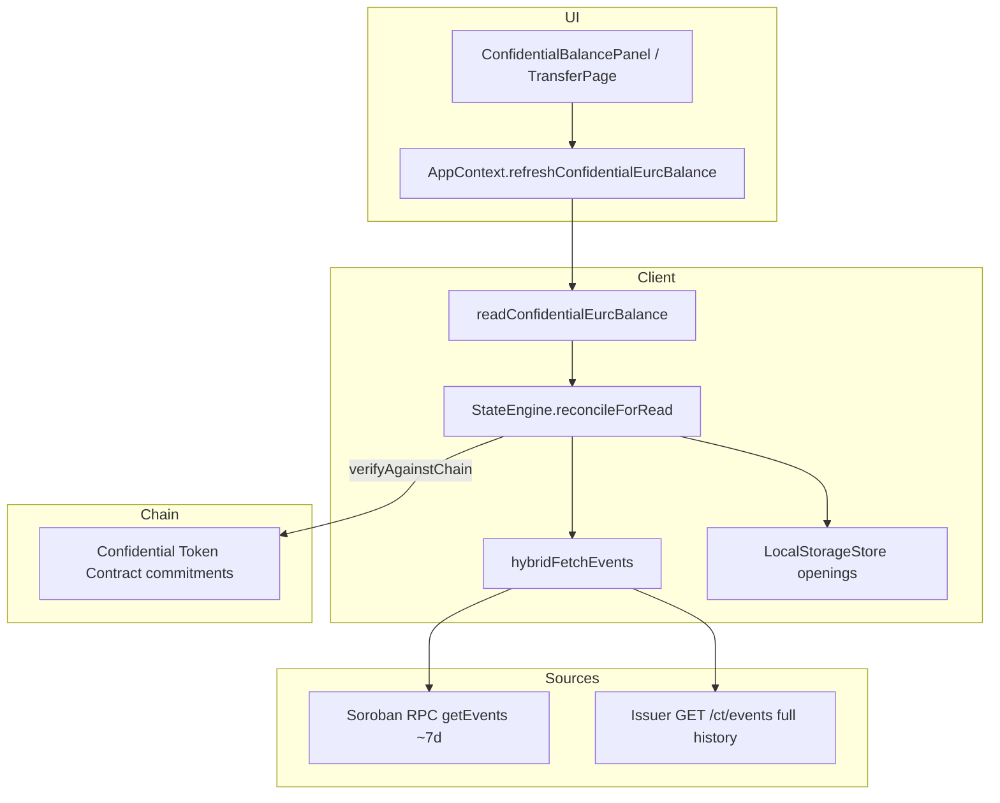
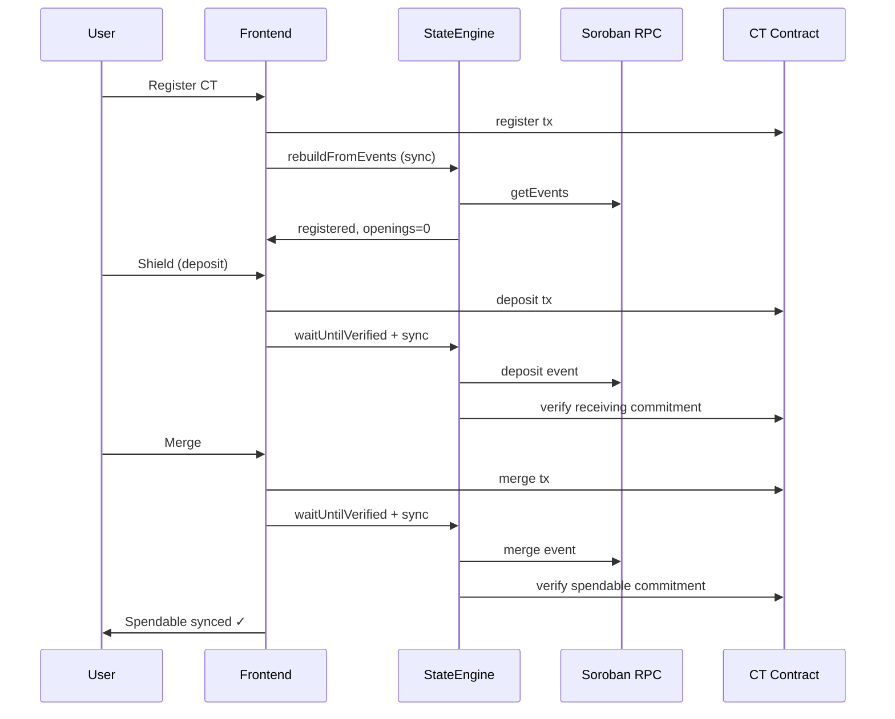
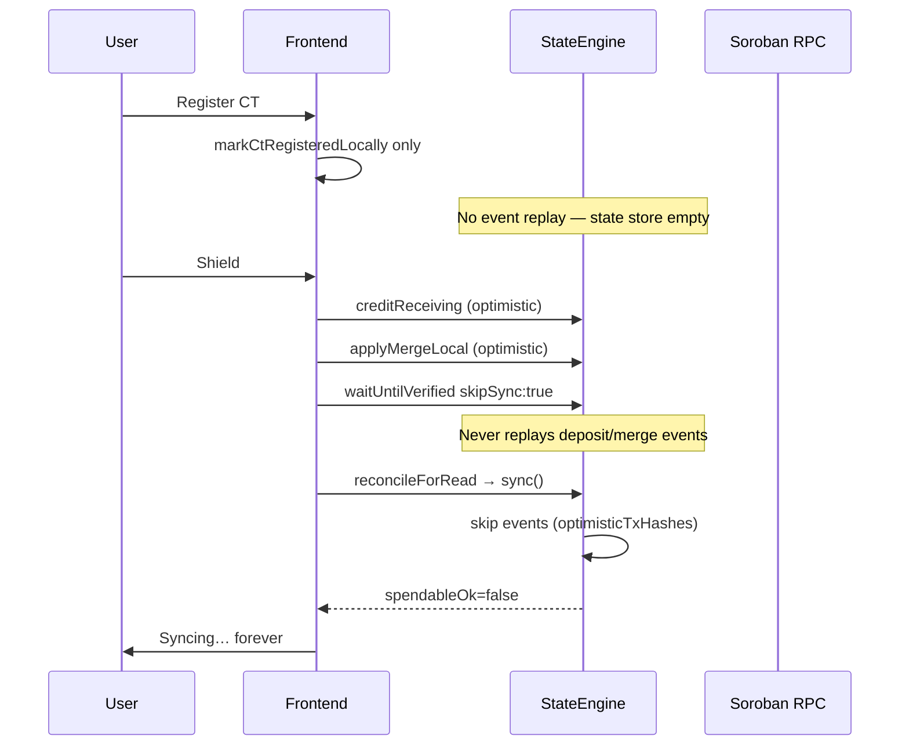

# ROOT CAUSE SYNC REPORT — Confidential EURC (Passkey Accounts)

**Date:** 2026-06-30  
**Scope:** New passkey-only smart accounts stuck on `Syncing…` / merge errors; old accounts work.  
**Environment:** Stellar testnet, Lumengate deployment (`lumengatex.vercel.app`)

---

## Executive Summary

**Root cause (first divergence):** After CT `register`, new accounts never ran an **authoritative event replay** (`StateEngine.rebuildFromEvents()` / demo-style `engine.sync()`), while deposit/merge used **optimistic local openings** (`creditReceiving` / `applyMergeLocal`) with `skipSync: true`. When Soroban event indexing lagged or optimistic state diverged, `sync()` **skipped** correcting events via `optimisticTxHashes`, leaving spendable openings unverifiable forever on the read path.

**Compounding misconfiguration:** `VITE_CONFIDENTIAL_INDEXER_URL` pointed at the issuer service (`…/ct`), but the client used the **Goldsky Worker** `IndexerClient` (`/contracts/:id/events`). That path returns **404**, so hybrid backfill silently failed for all pre-window history.

**Fix applied:** (1) `IssuerCtIndexerClient` for `/ct/events`, (2) mandatory `initializeCtStateFromEvents()` after register, (3) deposit/merge flows now wait on **event sync** (demo parity), (4) `reconcileForRead` always attempts one authoritative rebuild.

---

## Architecture



---

## Sequence — Correct Path (Demo / Old Working Account)



---

## Sequence — Broken Path (New Passkey Account, Pre-Fix)



---

## First Divergence

| Step | Old / Working | New / Stuck (pre-fix) |
|------|---------------|------------------------|
| 1 Smart account ready | ✓ C-address + passkey | ✓ Same |
| 2 CT register tx | ✓ On-chain | ✓ On-chain |
| 3 **Post-register state init** | **`engine.sync()` / cached openings** | **`markCtRegisteredLocally` only — no `rebuildFromEvents`** ← **FIRST DIVERGENCE** |
| 4 Deposit | Event applied via sync | Optimistic `creditReceiving`, events skipped |
| 5 Merge | Event applied via sync | Optimistic `applyMergeLocal`, `skipSync:true` |
| 6 verifyAgainstChain | ✓ | ✗ spendableOk false |
| 7 UI | Shielded / send OK | `Syncing…` / merge error |

---

## Evidence

### E1 — Indexer API mismatch (404)

```bash
curl -sS -o /dev/null -w "%{http_code}" \
  "https://lumengate-issuer.onrender.com/ct/contracts/CD6GQ…/events"
# → 404

curl -sS "https://lumengate-issuer.onrender.com/ct/events?fromLedger=3352000"
# → 200, pre-decoded events JSON
```

- Config: `app/.env.example` line 66 — `VITE_CONFIDENTIAL_INDEXER_URL=…/ct`
- Wrong client: `app/src/lib/confidentialBalance.ts` (pre-fix) used `IndexerClient`
- Goldsky API contract: `app/src/lib/confidentialToken/chain/indexer.ts` lines 99–106

### E2 — Missing post-register initialization

- Demo reference: `stellar-confidential-token-demo/packages/app/lib/wallet.ts` — `refresh()` always calls `engine.sync()`
- Lumengate (pre-fix): `registerConfidentialEurcAccount` only called `markCtRegisteredLocally` — `app/src/lib/confidentialFlow.ts`

### E3 — Optimistic path blocked event repair

- `StateEngine.apply()` skips events when `optimisticTxHashes` contains tx hash — `engine.ts` lines 92–96
- Shield used `skipSync: true` — `confidentialFlow.ts` (pre-fix) `waitUntilVerified` options
- `reconcileForRead` deferred rebuild when `hadOptimistic` — `engine.ts` (pre-fix)

### E4 — On-chain timelines (issuer index)

**Working C-address (old pattern):** `CCGBAVANUVPWBNHPARLLUGREUQF737DTJMABGEWBWIJHQ6AWQHEGYVY3`

| Ledger | Event | Tx (prefix) |
|--------|-------|-------------|
| 3353211 | register | d07604fc… |
| 3355259 | deposit | 9fcaec61… |
| 3355275 | merge | 955efe31… |
| 3356535 | transfer | e72a4d0e… |

**Cold-start C-address with deposit+merge:** `CAL4ADYGVPUUWPAFCTAZKSAFY4DYB3P6BPMSBUGAF426BA5TJDUOJ57M`

| Ledger | Event |
|--------|-------|
| (register earlier) | register |
| 3353519 | deposit |
| 3353525 | merge |

---

## RPC / Indexer / Cache Traces

| Trace ID | Stage | Result |
|----------|-------|--------|
| `hybrid.indexer.backfill_failed` | IndexerClient → `/ct/contracts/…/events` | 404, `old=[]` |
| `engine.sync` | eventCount varies | Events skipped when optimistic markers set |
| `engine.verify` | spendableOk | false when openings ≠ chain commitments |
| `app.refresh.result` | spendableSynced | false → UI `Syncing…` |

Enable browser diagnostics:

```js
localStorage.setItem('lumengate:ct:diagnostics', '1')
```

---

## Fix Direction (Implemented)

| File | Change |
|------|--------|
| `app/src/lib/confidentialToken/chain/issuer-indexer.ts` | **New** — `IssuerCtIndexerClient` for `GET /ct/events` |
| `app/src/lib/confidentialBalance.ts` | Route indexer to issuer adapter; add `initializeCtStateFromEvents()` |
| `app/src/lib/confidentialFlow.ts` | Post-register init; deposit/merge use event `waitUntilVerified` (no optimistic skip) |
| `app/src/lib/confidentialToken/state/engine.ts` | Always one `rebuildFromEvents` in `reconcileForRead`; diagnostic traces |
| `app/src/lib/ctSyncDiagnostics.ts` | Structured `[ct-sync]` logging |
| `scripts/verify_ct_sync.mjs` | Automated regression checks |

---

## Regression Tests

```bash
# Typecheck
cd app && npm test

# Issuer + RPC sync wiring
node scripts/verify_ct_sync.mjs
```

---

## Validation Matrix (10 Fresh Passkey Users)

Manual-assisted checklist — **each user must complete without stuck states:**

| # | Passkey create | Trusted device | Register CT | Shield | Merge | Private send | Recipient merge | Withdraw | Pass? |
|---|----------------|----------------|-------------|--------|-------|--------------|-----------------|----------|-------|
| 1 | | | | | | | | | |
| 2 | | | | | | | | | |
| … | | | | | | | | | |
| 10 | | | | | | | | | |

**Fail criteria:** Any persistent `Syncing…`, `Checking…`, `Waiting…`, or `Reading…` on dashboard/send after operation completes.

**Automated pre-check (CI/local):** `node scripts/verify_ct_sync.mjs` — must pass before manual round.

---

## References

- OpenZeppelin Stellar Confidential Token design (local clone): `/tmp/lumengate-confidential-research/stellar-contracts/packages/tokens/src/confidential/docs/DESIGN.md`
- Demo SDK state reconstruction: `/tmp/lumengate-confidential-research/stellar-confidential-token-demo/packages/sdk/README.md`
- Stellar RPC `getEvents` retention: Stellar docs — recent-ledger API (~7 days)
- Lumengate issuer indexer: `issuer-service/lib/confidentialIndexer.js`
