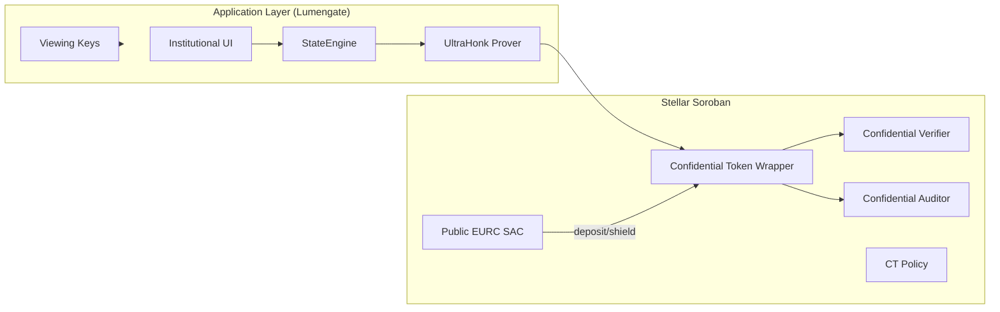

# Confidential Tokens on Stellar — Lumengate Implementation

**Document class:** Feature comparison and implementation reference  
**Baseline:** `main` @ `a8fed62` (2026-06-30)  
**Official preview:** [Stellar Developer Preview — Confidential Tokens](https://stellar.org/blog/developers/developer-preview-confidential-tokens-on-stellar)

This document explains how Lumengate implements the Stellar Confidential Token Developer Preview, compares it feature-by-feature to the reference architecture, and describes the institutional UX extensions built on top.

---

## Architecture Overview



**Key principle:** Stellar stores **commitments and verified proofs**, not plaintext balances. Privacy remains application-layer: the browser holds openings `(v, r)` and reconstructs spendable balance from events. The chain verifies Pedersen commitments and UltraHonk proofs at settlement time.

---

## Feature Comparison

| Developer Preview capability | Lumengate implementation | Status |
|------------------------------|--------------------------|--------|
| **Wrapper architecture** | Confidential token contract wraps public EURC SAC (`deployments.json` → `confidential_token.token`); deposit/withdraw to SAC | ✓ |
| **Shield (deposit)** | `shieldConfidentialEurc()` → `buildCtDepositTransaction` → on-chain `deposit` | ✓ |
| **Merge** | `mergeConfidentialEurc()` → `buildCtMergeTransaction`; shield auto-merges | ✓ |
| **Spendable balance** | `StateEngine.openSpendable(bTilde, sigma)` verified vs `confidential_balance` | ✓ |
| **Confidential transfers** | `executeConfidentialEurcSettlement()` → `confidential_transfer` + transfer circuit proof | ✓ |
| **Hidden balances** | Pedersen commitments on-chain; plaintext only in browser LocalStorage | ✓ |
| **Hidden transfer amounts** | Transfer events carry commitments, not plaintext amounts | ✓ |
| **Public counterparties** | `from` / `to` addresses visible in transfer events (Stellar model) | ✓ |
| **Viewing keys** | `generateViewingKey()` → `lgvk_…`; scoped to receipt/disclosure | ✓ |
| **Auditor Portal** | `/app/auditor` + `POST /disclose`; CT decrypt via `CtAuditorPanel` | ✓ |
| **Selective Disclosure** | Disclosure JSON packs + CT disclosure circuits in `confidentialToken/disclosure/` | ✓ |
| **Compliance** | Passport + `PolicyVerifier` before CT ops; registration requires EURC scope proof | ✓ |
| **Passport** | Same issuer credential + scoped nullifier as compliant settlement | ✓ |
| **Policy engine** | `confidential_token.policy` + Lumengate `CompliancePolicy` on smart account | ✓ |
| **Session UX improvements** | 7-day delegated session — no passkey per shield/merge/send | ✓ Lumengate extension |
| **Institutional workflow** | StageProgress rails, dashboard register panel, auto-shield on send | ✓ Lumengate extension |

---

## Contract Deployment

From `deployments.json` (testnet):

| Role | Key | Implementation |
|------|-----|----------------|
| Token wrapper | `confidential_token.token` | Lumengate confidential token WASM |
| Verifier | `confidential_token.verifier` | `ConfidentialVerifierContract` — VK registry |
| Auditor | `confidential_token.auditor` | `ConfidentialAuditorContract` — auditor keys |
| Policy | `confidential_token.policy` | CT policy contract |
| Underlying | `eurc_sac` | Public EURC SAC |

Deploy script: `scripts/deploy_confidential_token.sh`. Verification keys: `circuits/confidential/vks/` (aligned with OpenZeppelin `stellar-contracts` confidential circuits).

---

## Cryptography

### Pedersen Commitments

On-chain `confidential_balance` returns encrypted commitment bytes for:

- `spendable_balance`
- `receiving_balance`

The client reconstructs openings `(v, r)` such that:

```
commit(v, r) == onchain_commitment
```

Implementation: `app/src/lib/confidentialToken/crypto/` — Grumpkin curve, Poseidon2 (`constants.ts` aligned with OZ `packages/tokens/src/confidential/circuits`).

**Spendable opening after owner operations:**

```typescript
// engine.ts — openSpendable(bTilde, sigma)
v = bTilde - Poseidon2(ENC_BAL, [viewing_public_key, sigma])
r = deriveSpendR(viewing_public_key, sigma)
```

**Receiving:** cumulative sum from `deposit` events + incoming `transfer` decryption via `decryptIncoming(rE, vTilde, sigma)`.

### UltraHonk Proofs

| Operation | Circuit artifact | Prover |
|-----------|------------------|--------|
| Register | `public/confidential-circuits/register.json` | `proveCtCircuit('register')` |
| Transfer | `public/confidential-circuits/transfer.json` | `proveCtCircuit('transfer')` |
| Withdraw | `public/confidential-circuits/withdraw.json` | `proveCtCircuit('withdraw')` |

Prover: `app/src/lib/confidentialToken/proving/prover.ts` — `@aztec/bb.js` UltraHonk, keccak transcript, synchronous backend option for browser stability.

Proof size: 14,592 bytes (`ULTRA_HONK_PROOF_BYTES` in `contracts.ts`) — verified on-chain via `ConfidentialVerifier`.

### Noir Role

Noir defines circuit constraints for register, transfer, and withdraw. Compiled artifacts ship as JSON in `app/public/confidential-circuits/`. Witness builders in `app/src/lib/confidentialToken/witness/` populate private inputs from local state and chain reads.

Passport eligibility uses a **separate** Noir circuit (`public/circuit/lumengate.json`) — not the CT circuits, but the same UltraHonk verifier stack on `PolicyVerifier`.

### Nethermind / Soroban Verifier

On-chain verification uses the Soroban UltraHonk verifier pattern (`vendor/rs-soroban-ultrahonk`, `contracts/confidential_verifier`). The confidential token contract invokes `verify_proof` before mutating balances — observable in Stellar Expert traces (e.g. tx `2561ad3661e5c9ab…` — `verify_proof` → `transfer` event → persistent balance updates).

---

## Event Model and Balance Sync

### Event types

Parsed in `app/src/lib/confidentialToken/chain/events.ts`:

| Event | Balance effect |
|-------|----------------|
| `register` | Account registered |
| `deposit` | Increase receiving |
| `merge` | Move receiving → spendable |
| `transfer` | Update sender spendable; credit recipient receiving |
| `withdraw` | Reduce sender spendable |

### Hybrid sync

`hybridFetchEvents()` in `event-source.ts`:

1. **Issuer indexer** — `GET /ct/events` via `IssuerCtIndexerClient` (full history)
2. **Soroban RPC** — `getEvents` with pagination to chain head (~7-day retention)
3. **Dedup** — `dedupeById()` prevents double-apply

**Critical fix:** Do not use Goldsky Worker `IndexerClient` paths against issuer `/ct` host — returns 404. See `ROOT_CAUSE_SYNC_REPORT.md`.

### State engine

`StateEngine` (`engine.ts`):

- `sync()` — incremental from cursor
- `rebuildFromEvents()` — cold authoritative replay
- `verifyAgainstChain()` — commitment check
- `reconcileForRead()` — bounded read-path repair (~4.5s)
- `waitUntilVerified()` — post-tx poll (40×1500ms)

Post-register: `initializeCtStateFromEvents()` mandatory (`confidentialBalance.ts`).

---

## Operation Flows

### Register

1. Ensure EURC passport scope proof + session proof bound
2. `buildRegisterWitness()` → UltraHonk proof
3. Smart account submits `register` via session signer
4. `initializeCtStateFromEvents()`

UI: `ConfidentialBalancePanel` — 4-stage progress (`CT_REGISTER_STAGES`).

### Shield

1. `buildCtDepositTransaction` — public EURC → receiving commitment
2. `waitUntilVerified({ requireReceiving: true })`
3. Auto-merge to spendable
4. `waitUntilVerified({ requireSpendable: true })`

UI: 7-stage `CT_ACTION_STAGES` progress rail.

### Confidential Send

1. Recipient must be registered CT account (`C…` address)
2. Auto-deposit shortfall + auto-merge if needed
3. `buildTransferWitness()` → UltraHonk → `confidential_transfer`
4. Optimistic `setSpendable(witness.next)`

Requires active 7-day session (`TransferPage`).

### Unshield (Withdraw)

1. Merge if spendable insufficient but receiving available
2. `buildWithdrawWitness()` → UltraHonk → `withdraw`
3. Public EURC returned to SAC

---

## Privacy Layers

| Data | Public ledger | Lumengate UI | Auditor with viewing key |
|------|---------------|--------------|--------------------------|
| Transfer amount (CT) | Hidden (commitments) | Reveal toggle on dashboard | Scoped disclosure |
| Balances (CT) | Hidden | Local openings + verify | CT decrypt panel |
| Counterparty address | Public | Public | Reference in disclosure |
| Eligibility attributes | ZK public inputs only | Passport claims | Disclosure pack claims |
| Identity | Not on ledger | Local credential | Not in default disclosure |

---

## Selective Disclosure

**Settlement disclosures (passport/compliance):**

- `buildDisclosurePack()` — claims + proof public inputs
- Stored via `POST /disclose/store` keyed by SHA-256(viewing_key)
- Optional on-chain `AuditorRegistry.record_disclosure`

**Confidential transfer disclosures:**

- `app/src/lib/confidentialToken/disclosure/` — ZK disclosure circuits
- `CtDisclosurePanel` on compliance page

---

## Auditor Packages

`buildAuditorPackage()` in `viewingKey.ts` bundles:

- Viewing key reference
- Disclosure pack
- Settlement tx references
- Eligibility claim subset

Auditors verify via:

1. **Portal** — `AuditorPage` + `POST /disclose`
2. **Local** — paste disclosure JSON into verifier
3. **CT decrypt** — auditor secret + indexed events

On-chain: `AuditorRegistry.verify_viewing_key`.

---

## Institutional UX Extensions (Beyond Reference Demo)

| Extension | Reference demo | Lumengate |
|-----------|----------------|-----------|
| Session signing | Passkey per operation typical | 7-day delegated session |
| Registration entry point | CLI / demo wallet | Dashboard `ConfidentialBalancePanel` |
| Progress feedback | Minimal | `StageProgress` on register/shield/session |
| Auto-shield on send | Manual deposit | `executeConfidentialEurcSettlement` auto-deposit |
| Background sync | Manual refresh | AppContext 15-attempt resync timer |
| Receipt privacy | N/A | “Shielded amount” default |
| Passport gating | Basic | Full compliance stack + scoped nullifiers |
| Indexer | RPC-only or worker | Issuer `/ct/events` hybrid backfill |

SDK comment in `confidentialToken/index.ts` notes RPC-only reconstruction; Lumengate extends with hybrid indexer + optimistic idempotency.

---

## Verification Evidence

| Evidence | Reference |
|----------|-----------|
| Shield 0.2 EURC → spendable synced | User acceptance 2026-06-30, dashboard screenshot |
| Confidential send tx | Stellar Expert `2561ad3661e5c9ab…` — verify_proof + transfer + balance updates |
| Receipt privacy | “Shielded amount” in ProofReceiptHero |
| Viewing key | `lgvk_gvP5TbxF…` generated on receipt |
| Auditor portal | Eligibility record loaded from viewing key |
| Automated sync check | `node scripts/verify_ct_sync.mjs` |

---

## Production Recommendations

1. Keep issuer CT indexer synced (`POST /ct/sync` cron on Render)
2. Never route issuer URL through Goldsky Worker client
3. Always `rebuildFromEvents()` after register
4. Use `reconcileForRead` before displaying spendable
5. Require 7-day session for CT ops to reduce passkey friction
6. Default receipt to privacy-first copy for confidential settlements
7. Plan migration to `CallContract` session rules per CT contract address

---

## References

- [Stellar Confidential Tokens Developer Preview](https://stellar.org/blog/developers/developer-preview-confidential-tokens-on-stellar)
- [OpenZeppelin Stellar Contracts](https://docs.openzeppelin.com/stellar-contracts)
- OpenZeppelin confidential token design (vendored VKs): `circuits/confidential/vks/README.md`
- Lumengate RCA: `ROOT_CAUSE_SYNC_REPORT.md`
- Implementation: `app/src/lib/confidentialToken/`, `app/src/lib/confidentialFlow.ts`

---

*Document derived from codebase audit and verified testnet transactions. No speculative features included.*
