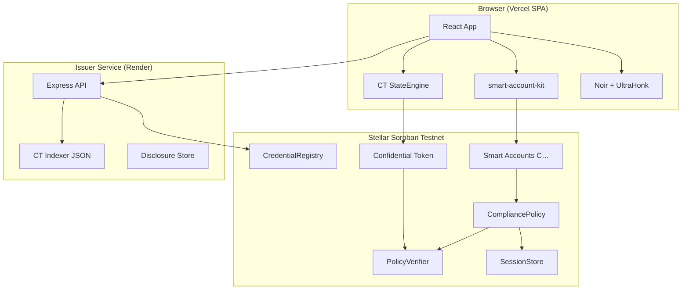

# Lumengate — Final Project Implementation Report

**Document class:** Release architecture and implementation report  
**Baseline:** `main` @ `a8fed62` (2026-06-30)  
**Network:** Stellar Soroban testnet only  
**Production:** Frontend [lumengatex.vercel.app](https://lumengatex.vercel.app) · Issuer [lumengate-issuer.onrender.com](https://lumengate-issuer.onrender.com)

---

## Executive Summary

Lumengate is a privacy-preserving compliance platform on Stellar. Users prove eligibility with zero-knowledge passports, authorize settlement through passkey smart accounts, and optionally move EURC into Stellar’s Confidential Token (Developer Preview) wrapper for shielded transfers. The system combines:

- **Browser-local proving** (Noir + UltraHonk) — eligibility and CT circuits
- **Soroban contracts** — policy verification, session store, compliance SAC admin, RWA adapter, confidential token stack
- **OpenZeppelin smart accounts** — passkey signers, context rules, delegated 7-day sessions
- **Issuer service** — credential issuance, registry sync, disclosures, CT event indexer, testnet faucet, Channels relayer

As of 2026-06-30, a fresh passkey account can complete the full lifecycle: smart account → passport → 7-day session → CT register → shield → merge → confidential send → receipt → viewing key → auditor portal — without stuck sync states.

---

## Product Vision

**Problem:** Regulated finance requires eligibility proof, but putting identity on-chain destroys privacy.

**Solution:** Lumengate separates:

| Layer | What is proven | What stays private |
|-------|----------------|-------------------|
| Passport (ZK) | Accredited, sanctions-clear, jurisdiction, age | Raw PII, wallet linkage in proof inputs |
| Compliant settlement | Scoped nullifier spent once per asset/action | Eligibility attributes |
| Confidential EURC | Balance and transfer amounts (Pedersen commitments) | Plaintext balances on ledger |
| Receipt / disclosure | Selective claims to auditors | Full identity on public ledger |

**Institutional UX goal:** Translate Stellar Developer Preview cryptography into guided flows with progress rails, trusted-device sessions, and auditor-ready artifacts.

---

## Architecture

**Privacy model for public settlement:** Amount, `from`, and `to` remain on the public ledger. Eligibility attributes stay in ZK private inputs. See `docs/CURRENT_ARCHITECTURE.md` §1.

**Privacy model for confidential EURC:** Balances and transfer amounts are hidden on-chain via Pedersen commitments; counterparties remain public addresses.

---

## Frontend

| Attribute | Value |
|-----------|-------|
| Stack | Vite 5, React 18, TypeScript, Tailwind, Framer Motion |
| Routing | `app/src/App.tsx` — `/app/welcome`, `/verify`, `/home`, `/marketplace`, `/send`, `/compliance`, `/auditor`, `/settings` |
| State | Single `AppContext` — wallet, smart account, passport, session, CT balance, receipts |
| Entry | `app/src/main.tsx` |

**Key pages:**

| Route | Page | Purpose |
|-------|------|---------|
| `/app/welcome` | WelcomePage | Passkey create / sign-in |
| `/app/verify` | VerifyPage | Smart account, passport, proof, session enable |
| `/app/home` | DashboardPage | Trusted device + confidential EURC panel |
| `/app/send` | TransferPage | Public and confidential EURC send |
| `/app/compliance` | CompliancePage | Receipts, activity, disclosure |
| `/app/auditor` | AuditorPage | Auditor portal |
| `/app/marketplace` | MarketplacePage | RWA offerings, proof-gated invest |

**Deployment:** Vercel — `app/vercel.json`, COOP/COEP headers for in-browser prover.

---

## Backend

**Single backend:** `issuer-service/` — Express on Node 20, port 3001.

| Module | Path | Role |
|--------|------|------|
| Entry | `issuer-service/server.js` | HTTP routes |
| Credentials | `lib/credentialCommitment.js` | Dynamic Merkle commitments |
| Signing | `lib/ed25519Issuer.js` | Ed25519 issuer signatures |
| Disclosures | `lib/disclose.js` | JSON store + optional on-chain record |
| CT indexer | `lib/confidentialIndexer.js` | RPC → `data/confidential_events.json` |
| Faucet | `lib/faucet.js` | Testnet asset claims |
| Relayer | `lib/relayer.js` | OpenZeppelin Channels proxy |

**Deployment:** Render — `render.yaml`, health check `/health`.

**No SQL database.** Persistence: JSON files under `issuer-service/data/`, on-chain Soroban state, browser localStorage/IndexedDB.

---

## Smart Contracts

**16 Rust crates with source** under `contracts/`. Workspace also lists `lumengate_smart_account`, `lumengate_confidential_token`, `lumengate_confidential_policy` — deployed WASM referenced in `deployments.json`; Rust sources vendored/deployed separately.

| Contract | Purpose |
|----------|---------|
| `issuer_registry` | Authorized Ed25519 issuers |
| `credential_registry` | Global Merkle roots (credential, revocation, note) |
| `policy_verifier` | UltraHonk verify/check/validate + nullifiers |
| `rwa_adapter` | SEP-57-style passport routing |
| `rwa_token` | Proof-gated internal RWA ledger |
| `compliance_sac_admin` | Proof-gated USDC/EURC SAC transfers |
| `compliant_dex` / `compliant_payroll` | Proof-gated swap and payroll |
| `compliance_policy` | OZ Policy — session proof + check_passport |
| `session_store` | Per-account bound eligibility proofs |
| `webauthn_verifier` | OZ Verifier for passkeys |
| `session_key_policy` | OZ spending limit policy (deployed, not wired in app session) |
| `auditor_registry` | Viewing key verification, disclosure records |
| `confidential_verifier` / `confidential_auditor` | OZ confidential token support contracts |
| `governance_timelock` | Timelock controller |

**Smart account WASM hash:** `deployments.json` → `lumengate_smart_account_wasm_hash`.

**Canonical addresses:** `deployments.json` (testnet).

---

## Passport System

**Flow:**

1. `POST /credential` — issuer builds commitment, syncs Merkle root, returns credential + prover inputs
2. Browser `generateProof()` — UltraHonk over `/circuit/lumengate.json`
3. Scoped nullifiers per asset — `assetScope.ts` (RWA=1, USDC=2, EURC=3)
4. On-chain verification via `PolicyVerifier` with 192-byte scoped public inputs

**Issuer policies:** `issuer-service/lib/policies.js` — general-eligibility, accredited-investor, proof-of-funds, etc.

**Lifecycle UI:** `passportLifecycle.ts`, `ProofLifecyclePanel`, `PassportRequestProgress` (4 stages).

---

## Smart Accounts

Per-user `C…` accounts deployed via `smart-account-kit`:

- **Rule 0:** Passkey signer + `CompliancePolicy`
- **Session rule:** Delegated `G…` signer + same policy, 7-day `valid_until`

Implementation: `app/src/lib/smartAccount.ts`. Contract delegate: `contracts/lumengate_smart_account/src/lib.rs` → `do_check_auth`.

**Relayer:** Passkey-only deploy via issuer `POST /relayer/submit` (OpenZeppelin Channels).

---

## Sessions

| Component | Detail |
|-----------|--------|
| Duration | 7 days / ledger TTL |
| Enable order | Bind session proof → install context rule |
| Signing | `submitWithLumengateSession()` when enabled |
| Storage | `localStorage` session key + on-chain rule |
| UI | `TrustedDeviceSessionPanel`, `PasskeyAuthorizePanel` with `SESSION_ENABLE_STAGES` |
| Revoke | Local storage clear; on-chain expiry at ledger |

See `docs/PASSKEY_SMART_ACCOUNT_IMPLEMENTATION_GUIDE.md` for full bug catalog.

---

## Confidential Tokens

Lumengate implements Stellar Confidential Token Developer Preview with institutional UX extensions. See **`docs/CONFIDENTIAL_TOKENS_ON_STELLAR.md`** for feature comparison and cryptography detail.

**Contracts (deployments.json → confidential_token):**

| Role | Contract ID key |
|------|-----------------|
| Token wrapper | `token` |
| Verifier | `verifier` |
| Auditor | `auditor` |
| Policy | `policy` |

**Client stack:** `app/src/lib/confidentialToken/` — StateEngine, hybrid event sync, UltraHonk proving, auditor decrypt, selective disclosure.

---

## Marketplace

| Component | Path |
|-----------|------|
| Offerings API | `GET /offerings`, `GET /offerings/:id` |
| Fixtures | `issuer-service/fixtures/offerings.json` + env contract IDs |
| UI | `MarketplacePage`, `OfferingDetailPage`, `MarketplaceProductCard` |
| Gating | `marketplaceActions.ts` — account, passport, scope, funds checks |
| Settlement | `signAndSubmitSettlement` + `SettlementProgressOverlay` |

---

## Receipt System

**Client-assembled** — no server receipt API.

| Component | Path |
|-----------|------|
| Builder | `app/src/lib/proofReceipt.ts` |
| UI | `CompliancePage`, `ProofReceiptHero` |
| Privacy | Confidential receipts show “Shielded amount” |
| Events | `app/src/lib/events.ts` — raw RPC parsing for testnet meta |
| Persistence | `AppContext.recordTransferTx`, session archive |

Receipt version: 2. Includes nullifier status, roots match, chain events, compliance badges, explorer links.

---

## Auditor Portal

| Layer | Implementation |
|-------|----------------|
| Viewing keys | `app/src/lib/viewingKey.ts` — `lgvk_…` prefix |
| Disclosure packs | `app/src/lib/disclosure.ts` |
| Store/query | `POST /disclose/store`, `POST /disclose` |
| On-chain | `AuditorRegistry.verify_viewing_key`, `record_disclosure` |
| UI | `AuditorPage`, `CtAuditorPanel` (CT-specific decrypt) |
| Client verify | `app/src/lib/auditor.ts` |

---

## Disclosure

Investors generate read-only viewing keys on receipts. Packs contain eligibility claims and settlement references — not raw identity. Auditors query via portal or verify JSON locally.

Confidential-token selective disclosure: `app/src/lib/confidentialToken/disclosure/`.

---

## Compliance

| Mechanism | Contract / module |
|-----------|-------------------|
| ZK eligibility | `PolicyVerifier` + UltraHonk |
| Scoped nullifiers | `(policy_id, asset_id, action_id, nullifier)` |
| Session binding | `SessionStore.set_proof` |
| Policy enforcement | `CompliancePolicy.enforce` → `check_passport` |
| SAC transfers | `ComplianceSacAdmin.transfer_compliant(_eurc)` |
| Sanctions UI | Transfer/marketplace preflight panels |

---

## APIs

**Issuer base:** `VITE_ISSUER_SERVICE_URL`

| Method | Path | Purpose |
|--------|------|---------|
| GET | `/health` | Health |
| POST | `/credential` | Issue passport |
| POST | `/registry/sync-root` | Sync eligibility root |
| GET | `/roots` | Read Merkle roots |
| POST | `/disclose/store` | Store disclosure |
| POST | `/disclose` | Query by viewing key |
| GET/POST | `/ct/events`, `/ct/sync` | CT indexer |
| POST | `/faucet/claim` | Testnet faucet |
| POST | `/relayer/submit` | Smart account relayer |

Full table: `docs/CURRENT_ARCHITECTURE.md` §7, `docs/ENVIRONMENT.md`.

---

## Database

No relational database. Storage layers:

| Store | Location | Contents |
|-------|----------|----------|
| Disclosures | `issuer-service/data/disclosures.json` | Viewing-key hashed packs |
| CT events | `issuer-service/data/confidential_events.json` | Indexed CT events |
| Faucet | `issuer-service/data/faucet_claims.json` | Claim cooldowns |
| Notes | `issuer-service/data/note_commitments.json` | Note Merkle leaves |
| Browser | localStorage / IndexedDB | Session, CT openings, viewing keys |

---

## Deployment

| Component | Host | Config |
|-----------|------|--------|
| Frontend | Vercel | `app/vercel.json`, `VITE_*` |
| Issuer | Render | `render.yaml` |
| Contracts | Testnet | `scripts/deploy_*.sh`, `deployments.json` |
| Env sync | Scripts | `sync_vercel_env.mjs`, `sync_render_env.mjs` |

**CI:** `.github/workflows/ci.yml` — npm test, build, passkey encoding verify, CT verify (continue-on-error).

---

## Security

| Control | Implementation |
|---------|----------------|
| Nullifier anti-replay | `PolicyVerifier.verify` spends scoped nullifiers |
| Session proof binding | Smart account auth requires bound proof except `set_proof` |
| Passkey UV | Required for WebAuthn (`userVerification: 'required'`) |
| AuthPayload integrity | Canonical map order; rule IDs in digest |
| Revoke API | `POST /revoke` with `REVOKE_API_KEY` |
| AccessControl | OZ roles on admin contracts |
| Confidential amounts | Hidden in UI receipts by default |

**Limitations:** Testnet only. Default session context rule is broader than `CallContract` per-contract rules. UI session revoke is local-only.

---

## Testing

| Type | Command | Coverage |
|------|---------|----------|
| Typecheck | `npm test` | App TS + issuer syntax |
| Build | `cd app && npm run build` | Production bundle |
| Passkey encoding | `bash scripts/verify_passkey_auth_encoding.sh` | AuthPayload simulation |
| CT sync | `node scripts/verify_ct_sync.mjs` | Indexer routing |
| CT on-chain | `bash scripts/verify_confidential_token.sh` | Contract smoke |
| E2E | `cd app && npm run test:e2e` | 3 Playwright specs (not in CI) |
| Manual | `node scripts/ct_passkey_validation.mjs` | 10-user passkey matrix |

Full enumeration: **`docs/FINAL_TEST_REPORT.md`**.

---

## Known Limitations

1. **Testnet only** — Friendbot, faucet, no mainnet deployment
2. **Default session rule** — product-wide scope; production should migrate to `CallContract` rules
3. **Session revoke** — clears local key; on-chain rule expires at ledger only
4. **Playwright not in CI** — e2e requires manual or pipeline extension
5. **Rust contract tests** — exist on disk, not wired to CI/npm
6. **RPC event retention** — ~7 days; issuer indexer backfills history
7. **Two passkey prompts** — session enable (bind + install) and USDC send after RWA-scoped verify bind
8. **Confidential policy/token Rust sources** — not in repo tree; WASM deployed externally

---

## Future Work

1. Migrate session rules to per-contract `CallContract` allowlists
2. Wire `session_key_policy` spending limits for delegated sessions
3. Add Playwright e2e to CI with testnet mocks
4. Mainnet deployment checklist (no Friendbot, explicit signer funding)
5. Hardware security module integration for issuer Ed25519 key
6. Multi-auditor disclosure policies
7. Confidential USDC parity (currently EURC-focused in UI)

---

## Related Documents

| Document | Purpose |
|----------|---------|
| `docs/PASSKEY_SMART_ACCOUNT_IMPLEMENTATION_GUIDE.md` | Passkey, sessions, bug catalog |
| `docs/CONFIDENTIAL_TOKENS_ON_STELLAR.md` | CT feature comparison |
| `docs/FINAL_TEST_REPORT.md` | Test enumeration |
| `docs/PROJECT_HISTORY.md` | Milestone timeline |
| `docs/CURRENT_ARCHITECTURE.md` | Operational architecture SOT |
| `docs/ENVIRONMENT.md` | Environment variables |
| `ROOT_CAUSE_SYNC_REPORT.md` | CT sync RCA |

---

*Report generated from repository audit @ `a8fed62`. Cross-checked against git history, npm test, agent codebase review, and user acceptance testing 2026-06-30.*
