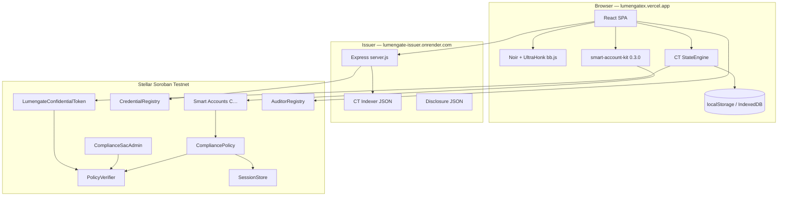
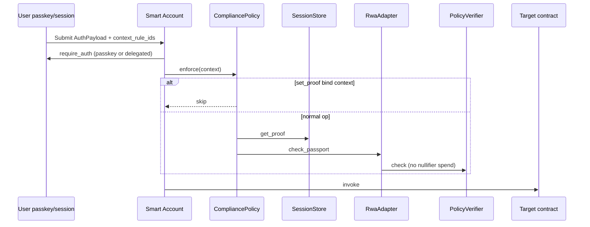
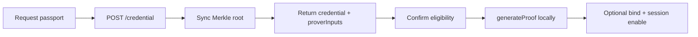
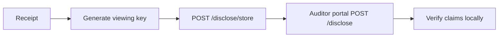
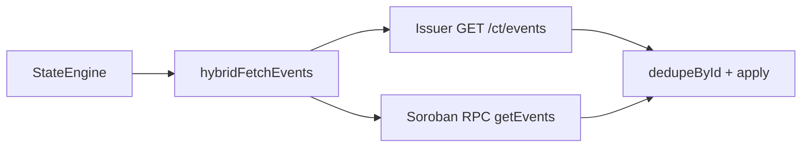
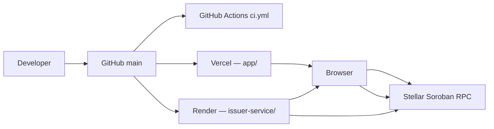
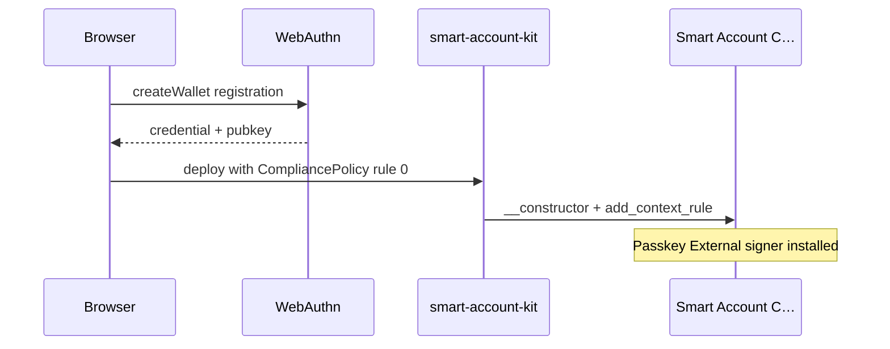
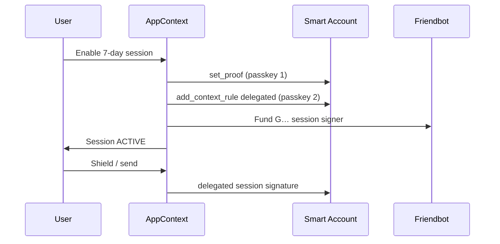
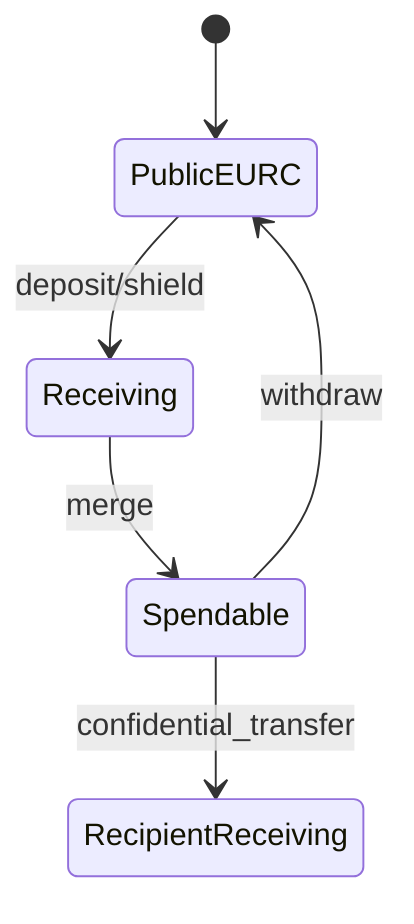

# Lumengate Master Documentation

**Document class:** Canonical technical reference for the entire repository  
**Status:** Single source of truth — supersedes all other project documentation when conflicts arise  
**Repository:** [github.com/goat-dev8/Lumengate](https://github.com/goat-dev8/Lumengate)  
**Baseline commit:** `e423435` (2026-06-30)  
**Network:** Stellar Soroban **testnet only** (not mainnet)  
**Production URLs:** Frontend `https://lumengatex.vercel.app` · Issuer `https://lumengate-issuer.onrender.com`

**Verification rule:** Every claim in this document was cross-checked against source code, `deployments.json`, git history, or executable test artifacts. Items marked **LIMITATION** are explicit gaps found in the repository.

---

## Table of Contents

1. [Executive Summary](#1-executive-summary)
2. [Repository Statistics](#2-repository-statistics)
3. [Problem, Solution, Vision](#3-problem-solution-vision)
4. [Complete Architecture](#4-complete-architecture)
5. [Repository Structure](#5-repository-structure)
6. [Technology Stack](#6-technology-stack)
7. [Frontend Architecture](#7-frontend-architecture)
8. [Backend Architecture](#8-backend-architecture)
9. [Smart Account Architecture](#9-smart-account-architecture)
10. [Passkey Architecture](#10-passkey-architecture)
11. [Session Architecture](#11-session-architecture)
12. [OpenZeppelin Integration](#12-openzeppelin-integration)
13. [Authorization and Compliance Flows](#13-authorization-and-compliance-flows)
14. [Passport, Credential, and Proof Flows](#14-passport-credential-and-proof-flows)
15. [Marketplace, Transfer, Receipt, Auditor Flows](#15-marketplace-transfer-receipt-auditor-flows)
16. [Confidential Token Architecture](#16-confidential-token-architecture)
17. [ZK Circuits and Verifiers](#17-zk-circuits-and-verifiers)
18. [Smart Contracts Reference](#18-smart-contracts-reference)
19. [Scripts and Tooling](#19-scripts-and-tooling)
20. [Deployment Architecture](#20-deployment-architecture)
21. [Environment Variables](#21-environment-variables)
22. [Security and Privacy Models](#22-security-and-privacy-models)
23. [Testing](#23-testing)
24. [Limitations and Trust Assumptions](#24-limitations-and-trust-assumptions)
25. [Official References](#25-official-references)

---

## 1. Executive Summary

Lumengate is a privacy-preserving compliance platform on Stellar Soroban testnet. Users obtain a **Private Financial Passport** (issuer-signed credential + browser-local UltraHonk proof), deploy a **passkey-authorized smart account** (`C…` address), optionally enable a **7-day delegated session**, and settle assets under **PolicyVerifier** nullifier rules. **Confidential EURC** extends the Stellar Confidential Token Developer Preview with shield, merge, private transfer, and unshield flows backed by a client-side **StateEngine** and hybrid event sync.

The system comprises:

- **Browser SPA** (`app/`) — React/Vite on Vercel
- **Issuer service** (`issuer-service/`) — Express on Render
- **Soroban contracts** (`contracts/`) — 19 Lumengate contract crates
- **Noir circuits** (`circuits/`) — 2 eligibility circuits + 6 confidential VK artifacts
- **Scripts** (`scripts/`, `app/scripts/`, `issuer-service/scripts/`) — 57 automation files

Settlement is **passkey smart-account-first**: Freighter (`G…`) funds the smart account but does not sign compliant settlements (`app/src/lib/smartAccount.ts`, `app/src/context/AppContext.tsx`).

---

## 2. Repository Statistics

All counts computed from repository at commit `e423435`.

| Metric | Exact count | Source |
|--------|------------:|--------|
| Git commits | **205** | `git rev-list --count HEAD` |
| Git date range | **2026-06-12** → **2026-06-30** | `git log` |
| Documentation files in `docs/` | **13** | `ls docs/*.md` |
| CI workflows | **1** | `.github/workflows/ci.yml` |
| `package.json` files | **5** | root, app, issuer-service, 2 vendor kits |
| Rust workspace members | **22** | `Cargo.toml` `[workspace.members]` |
| Soroban contract crates (`contracts/*/src/lib.rs`) | **19** | `find contracts -name lib.rs` |
| Files under `contracts/` | **54** | filesystem |
| `deployments.json` top-level keys | **30** | JSON parse |
| Issuer HTTP route handlers | **21** | `issuer-service/server.js` (11 GET, 10 POST) |
| Issuer `lib/*.js` modules | **19** | filesystem |
| Issuer runtime JSON stores | **5** | disclose, revoke, note, faucet, confidential_events |
| Issuer fixture files | **3** | credential, offerings, revoked_commitments |
| Issuer eligibility policies | **6** | `issuer-service/lib/policies.js` |
| Frontend pages (`app/src/pages/*.tsx`) | **13** | filesystem |
| Frontend components (`app/src/components/**/*.tsx`) | **91** | filesystem |
| Frontend route declarations (`App.tsx`) | **27** | grep |
| Top-level `app/src/lib/*.ts` modules | **60** | filesystem |
| Total `app/src/lib/**/*.ts` files | **99** | filesystem |
| React hooks | **4** | `app/src/hooks/` |
| Playwright e2e spec files | **3** | `app/e2e/` |
| Playwright runtime test cases | **25** | 22 smoke + 1 proof-recovery + 2 confidential-token |
| Rust `#[test]` functions in `contracts/` | **10** | ripgrep (6 files) |
| Noir source files (`.nr`) | **2** | `circuits/lumengate`, `circuits/proof_of_funds` |
| Passport circuit artifact (browser) | **1** | `app/public/circuit/lumengate.json` |
| Confidential circuit artifacts (browser) | **3** | register, transfer, withdraw JSON |
| Confidential VK JSON files | **6** | `circuits/confidential/vks/` |
| Automation scripts (sh/mjs/js/cjs) | **57** | scripts + app/scripts + issuer-service/scripts |
| Deploy shell scripts (`scripts/deploy*.sh`) | **9** | filesystem |
| Settlement asset scopes | **3** | rwa, usdc, eurc (`assetScope.ts`) |
| UltraHonk policy verifiers deployed | **2** | eligibility + proof-of-funds keys in `deployments.json` |
| Confidential token verifier deployed | **1** | `confidential_token.verifier` |
| WebAuthn verifier deployed | **1** | `webauthn_verifier` |

---

## 3. Problem, Solution, Vision

### Problem

Regulated financial activity requires proving eligibility (accreditation, sanctions, jurisdiction, age) without publishing identity attributes on a public ledger. Users also need modern authentication (passkeys) and, for EURC, optional **amount privacy** via Stellar Confidential Tokens.

### Solution

| Layer | Mechanism |
|-------|-----------|
| Identity / eligibility | Issuer-signed credential + Noir proof + UltraHonk verification on `PolicyVerifier` |
| Authentication | OpenZeppelin smart account + WebAuthn verifier + optional 7-day delegated session |
| Public settlement | Proof-gated SAC transfers (`ComplianceSacAdmin`), RWA ledger, DEX, payroll |
| Private EURC | Confidential token wrapper + client StateEngine + hybrid event sync |
| Audit | Client-built receipts, viewing keys, issuer disclosure store, auditor portal |

### Vision

Provide an **institutional workflow** on top of Stellar and OpenZeppelin primitives: guided UX (stage progress rails), session reuse, background sync, and selective disclosure — without altering the on-chain privacy guarantees of the Confidential Token Developer Preview.

---

## 4. Complete Architecture

### Data flow summary

1. **Passport:** Issuer builds commitment → syncs Merkle root on-chain → browser proves locally.
2. **Smart account:** Passkey registers → WASM deploy with CompliancePolicy → user funds `C…`.
3. **Session:** Bind proof to SessionStore → install delegated signer context rule → session key signs subsequent ops.
4. **Public send:** Scoped proof → bind if needed → `transfer_compliant` spends nullifier.
5. **Confidential EURC:** Register → shield (deposit+merge) → transfer with CT proof → optional unshield.
6. **Receipt:** Client assembles from chain events + session state → optional viewing key → issuer disclosure store.

---

## 5. Repository Structure

| Path | Role |
|------|------|
| `app/` | Vite/React frontend (Vercel) |
| `issuer-service/` | Express issuer API (Render) |
| `contracts/` | 19 Soroban Rust contracts |
| `circuits/` | Noir sources + confidential VK JSON |
| `scripts/` | Deploy, verify, regression, env sync |
| `vendor/rs-soroban-ultrahonk/` | UltraHonk Soroban verifier crate + contract |
| `vendor/stellar-contracts/` | Referenced by deploy scripts for CT VK fallback |
| `deployments.json` | Testnet contract IDs and reference tx hashes |
| `docs/` | Canonical documentation (this file is primary) |
| `.github/workflows/` | CI pipeline |
| `research/` | Stellar docs mirror and reference material |
| `target/` | Rust build output (local) |

---

## 6. Technology Stack

### Frontend (`app/package.json`)

| Component | Version |
|-----------|---------|
| React | `^18.3.1` |
| React Router | `^6.28.0` |
| Vite | `^5.4.11` |
| TypeScript | `^5.6.3` |
| `@stellar/stellar-sdk` | `^16.0.1` |
| `@noir-lang/noir_js` | `1.0.0-beta.9` |
| `@aztec/bb.js` | `0.87.0` |
| `@simplewebauthn/browser` | `^13.2.2` |
| `smart-account-kit` | `0.3.0` (vendored) |
| `@creit.tech/stellar-wallets-kit` | `^1.9.5` |
| `@playwright/test` | `^1.61.1` (dev) |

### Backend (`issuer-service/package.json`)

| Component | Version |
|-----------|---------|
| Node engine | `>=20` |
| Express | (see package-lock) |
| Runtime entry | `server.js` |

### Contracts (`Cargo.toml`)

| Crate | Version |
|-------|---------|
| `soroban-sdk` | `26.0.1` |
| `stellar-accounts` | `=0.7.2` |
| `stellar-access` | `=0.7.2` |
| `stellar-governance` | `=0.7.2` |
| Confidential token crates | `stellar-tokens` git rev `539968f…` |

---

## 7. Frontend Architecture

### Entry and routing

- **Entry:** `app/src/main.tsx` → `AppProvider` → `App.tsx`
- **Shell:** `app/src/components/layout/Shell.tsx` — sidebar navigation

### Pages (13)

| File | Route(s) | Purpose |
|------|----------|---------|
| `LandingPage.tsx` | `/` | Marketing landing |
| `WelcomePage.tsx` | `/app/welcome` | Passkey create / sign-in |
| `DashboardPage.tsx` | `/app/home` | Dashboard + confidential EURC panel |
| `VerifyPage.tsx` | `/app/verify` | Smart account, passport, proof, session |
| `MarketplacePage.tsx` | `/app/marketplace` | RWA offerings grid |
| `OfferingDetailPage.tsx` | `/app/marketplace/:offeringId` | Single offering |
| `TransferPage.tsx` | `/app/send` | Public + confidential EURC send |
| `CompliancePage.tsx` | `/app/compliance` | Receipts, activity, disclosure |
| `AuditorPage.tsx` | `/app/auditor` | Auditor portal |
| `AdminPage.tsx` | `/app/admin` | Operator revoke panel |
| `SettingsPage.tsx` | `/app/settings` | User settings |
| `PortfolioPage.tsx` | *(unrouted — redirects via App)* | Legacy portfolio |
| `ActivityPage.tsx` | *(redirect to compliance tab)* | Legacy activity |

### Components (91) by directory

| Directory | Count | Primary responsibility |
|-----------|------:|------------------------|
| `product/` | 31 | Passkey, session, CT, passport, funding panels |
| `fintech/` | 16 | Wallet connect, forms, financial UI |
| `marketing/` | 14 | Landing sections |
| `design/` | 7 | StageProgress, pills, passport hero |
| `dashboard/` | 6 | Dashboard widgets |
| `education/` | 5 | Diagrams, explainers |
| `ui/` | 4 | Button, base UI |
| `compliance/` | 1 | ProofReceiptHero |
| `layout/` | 2 | Shell, app layout |
| `lumengate/` | 2 | Auditor workflow diagram |
| `marketplace/` | 1 | Product card |
| `send/` | 2 | Settlement progress overlay |

### State management

**Single context:** `app/src/context/AppContext.tsx` exposes wallet, smart account, passport, proof lifecycle, session, confidential balance, settlement, receipts, and activity.

**Persistence modules:**

| Module | Storage |
|--------|---------|
| `session.ts` | Wallet session localStorage |
| `passkeySession.ts` | Passkey-first session |
| `confidentialToken/state/browser-store.ts` | CT openings (`lumengate:ct:state:…`) |
| `viewingKey.ts` | Viewing keys per receipt tx |
| `activity.ts` | Activity log |

### Key library modules (60 top-level + `confidentialToken/` subtree)

| Module | Purpose |
|--------|---------|
| `smartAccount.ts` | Passkey smart account + 7-day session |
| `contracts.ts` | Soroban reads/writes, bind proof, settlement txs |
| `prover.ts` | Passport Noir/UltraHonk proving |
| `confidentialFlow.ts` | CT register/shield/merge/unshield/send orchestration |
| `confidentialBalance.ts` | CT balance read, indexer routing, init |
| `proofReceipt.ts` | Receipt assembly |
| `disclosure.ts` / `disclosureApi.ts` | Disclosure packs + issuer API |
| `viewingKey.ts` | Viewing key generation |
| `auditor.ts` | Client-side auditor verification |
| `onChainContextRules.ts` | Smart account rule reads |
| `passkeyCeremony.ts` | Serialized WebAuthn prompts |
| `assetScope.ts` | Scoped nullifiers per asset |
| `proofLifecycle.ts` | On-chain nullifier sync |
| `events.ts` | Raw RPC receipt event parsing |

---

## 8. Backend Architecture

### Entry point

`issuer-service/server.js` — loads `../.env`, initializes Ed25519 issuer, mounts 21 HTTP routes, listens on `HOST:PORT` (default `0.0.0.0:3001`).

### HTTP API (21 endpoints)

| Method | Path | Purpose |
|--------|------|---------|
| GET | `/health` | Service health + issuer pubkey |
| GET | `/relayer/status` | OpenZeppelin Channels relayer status |
| POST | `/relayer/submit` | Submit smart-account XDR via Channels |
| GET | `/faucet/status` | Per-asset faucet availability |
| POST | `/faucet/claim` | Claim testnet USDC/EURC/XLM/treasury |
| GET | `/roots` | Read/sync credential Merkle roots |
| GET | `/issuer` | Issuer metadata |
| GET | `/issuer/:id` | On-chain issuer lookup |
| POST | `/revoke` | Revoke credential (API key) |
| GET | `/policies` | List 6 eligibility policies |
| GET | `/offerings` | RWA marketplace offerings |
| GET | `/offerings/:id` | Single offering |
| POST | `/registry/sync-root` | Sync wallet eligibility root |
| POST | `/credential` | Issue passport credential |
| POST | `/smart-account/passkeys` | Admin `add_passkey` invoke |
| POST | `/pof/nullifier` | Proof-of-funds nullifier helper |
| POST | `/disclose/store` | Store disclosure pack |
| POST | `/disclose` | Query disclosures by viewing key |
| GET | `/ct/deployments` | Confidential token deployment config |
| GET | `/ct/events` | List indexed CT events |
| POST | `/ct/sync` | Pull CT events from Soroban RPC |

### Issuer lib modules (19)

See `issuer-service/lib/` — credential commitment, Ed25519 signing, Soroban admin, note Merkle, disclosure, confidential indexer, faucet, relayer, SAC liquidity, Poseidon fields, offerings, revoke, issuer registry lookup.

### Storage (no SQL)

Runtime JSON under `issuer-service/data/`: `disclosures.json`, `confidential_events.json`, `note_commitments.json`, `faucet_claims.json`, `revoked_commitments.json`.

---

## 9. Smart Account Architecture

### Contract

`contracts/lumengate_smart_account/src/lib.rs` — `LumengateSmartAccount`:

- `__constructor` installs context rule 0: passkey `External` signer + `CompliancePolicy`
- `__check_auth` delegates to OpenZeppelin `do_check_auth`
- `AuthPayload` signature type with explicit `context_rule_ids`

**WASM hash (testnet):** `df911f9fd998495cb41bd39f4254b70acfde8dc6e86f230fb139481e3247b969` (`deployments.json`)

### Client integration

`app/src/lib/smartAccount.ts`:

- `createPersonalSmartAccount()` — WebAuthn registration + deploy via kit
- `patchDeployWithCompliancePolicy()` — rule 0 with `{ adapter, policy_id, session_store }`
- Deploy salt: `hash(credentialId)`; deployer seed: `openzeppelin-smart-account-kit`

### Settlement owner

`app/src/lib/settlementOwner.ts` — prefers smart account `C…` over funding wallet `G…`.

---

## 10. Passkey Architecture

### WebAuthn flow

| Step | Implementation |
|------|----------------|
| Registration | `kit.createWallet()` with hooks in `smartAccount.ts` |
| User handle | `passkeyUserHandle.ts` — truncated hash of wallet address |
| Key data | 65-byte secp256r1 pubkey + credential id bytes |
| Authentication | `passkeyCeremony.ts` serializes prompts |
| On-chain verify | `WebauthnVerifierContract` (`contracts/webauthn_verifier`) |

**Requirements:** `userVerification: 'required'` (stellar-accounts 0.7.2 UV bit — issue #3117).

### Verifier contract

Deployed: `CAQK36HSHDHLH3XKAP6GTMPCPBFDP362A3V7XUEZRYKCD2LJBW76ACTH`

---

## 11. Session Architecture

### 7-day delegated session

| Constant | Value | Source |
|----------|-------|--------|
| `LUMENGATE_SESSION_DAYS` | 7 | `smartAccount.ts` |
| Storage key | `lumengate.smartAccount.session.v1:{address}` | localStorage |
| Session signer | Random Ed25519 `G…` keypair | `getOrCreateLumengateSession()` |

### Enable order (required)

1. **Bind eligibility** — `SessionStore.set_proof` (CompliancePolicy exempt)
2. **Install rule** — `add_context_rule` with `Delegated(sessionPubkey)` + CompliancePolicy
3. **Fund signer** — Friendbot on testnet (`ensureDelegatedSessionAccountExists`)

Orchestration: `AppContext.enableLumengateSession()` → progress stages `bind-eligibility` → `install-session` → `done`.

### Signing during session

`submitSmartAccountOperation()` → if session enabled → `submitWithLumengateSession()` → `kit.multiSigners.operation` with `resolveSessionContextRuleIdsForEntry`.

**No WebAuthn** during shield, merge, confidential send, or marketplace settlement when session valid.

### Revoke

`revokeLumengateSession()` clears localStorage only. On-chain rule expires at `valid_until` ledger.

---

## 12. OpenZeppelin Integration

### Traits implemented in Lumengate contracts

| Contract | OpenZeppelin trait |
|----------|-------------------|
| `CompliancePolicy` | `stellar_accounts::policies::Policy` |
| `SessionKeyPolicyContract` | `Policy` → spending limit (**deployed, not wired in app session**) |
| `WebauthnVerifierContract` | `stellar_accounts::verifiers::Verifier` |
| `TimelockController` | `stellar_governance::timelock::Timelock` |
| `ConfidentialVerifierContract` | `stellar_tokens::confidential::verifier::ConfidentialVerifier` |
| `ConfidentialAuditorContract` | `stellar_tokens::confidential::auditor::ConfidentialAuditor` |

### Context rules

| Rule | Type | Signers | Policies | When |
|------|------|---------|----------|------|
| 0 (deploy) | Default | Passkey External | CompliancePolicy | Account creation |
| Session | Default | Delegated G… | CompliancePolicy | After enable session |

**Production recommendation (documented in code comments):** migrate session to `CallContract(address)` per target contract. Current product uses Default for breadth.

### AuthPayload

Vendored kit `0.3.0` — canonical ScVal map order. Verified by `scripts/verify_passkey_auth_encoding.sh`.

References: [Smart Accounts](https://docs.openzeppelin.com/stellar-contracts/accounts/smart-account), [Context Rules](https://docs.openzeppelin.com/stellar-contracts/accounts/context-rules), [Authorization Flow](https://docs.openzeppelin.com/stellar-contracts/accounts/authorization-flow).

---

## 13. Authorization and Compliance Flows

### CompliancePolicy (`contracts/compliance_policy/src/lib.rs`)

- `enforce` reads bound proof from SessionStore, calls `RwaAdapter.check_passport` (non-consuming)
- **Exempt:** `SessionStore.set_proof` only (`is_session_bind_context`)

### PolicyVerifier modes

| Function | Spends nullifier |
|----------|-----------------|
| `verify` | Yes |
| `check` | No |
| `validate` | No (ignores spent) |

Scoped public inputs require length ≥ 192 bytes: root, rev_root, policy_id, asset_id, action_id, nullifier at defined offsets.

### Asset scopes (`assetScope.ts`)

| Asset | asset_id | action_id |
|-------|----------|-----------|
| rwa | 1 | 1 |
| usdc | 2 | 1 |
| eurc | 3 | 1 |

---

## 14. Passport, Credential, and Proof Flows

### Issuer policies (6)

`general-eligibility`, `accredited-investor`, `us-jurisdiction`, `sanctions-clear`, `age-verified`, `proof-of-funds` — `issuer-service/lib/policies.js`.

### Proof lifecycle

`proofLifecycle.ts` — on-chain source of truth via `PolicyVerifier.is_scoped_nullifier_spent`. States: `none`, `ready`, `consumed`, `invalid`.

### Passport UI stages

`PassportRequestProgress` — 4 stages: connect → sync registry → issue → ready.

---

## 15. Marketplace, Transfer, Receipt, Auditor Flows

### Marketplace

- Offerings: `GET /offerings` + `fixtures/offerings.json`
- Gating: `marketplaceActions.ts`
- Settlement: `signAndSubmitSettlement` + `SettlementProgressOverlay`

### Transfer (public)

- USDC/EURC via `ComplianceSacAdmin.transfer_compliant(_eurc)`
- Requires scoped proof; typically **two passkey steps on send** if Verify bound RWA scope and send needs USDC scope (different nullifier digest)

### Transfer (confidential EURC)

- `TransferPage` → `executeConfidentialEurcSettlement()` in `confidentialFlow.ts`
- Requires: CT registered, session enabled, recipient CT registered (`C…`)

### Receipt

- **Client-built** — `proofReceipt.ts`, no server receipt API
- Version 2; includes nullifier status, chain events, compliance badges
- Confidential: displays **"Shielded amount"** (`ProofReceiptHero.tsx`)

### Viewing keys

- Format: `lgvk_` + base64url (`viewingKey.ts`)
- Stored: `POST /disclose/store` keyed by SHA-256(viewing key)

### Auditor

- Page: `/app/auditor` — paste disclosure JSON or query by viewing key
- On-chain: `AuditorRegistry.verify_viewing_key`, `record_disclosure`
- CT-specific: `CtAuditorPanel` + `confidentialToken/auditor/decrypt.ts`

---

## 16. Confidential Token Architecture

Implements [Stellar Confidential Token Developer Preview](https://stellar.org/blog/developers/developer-preview-confidential-tokens-on-stellar) with Lumengate UX extensions. See comparison table below.

### Deployed contracts (`deployments.json → confidential_token`)

| Role | Contract ID |
|------|-------------|
| Token | `CD6GQ4ZMC3VOE4QZJY32IGXRNOESZGLCZDRLD2PNWZSMKLMH2XR3MLZ6` |
| Verifier | `CDT6OHHRX2WK45A7RXAFCAA3ETOOYWD67N4XEUZN7BDRR7NOYSUNB2GO` |
| Auditor | `CCUMCSQOSLI2VHE4FIGYATSEPBUDMPFNDLUQH753HIOFKECH435QKNEW` |
| Policy | `CBBGGAKMHHDQKLF2ER4HAB6ATIEGZZ75CNAADKQJRP6E34HMNQQ72274` |
| Underlying EURC SAC | `CCEO6CAXLBLBOPES32MALMYLOJPHSK477WZH6ZOOHECV4IKLUCTZKU25` |
| Deploy ledger | `3352000` |

### Wrapper model

Public EURC SAC → `deposit` → confidential receiving balance → `merge` → spendable → `confidential_transfer` → recipient receiving → `withdraw` → public SAC.

### Client StateEngine (`confidentialToken/state/engine.ts`)

| State field | Meaning |
|-------------|---------|
| `spendable {v,r}` | Opening for spendable commitment |
| `receiving {v,r}` | Opening for incoming balance |
| `registered` | Account registered on-chain |
| `cursor` | Event sync cursor |

| Method | Purpose |
|--------|---------|
| `apply(event)` | Replay one CT event |
| `sync()` | Incremental from cursor |
| `rebuildFromEvents()` | Cold authoritative replay |
| `verifyAgainstChain()` | Commitment check vs `confidential_balance` |
| `reconcileForRead()` | Bounded read-path repair (~4.5s) |
| `waitUntilVerified()` | Post-tx poll (40×1500ms) |

### Hybrid event sync

**Critical routing (`confidentialBalance.ts`):** If indexer URL is issuer `/ct`, use `IssuerCtIndexerClient` — **not** Goldsky Worker `IndexerClient` (404 on issuer host). Documented in `ROOT_CAUSE_SYNC_REPORT.md`.

### Operations (implemented)

| Operation | Client function | On-chain |
|-----------|-----------------|----------|
| Register | `registerConfidentialEurcAccount` | `register` + UltraHonk proof |
| Shield | `shieldConfidentialEurc` | `deposit` + auto `merge` |
| Merge | `mergeConfidentialEurc` | `merge` |
| Private send | `executeConfidentialEurcSettlement` | `confidential_transfer` |
| Unshield | `unshieldConfidentialEurc` | `withdraw` |

UI: `ConfidentialBalancePanel.tsx` on dashboard (register, shield, merge, unshield, session panel).

### Developer Preview feature comparison

| Developer Preview | Lumengate | Evidence |
|-------------------|-----------|----------|
| Wrapper architecture | ✓ EURC SAC wrapper | `deployments.json`, `confidentialSettlement.ts` |
| Shield | ✓ deposit | `shieldConfidentialEurc` |
| Merge | ✓ | `mergeConfidentialEurc`, auto-merge in shield |
| Private transfer | ✓ | `executeConfidentialEurcSettlement` |
| Hidden balances | ✓ Pedersen commitments | `verifyAgainstChain` |
| Hidden transfer amounts | ✓ | transfer event schema |
| Public counterparties | ✓ addresses in events | Stellar model |
| Viewing keys | ✓ `lgvk_…` | `viewingKey.ts` |
| Auditor | ✓ portal + CT decrypt | `AuditorPage`, `CtAuditorPanel` |
| Selective disclosure | ✓ JSON packs + CT circuits | `disclosure.ts`, `confidentialToken/disclosure/` |
| Compliance / passport | ✓ scoped proof before register | `ConfidentialBalancePanel` |
| UltraHonk | ✓ bb.js + Soroban verifier | `proving/prover.ts`, on-chain `verify_proof` |
| Noir | ✓ register/transfer/withdraw artifacts | `app/public/confidential-circuits/` |
| State reconstruction | ✓ StateEngine | `engine.ts` |
| Hybrid sync | ✓ issuer + RPC | `event-source.ts`, `issuer-indexer.ts` |
| Institutional workflow | ✓ StageProgress, session, dashboard register | UI components |

**Not claimed:** Features absent from code (e.g. mainnet deploy, privacy pool integration — `privacy_pool` address in `deployments.json` has **no references** in `app/src` or `issuer-service`).

### Pedersen commitments

Client crypto: `confidentialToken/crypto/` — Grumpkin, Poseidon2, `commit(v,r)` verified against on-chain `spendable_balance` / `receiving_balance`.

### Background sync

`AppContext.refreshConfidentialEurcBalance()` — when `!spendableSynced`, retries up to **15** times with exponential backoff (2s–12s).

### Recovery

- `proof-recovery.spec.ts` — stale consumed credential UX
- `rebuildFromEvents()` after verification failure
- `optimisticTxHashes` skip to prevent double-apply (`engine.ts`)

---

## 17. ZK Circuits and Verifiers

### Noir circuits (2 source files)

| Circuit | Path | Policy | Browser artifact |
|---------|------|--------|------------------|
| Eligibility | `circuits/lumengate/src/main.nr` | policy_id 1 | `app/public/circuit/lumengate.json` |
| Proof of funds | `circuits/proof_of_funds/src/main.nr` | policy_id 2 | (prover inputs via issuer) |

Build: `scripts/build_circuit.sh`, `scripts/build_pof_circuit.sh`.

### Confidential circuits (3 browser artifacts)

`app/public/confidential-circuits/register.json`, `transfer.json`, `withdraw.json`.

### Verifier contracts (4 deployed types)

| Verifier | Address key | Purpose |
|----------|-------------|---------|
| UltraHonk eligibility | `ultrahonk_verifier_eligibility` | Passport policy 1 |
| UltraHonk PoF | `ultrahonk_verifier_pof` | Proof-of-funds policy 2 |
| Confidential verifier | `confidential_token.verifier` | CT register/transfer/withdraw proofs |
| WebAuthn | `webauthn_verifier` | Passkey signatures |

Routing hub: `PolicyVerifier` → external UltraHonk contracts for passport proofs.

Proof byte length: **14592** (`ULTRA_HONK_PROOF_BYTES` in `contracts.ts`).

---

## 18. Smart Contracts Reference

### All 19 Lumengate contracts

| Contract | Struct | Purpose |
|----------|--------|---------|
| `issuer_registry` | `IssuerRegistry` | Authorized Ed25519 issuers |
| `credential_registry` | `CredentialRegistry` | Merkle roots (credential, revocation, note) |
| `policy_verifier` | `PolicyVerifier` | UltraHonk verify/check/validate + nullifiers |
| `rwa_adapter` | `RwaAdapter` | SEP-57-style passport routing |
| `rwa_token` | `RwaToken` | Proof-gated RWA ledger |
| `compliance_sac_admin` | `ComplianceSacAdmin` | Proof-gated USDC/EURC SAC transfers |
| `compliant_dex` | `CompliantDex` | Proof-gated swap |
| `compliant_payroll` | `CompliantPayroll` | Proof-gated payroll |
| `compliance_policy` | `CompliancePolicy` | Smart account Policy hook |
| `session_store` | `SessionStore` | Bound eligibility proofs |
| `webauthn_verifier` | `WebauthnVerifierContract` | Passkey verification |
| `session_key_policy` | `SessionKeyPolicyContract` | Spending limit policy (**not app-wired**) |
| `governance_timelock` | `TimelockController` | Timelock admin |
| `auditor_registry` | `AuditorRegistry` | Viewing keys + disclosure records |
| `confidential_verifier` | `ConfidentialVerifierContract` | CT VK registry |
| `confidential_auditor` | `ConfidentialAuditorContract` | CT auditor keys |
| `lumengate_confidential_token` | `LumengateConfidentialToken` | CT wrapper |
| `lumengate_confidential_policy` | `LumengateConfidentialPolicy` | CT policy |
| `lumengate_smart_account` | `LumengateSmartAccount` | Passkey smart account |

### Addresses in `deployments.json` without Lumengate crate in repo tree

`privacy_pool`, `asp_membership`, `privacy_pool_verifier` — IDs present; **no application code references** found in `app/src` or `issuer-service`.

---

## 19. Scripts and Tooling

**Total automation files: 57**

| Category | Count | Examples |
|----------|------:|---------|
| Deploy (`scripts/deploy*.sh`) | 9 | `deploy_testnet.sh`, `deploy_confidential_token.sh`, `deploy_v3_contracts.sh` |
| Verify | 6 | `verify_passkey_auth_encoding.sh`, `verify_ct_sync.mjs`, `verify_confidential_token.sh` |
| Integration / regression | 5 | `regression_test.sh`, `api_integration_test.sh`, `ct_integration_test.sh` |
| Circuit build | 2 | `build_circuit.sh`, `build_pof_circuit.sh` |
| Env sync | 3 | `sync_vercel_env.mjs`, `sync_render_env.mjs` |
| App scripts | 6 | `test-sync-prove.mjs`, `ct_register_account.mjs`, `verify-receipt-rpc.mjs` |
| Issuer scripts | 3 | `test_normalize_and_submit.js`, etc. |

---

## 20. Deployment Architecture

| Component | Host | Config file |
|-----------|------|-------------|
| Frontend | Vercel | `app/vercel.json` |
| Issuer | Render | `render.yaml` (rootDir: `issuer-service`) |
| Contracts | Testnet | `scripts/deploy_*.sh`, `deployments.json` |

**Vercel headers:** COOP `same-origin`, COEP `credentialless` — required for in-browser UltraHonk prover.

---

## 21. Environment Variables

**Authoritative list:** `docs/ENVIRONMENT.md`

**Categories:**

| Prefix | Consumer |
|--------|----------|
| `VITE_*` | Frontend build (Vercel) |
| Unprefixed / issuer vars | `issuer-service/server.js` + lib modules |
| `CONTRACT_ADMIN_SECRET_KEY` | Soroban admin ops |
| `CHANNELS_*` | OpenZeppelin relayer |
| `CONFIDENTIAL_*` | CT indexer + deployment |

Root `.env` loaded by issuer at startup (`server.js` lines 42–61). Frontend reads `app/.env.local` / Vercel env at build time via `app/src/lib/config.ts`.

---

## 22. Security and Privacy Models

### Security model

| Control | Implementation |
|---------|----------------|
| Nullifier anti-replay | `PolicyVerifier.verify` on settlement |
| Session proof binding | Required by CompliancePolicy except `set_proof` |
| Passkey UV | Required WebAuthn user verification |
| AuthPayload integrity | Canonical map + context rule IDs in digest |
| Revoke API | Bearer `REVOKE_API_KEY` |
| Relayer rate limit | 30 req/min/IP |

### Privacy model

| Data | Public ledger | Browser | Auditor (with key) |
|------|---------------|---------|-------------------|
| Eligibility attributes | ZK public inputs only | Private prover inputs | Disclosure claims |
| Settlement amount (public) | Visible | Visible | In disclosure pack |
| CT amounts | Hidden (commitments) | Openings in LocalStorage | CT decrypt |
| Counterparty | Visible | Visible | Reference only |
| Identity | Not in proof public inputs | Local credential | Not default in disclosure |

### Trust assumptions

- Issuer Ed25519 key is honest for credential issuance
- User device protects passkey and session localStorage
- Soroban RPC and issuer indexer eventually reflect confirmed events
- Testnet Friendbot availability for delegated signer funding

---

## 23. Testing

### Automated (CI — `.github/workflows/ci.yml`)

| ID | Test | Command | Status |
|----|------|---------|--------|
| AUTO-01 | TypeScript compile | `npm test` (app `tsc -b`) | Runs in CI |
| AUTO-02 | Issuer syntax | `npm test` (issuer `node --check` × 9 files) | Runs in CI |
| AUTO-03 | Frontend build | `npm run build` in app | Runs in CI |
| AUTO-04 | Passkey AuthPayload | `bash scripts/verify_passkey_auth_encoding.sh` | Runs in CI — PASS verified 2026-06-30 |
| AUTO-05 | CT on-chain smoke | `bash scripts/verify_confidential_token.sh` | CI `continue-on-error: true` |

### Playwright E2E (3 specs, 25 runtime tests — **not in CI**)

| Spec | Tests |
|------|------:|
| `smoke.spec.ts` | 22 (landing + 19 routes + verify + issuer health) |
| `proof-recovery.spec.ts` | 1 |
| `confidential-token.spec.ts` | 2 |

### Rust unit tests (10 tests — **not in CI**)

Files: `issuer_registry/test.rs` (3), `rwa_token/test.rs` (3), `credential_registry/test.rs` (1), `policy_verifier/test.rs` (1), `rwa_adapter/test.rs` (1), `compliance_sac_admin/lib.rs` (1).

### Shell integration scripts (require testnet `.env` — manual)

`regression_test.sh`, `api_integration_test.sh`, `ct_integration_test.sh`, `integration_e2e.sh`, `freighter_usdc_e2e.sh`, `verify_ct_sync.mjs`, `ct_passkey_validation.mjs`.

### Manual acceptance (PASS-001–019)

Documented in `docs/FINAL_TEST_REPORT.md`. Fresh passkey account full lifecycle verified 2026-06-30 on production with on-chain tx `2561ad3661e5c9ab2219981c065e45169c7b132f300c44bdd5057e1a8e61ecc` (confidential transfer + `verify_proof`).

---

## 24. Limitations and Trust Assumptions

### Explicit limitations found in repository

1. **Testnet only** — `README.md`, `CURRENT_ARCHITECTURE.md`; mainnet blocked for faucet
2. **Default session context rule** — broader than per-contract `CallContract` (documented in `smartAccount.ts`)
3. **Session revoke is local-only** — on-chain rule expires at ledger
4. **Playwright not in CI**
5. **Rust tests not in npm/CI pipeline**
6. **`session_key_policy` deployed but not wired** in app session setup
7. **`privacy_pool` / `asp_membership` / `privacy_pool_verifier`** in `deployments.json` — no app/issuer code references
8. **RPC event retention ~7 days** — issuer indexer backfill required (`ROOT_CAUSE_SYNC_REPORT.md`)
9. **Two passkey prompts** on session enable (bind + install rule) — by design
10. **USDC send after RWA verify** may require separate scoped proof bind — different nullifier digests

### Partially implemented (code present, not production-hardened)

- `CallContract` session rules — documented target; installer uses `Default`
- `ConfidentialEurcPanel.tsx` — exists but **not mounted**; superseded by `ConfidentialBalancePanel`

---

## 25. Official References

| Topic | URL |
|-------|-----|
| Stellar Confidential Tokens | https://stellar.org/blog/developers/developer-preview-confidential-tokens-on-stellar |
| OpenZeppelin Stellar Contracts | https://docs.openzeppelin.com/stellar-contracts |
| Smart Accounts | https://docs.openzeppelin.com/stellar-contracts/accounts/smart-account |
| Context Rules | https://docs.openzeppelin.com/stellar-contracts/accounts/context-rules |
| Authorization Flow | https://docs.openzeppelin.com/stellar-contracts/accounts/authorization-flow |
| Stellar Smart Wallets | https://developers.stellar.org/docs/build/guides/contract-accounts/smart-wallets |
| OpenZeppelin Stellar GitHub | https://github.com/OpenZeppelin/stellar-contracts |

---

## Appendix A — Mermaid Diagrams Index

Diagrams included above:

1. Complete architecture (§4)
2. Compliance authorization sequence (§13)
3. Passport flow (§14)
4. Auditor/disclosure flow (§15)
5. CT hybrid sync (§16)
6. Deployment topology (§20)

### Passkey flow

### Session flow

### Confidential token flow

---

## Appendix B — Related Documents (superseded by this file)

| Document | Relationship |
|----------|--------------|
| `docs/CURRENT_ARCHITECTURE.md` | Operational detail; defer to this master doc on conflict |
| `docs/PASSKEY_SMART_ACCOUNT_IMPLEMENTATION_GUIDE.md` | Passkey bug catalog depth |
| `docs/CONFIDENTIAL_TOKENS_ON_STELLAR.md` | CT comparison depth |
| `docs/FINAL_TEST_REPORT.md` | Test enumeration |
| `docs/PROJECT_HISTORY.md` | Git milestone timeline |
| `ROOT_CAUSE_SYNC_REPORT.md` | CT sync RCA |

---

*End of Lumengate Master Documentation. Generated from repository source at commit `e423435`. For due diligence, verify contract IDs against live `deployments.json` and on-chain state before mainnet use.*
