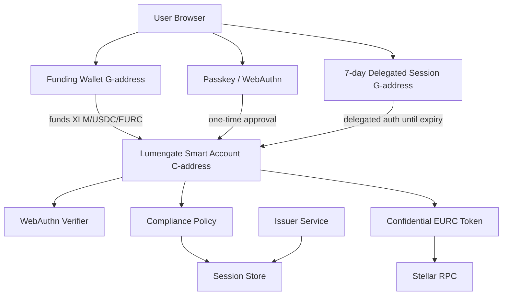
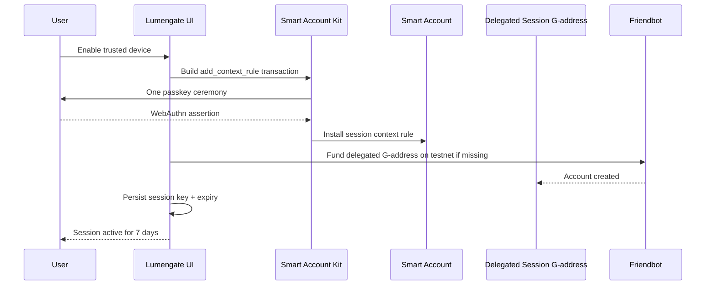
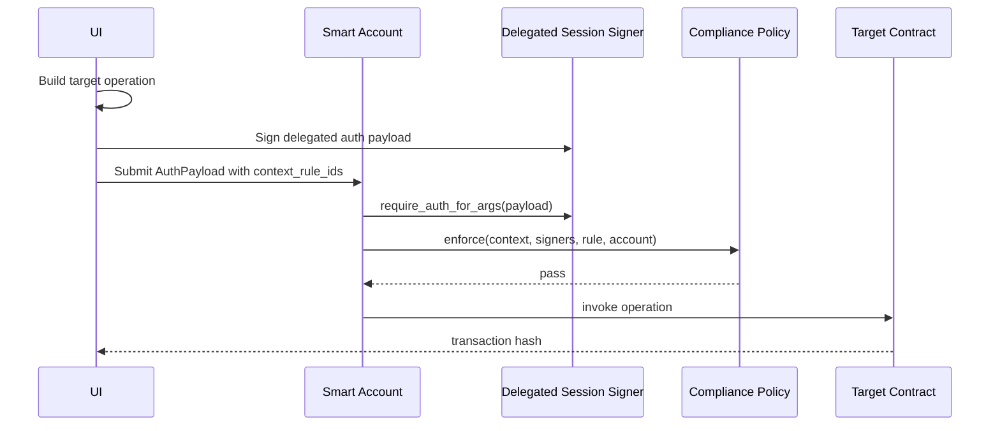
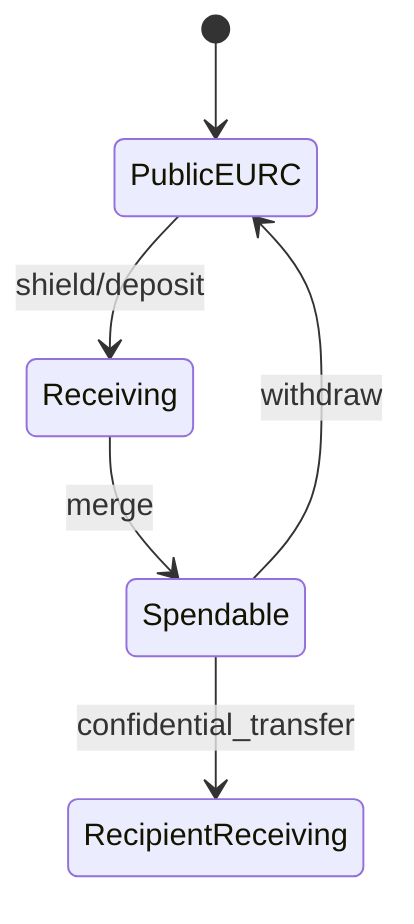
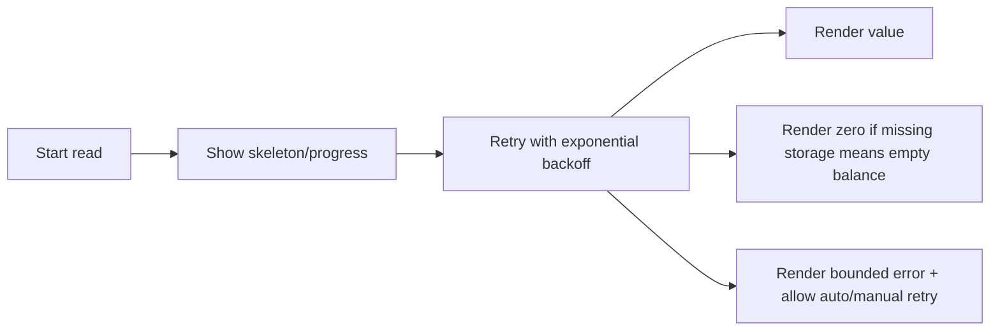

# Lumengate Passkey Smart Account Implementation Guide

**Status:** definitive implementation guide  
**Network:** Stellar testnet  
**Last updated:** 2026-06-30  
**Audience:** engineers building a passkey + smart account + confidential token product on Stellar

This guide explains the architecture Lumengate uses for passkey smart accounts, 7-day trusted-device sessions, delegated signers, confidential EURC operations, and first-user synchronization. It is written to help another team rebuild the same system from scratch without repeating the mistakes we found in production testing.

## Official References

- OpenZeppelin Stellar Contracts: https://docs.openzeppelin.com/stellar-contracts
- Smart Accounts: https://docs.openzeppelin.com/stellar-contracts/accounts/smart-account
- Context Rules: https://docs.openzeppelin.com/stellar-contracts/accounts/context-rules
- Signers and Verifiers: https://docs.openzeppelin.com/stellar-contracts/accounts/signers-and-verifiers
- Authorization Flow: https://docs.openzeppelin.com/stellar-contracts/accounts/authorization-flow
- Stellar OpenZeppelin Contracts tooling: https://developers.stellar.org/docs/tools/openzeppelin-contracts
- Stellar smart contract overview clone: `research/stellar-docs-clone/docs/build/smart-contracts/overview.mdx`

## Current Repository Anchors

- Frontend smart account integration: `app/src/lib/smartAccount.ts`
- Product auth and submission orchestration: `app/src/context/AppContext.tsx`
- Trusted-device UI: `app/src/components/product/TrustedDeviceSessionPanel.tsx`
- Confidential token flow: `app/src/lib/confidentialFlow.ts`
- Confidential state engine: `app/src/lib/confidentialToken/state/engine.ts`
- Confidential balance source: `app/src/lib/confidentialBalance.ts`
- Shield/Merge UI: `app/src/components/product/ConfidentialBalancePanel.tsx`
- Send UI: `app/src/pages/TransferPage.tsx`
- Marketplace loading/retry pipeline: `app/src/pages/MarketplacePage.tsx`, `app/src/hooks/useOfferings.ts`
- Retry helper: `app/src/lib/retry.ts`

## Dependency Snapshot

| Layer | Version / Source |
| --- | --- |
| `soroban-sdk` | `26.0.1` |
| `stellar-accounts` | `=0.7.2` |
| `stellar-contract-utils` | `=0.7.2` |
| `@stellar/stellar-sdk` | `^16.0.1` |
| `smart-account-kit` | vendored `0.3.0` |
| `smart-account-kit-bindings` | vendored `0.1.0` |
| `@simplewebauthn/browser` | app `^13.2.2`, kit `^13.3.0` |
| React | `18.3.1` |
| TypeScript | `5.6.3` |

## Why Lumengate Needed Smart Accounts

Lumengate actions are not simple wallet transfers. A user may:

- bind a private eligibility proof,
- invest in a permissioned marketplace offering,
- transfer public USDC/EURC under compliance policy,
- shield public EURC into a confidential wrapper,
- merge confidential receiving balance into spendable balance,
- send confidential EURC with a zero-knowledge proof,
- withdraw private EURC back to public EURC.

A normal Stellar `G...` account can sign transactions, but it cannot enforce programmable rules inside `__check_auth`. Lumengate needs a `C...` contract account so authorization can combine:

- a passkey signer,
- a delegated session signer,
- context rules,
- compliance policy,
- proof/session state,
- contract-specific authorization paths.

## Official Smart Account Model

OpenZeppelin Stellar smart accounts split authorization into three parts:

- **Signers:** who can authenticate. Examples: delegated `G...` accounts, delegated `C...` accounts, or external verifier-backed keys such as WebAuthn.
- **Context Rules:** where authorization applies. Examples: `Default`, `CallContract(address)`, `CreateContract(wasm_hash)`.
- **Policies:** what constraints must pass after signer authentication. Examples: compliance checks, thresholds, spending limits, rate limits.

The client supplies `context_rule_ids` in the `AuthPayload`. The rule IDs are bound into the signed digest. This prevents downgrade attacks where a signature intended for a strict rule is replayed against a weaker rule.

## Architecture Overview

## Session Lifecycle

## Transaction Flow During an Active Session

No passkey prompt appears in this flow. The passkey is only needed when installing or refreshing the trusted-device session.

## Why Repeated Passkey Prompts Happened

Repeated prompts happened when every protected action used the passkey signer directly. Each transaction needed a fresh WebAuthn assertion because the smart account had no reusable signer scoped to Lumengate operations.

That was correct cryptographically but bad product UX. Shield, merge, private send, marketplace investment, proof binding, and settlement each felt like separate approvals.

## Why Delegated Signers Solve It

A delegated signer is `Signer::Delegated(Address)`. OpenZeppelin delegates authentication to that address through `require_auth_for_args`.

Lumengate generates a session `G...` signer, installs it into the smart account context rules, and stores the session locally with an expiry. During the valid window, the app signs with the delegated session key instead of opening a WebAuthn ceremony.

Important testnet detail: a delegated `G...` address must exist on-chain. If the generated session key has no account entry, `require_auth_for_args` fails. On testnet Lumengate funds it with Friendbot in `ensureDelegatedSessionAccountExists`.

## Why Context Rules Are Required

OpenZeppelin smart accounts do not auto-discover a usable rule. The client must select exactly one rule per auth context. Without context rules:

- the smart account cannot know which signer/policy combination applies,
- the selected signer is not bound to a specific authorization scope,
- signatures could be ambiguous across operation classes.

Context rules are the routing table for authorization.

## Why `CallContract()` Is Safer Than `Default`

`Default` applies to any context. It is useful for admin-style authorization and for early product-wide session rollout because one rule can cover a broad operation set.

`CallContract(address)` applies only to calls targeting a specific contract. It is safer for production sessions because:

- a compromised session signer cannot authorize unrelated contracts,
- the UI can explain exactly which dApp/contracts are trusted,
- future contracts must be explicitly added,
- audits can reason about a smaller authorization surface.

**Recommended production shape:** install one 7-day `CallContract(address)` session rule for each Lumengate contract that should be callable during the session.

**Current Lumengate shape:** the app currently uses a 7-day product-wide `Default` session rule with compliance policy because it fixed repeated passkey prompts and matched the broad Lumengate UX requirement. Treat this as a product-wide trusted-device rule. If the contract set stabilizes, migrate to batched `CallContract` rules.

## Why Sessions Expire After 7 Days

Seven days is a product/security compromise:

- short enough that stolen device/session state naturally expires,
- long enough for repeated marketplace/send/shield operations without daily friction,
- easy to explain to users,
- implemented as `valid_until = current_ledger + ledgers_for_7_days`.

The UI shows expiry and supports revoke.

## Confidential EURC Lifecycle

Confidential transfer proofs spend only the sender's **spendable** opening. Receiving balance matters when the user wants to merge or when spendable is not enough and the app needs to use recently received private funds.

## Private Balance Synchronization

On-chain confidential token state stores commitments, not plaintext balances. The browser must keep local openings:

- `spendable = { v, r }`
- `receiving = { v, r }`

The state engine reconstructs these openings from events and verifies them against on-chain commitments:

- `commit(spendable.v, spendable.r) == onchain.spendable_balance`
- `commit(receiving.v, receiving.r) == onchain.receiving_balance`

Fresh accounts are hardest because:

- RPC event indexing can lag transaction success,
- a browser has a cold local CT cache,
- marketplace and dashboard balances may be read before the new account's ledger state is visible,
- indexer/API services may be cold.

Lumengate now handles this with:

- optimistic CT state updates after confirmed deposit/merge/transfer,
- tx-hash tracking so delayed events are not double-applied,
- rebuild from event stream when cached state fails commitment verification,
- separate `spendableSynced` and `receivingSynced` flags,
- bounded exponential retries for fresh reads,
- automatic refresh while CT state is not fully synced,
- skeletons and progress rails instead of permanent `Reading...`.

## Shield Progress UX

Shield can take time because it may involve:

1. Preparing private operation.
2. Generating local proof or eligibility material.
3. Creating the confidential deposit.
4. Waiting for Stellar confirmation.
5. Merging into spendable balance.
6. Synchronizing local openings against chain commitments.
7. Showing ready state.

The UI must always show progress. A static form during a blockchain wait looks frozen even when the system is working.

## First-User Loading Pipeline

Every first-user read follows this model:

Do not leave permanent placeholders. `Reading...` is acceptable only while an active retry is running.

## Bugs Found and Fixed

### 1. Repeated passkey prompts

**Symptom:** Shield and send asked for passkey after trusted-device enable.  
**Cause:** operations still routed through passkey signing instead of delegated session signing.  
**Fix:** `submitSmartAccountOperation` routes through the active session when possible.

### 2. Trusted device loading loop from indexer timeout

**Symptom:** Enable button stayed loading.  
**Cause:** smart-account rule discovery depended on an indexer that timed out.  
**Fix:** direct RPC rule probing with bounded simulation timeout.

### 3. Passkey ceremony deadlock

**Symptom:** enable session appeared stuck with no clear error.  
**Cause:** app wrapped `smart-account-kit.signAndSubmit`, which already runs WebAuthn, inside another passkey ceremony lock.  
**Fix:** removed nested WebAuthn wrapper.

### 4. Delegated signer account missing

**Symptom:** shield failed under session auth.  
**Cause:** delegated `G...` signer did not exist on-chain, so `require_auth_for_args` could not authenticate it.  
**Fix:** fund delegated testnet signer with Friendbot and wait for RPC visibility.

### 5. Shield timeout after successful deposit

**Symptom:** `Confidential balance sync timed out waiting for Stellar events.`  
**Cause:** optimistic deposit was applied locally, then the delayed event replay applied the same deposit again. Commitment verification failed forever.  
**Fix:** track optimistically applied tx hashes and skip matching delayed events.

### 6. Send blocked by receiving-side sync

**Symptom:** user had spendable private EURC but send failed with syncing error.  
**Cause:** Send required both spendable and receiving commitments to be synced.  
**Fix:** confidential send now requires only `spendableSynced`; receiving sync is required only when receiving funds must be merged.

### 7. New-user `Reading...` placeholders

**Symptom:** Marketplace/Dashboard cards stayed on `Reading...` for fresh users.  
**Cause:** single-shot balance/API reads failed during cold RPC or fresh ledger state.  
**Fix:** bounded exponential retries, skeletons while active, zero/error fallback afterward.

### 8. Enable 7-day session fails with Auth InvalidAction on new accounts

**Symptom:** `Re-simulation failed: HostError: Error(Auth, InvalidAction)` when clicking Enable 7-day session; event log shows `get_proof` / `add_context_rule`.  
**Cause:** `CompliancePolicy.enforce` reads `session_store.get_proof` for every smart-account auth except `session_store.set_proof`. The UI tried `add_context_rule` before binding passport eligibility.  
**Fix:** `enableLumengateSession` binds session proof first (`set_proof`, policy-exempt), then installs the Default session rule.

### 9. Weak Shield progress feedback

**Symptom:** user thought Shield froze.  
**Cause:** only a small text status changed during long blockchain/proof work.  
**Fix:** Shield/Merge/Unshield now show staged animated progress.

## Implementation Timeline

| Phase | Result |
| --- | --- |
| Initial passkey account | Smart account creation and passkey registration worked, but actions still prompted repeatedly. |
| Session UX pass | Added trusted-device UI and session status. |
| Rule discovery fix | Removed blocking dependency on indexer for session rule reads. |
| WebAuthn deadlock fix | Removed nested passkey ceremony wrapper. |
| Delegated signer fix | Funded generated session signer on testnet. |
| CT optimistic sync fix | Avoided double-applying delayed deposit/merge events. |
| Send gating fix | Split spendable and receiving sync checks. |
| Final polish | Added retry pipeline, skeletons, Shield progress rail, and this guide. |

## Build From Scratch

1. Deploy verifier and policy contracts.
2. Deploy smart account WASM that delegates `__check_auth` to OpenZeppelin `do_check_auth`.
3. Register a passkey as an `External(verifier, key_data)` signer.
4. Create a smart account for the user.
5. Fund the smart account with XLM and settlement assets.
6. Generate a delegated session key in the browser.
7. Ensure the delegated key account exists on testnet.
8. Install a 7-day context rule that includes the delegated signer and required policies.
9. Persist the session key and rule metadata locally.
10. Route protected Lumengate operations through session signing while valid.
11. Fall back to passkey signing only when the session is missing, expired, revoked, or outside scope.
12. For CT operations, maintain local openings and verify them against chain commitments.
13. Use optimistic state for post-transaction UX, but make it idempotent with tx-hash tracking.
14. Retry cold reads with bounded backoff.

## Troubleshooting

### Trusted device says off after enabling

Check:

- session key exists in local storage,
- session rule exists on-chain,
- `valid_until` is greater than current ledger,
- delegated signer matches the local session public key,
- selected `context_rule_ids` use the installed rule.

### Shield succeeds but balance does not update

Check:

- deposit tx reached `SUCCESS`,
- optimistic tx hash was stored,
- local receiving commitment verifies,
- delayed deposit event was not applied twice,
- `rebuildFromEvents()` can reconstruct the state.

### Send says spendable is syncing

Check:

- local spendable opening commits to on-chain `spendable_balance`,
- transfer event from a previous send has been applied or optimistic `setSpendable()` ran,
- stale browser cache was rebuilt from events,
- RPC is not returning old simulation state.

### Marketplace shows empty balances for a new user

Expected if the user really has no balances. Not expected if it stays loading. Check:

- `withRetry` completed,
- missing SAC storage returned zero,
- RWA balance read returned zero or a value,
- no permanent `Reading...` placeholder remains.

### Passkey appears during Shield or Send

Check:

- trusted-device session is enabled,
- delegated session signer is funded on testnet,
- submit path uses `submitSmartAccountOperation`,
- operation context matches the installed rule,
- session has not expired.

## FAQ

### Is a delegated session key less secure than a passkey?

It is a tradeoff. The passkey is stronger and user-present. The delegated key is scoped and time-limited. It improves UX for repeated operations but must expire and be revocable.

### Why not store the passkey private key?

Browsers and authenticators do not expose passkey private keys. WebAuthn returns assertions only after user presence/verification.

### Why can a confidential balance be visible locally but not on-chain?

The local UI stores plaintext openings. The chain stores commitments. A balance is safe to spend only when the local opening re-commits to the current on-chain commitment.

### Why hide confidential receipt amounts?

The ledger event may contain cryptographic data, but product receipts should be privacy-first. Lumengate records confidential settlement metadata and shows `Shielded amount` by default.

### Why does Friendbot matter?

Only on testnet. A delegated `G...` session signer must exist on-chain before OpenZeppelin delegated authentication can call `require_auth_for_args` successfully.

## Validation Checklist

Before pushing auth/session/CT changes:

- `npm test`
- `npm --prefix app run build`
- `cargo test`
- `bash scripts/ct_integration_test.sh`
- `bash scripts/verify_confidential_token.sh`
- manual or browser-assisted flow:
  - create brand new user,
  - enable trusted device,
  - shield,
  - merge,
  - private send,
  - recipient merge,
  - withdraw,
  - marketplace,
  - dashboard.

Expected results:

- one passkey prompt to enable session,
- no passkey prompt during Shield,
- no passkey prompt during Send,
- no permanent `Reading...`,
- no manual refresh required,
- confidential receipt amount hidden by default,
- balances auto-synchronize after chain/indexer lag.

## Lessons Learned

- Trust the official smart account model: signers, context rules, and policies are separate for a reason.
- `context_rule_ids` are not optional metadata; they are part of the security boundary.
- `CallContract` is the safer end state for sessions, even if `Default` is useful for a product-wide trusted-device rollout.
- Delegated signers need explicit client work because simulation does not include their auth entries automatically.
- Testnet-generated delegated `G...` signers must be funded.
- CT event streams are eventually visible; chain commitments are the verification source.
- Optimistic UI is required, but optimistic updates must be idempotent.
- Fresh users are a different class of bugs than warmed accounts.
- Never leave blockchain waits without progress, retry, and timeout.
