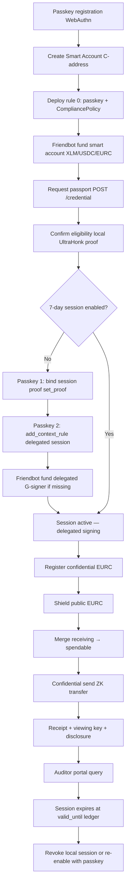

# Lumengate Passkey Smart Account Implementation Guide

**Status:** Definitive implementation reference  
**Network:** Stellar Soroban testnet  
**Baseline:** `main` @ `a8fed62` (2026-06-30)  
**Production:** [lumengatex.vercel.app](https://lumengatex.vercel.app)

This guide is the authoritative reference for Lumengate’s passkey smart accounts, OpenZeppelin context rules, 7-day delegated sessions, compliance policy integration, and the confidential EURC lifecycle. Every statement maps to repository code, git history, or verified testnet behavior.

---

## Official References

| Topic | URL |
|-------|-----|
| OpenZeppelin Stellar Contracts | https://docs.openzeppelin.com/stellar-contracts |
| Smart Accounts | https://docs.openzeppelin.com/stellar-contracts/accounts/smart-account |
| Context Rules | https://docs.openzeppelin.com/stellar-contracts/accounts/context-rules |
| Authorization Flow | https://docs.openzeppelin.com/stellar-contracts/accounts/authorization-flow |
| Stellar Smart Wallets | https://developers.stellar.org/docs/build/guides/contract-accounts/smart-wallets |
| OpenZeppelin Stellar GitHub | https://github.com/OpenZeppelin/stellar-contracts |
| Stellar Confidential Tokens (Developer Preview) | https://stellar.org/blog/developers/developer-preview-confidential-tokens-on-stellar |

---

## Repository Anchors

| Area | Path |
|------|------|
| Smart account integration | `app/src/lib/smartAccount.ts` |
| On-chain context rule reads | `app/src/lib/onChainContextRules.ts` |
| App orchestration | `app/src/context/AppContext.tsx` |
| Session proof bind tx | `app/src/lib/contracts.ts` — `buildBindSessionProofTransaction()` |
| Passkey ceremony serialization | `app/src/lib/passkeyCeremony.ts` |
| Compliance policy contract | `contracts/compliance_policy/src/lib.rs` |
| Session store contract | `contracts/session_store/src/lib.rs` |
| Smart account contract | `contracts/lumengate_smart_account/src/lib.rs` |
| WebAuthn verifier | `contracts/webauthn_verifier/src/lib.rs` |
| Vendored kit | `app/vendor/smart-account-kit/` |
| CT state engine | `app/src/lib/confidentialToken/state/engine.ts` |
| CT flows | `app/src/lib/confidentialFlow.ts`, `app/src/lib/confidentialBalance.ts` |
| Session / CT UI | `app/src/components/product/PasskeyAuthorizePanel.tsx`, `TrustedDeviceSessionPanel.tsx`, `ConfidentialBalancePanel.tsx` |

---

## Dependency Snapshot

| Layer | Version / Source |
|-------|------------------|
| `soroban-sdk` | `26.0.1` |
| `stellar-accounts` | `=0.7.2` |
| `@stellar/stellar-sdk` | `^16.0.1` |
| `smart-account-kit` | vendored `0.3.0` |
| `@simplewebauthn/browser` | app `^13.2.2` |
| React | `18.3.1` |

---

# Why Smart Accounts

Lumengate settlement is not a single wallet signature. A user may:

1. Bind a private eligibility proof to a session store
2. Install a delegated 7-day session rule
3. Invest in a permissioned marketplace offering
4. Transfer public USDC/EURC under compliance policy
5. Register for confidential EURC
6. Shield, merge, send, and unshield private EURC
7. Generate receipts, viewing keys, and auditor disclosures

A classic Stellar `G…` account can pay fees and sign transactions, but it cannot enforce programmable authorization inside Soroban `__check_auth`. Lumengate uses a `C…` smart account so authorization combines:

- **Signers** — passkey (WebAuthn) and delegated session `G…` key
- **Context rules** — where each signer/policy pair applies
- **Policies** — compliance checks against bound passport proofs

Implementation: `createPersonalSmartAccount()` in `smartAccount.ts` deploys via `smart-account-kit` with `CompliancePolicy` installed at context rule 0.

---

# Why Passkeys

Passkeys provide phishing-resistant, device-bound authentication without seed phrases. Lumengate uses WebAuthn secp256r1 keys as `Signer::External(webauthn_verifier, key_data)` on the smart account.

**Why not store a seed phrase?** Browsers and authenticators never expose passkey private keys. WebAuthn returns assertions only after user presence and verification (`userVerification: 'required'` in `smartAccount.ts`).

**Why not sign every operation with a passkey?** Correct cryptographically, unacceptable for product UX. Repeated Shield/Merge/Send operations would each trigger Face ID, fingerprint, or device PIN. The 7-day delegated session solves this (see below).

**Ceremony serialization:** `passkeyCeremony.ts` chains WebAuthn prompts so only one runs at a time — fixes deadlock when multiple flows competed for the authenticator.

---

# Why 7-Day Sessions

OpenZeppelin smart accounts support delegated signers: `Signer::Delegated(Address)`. During a valid session window, Lumengate signs `AuthPayload` with a locally stored Ed25519 session key instead of opening WebAuthn.

**Product rationale:**

| Factor | Choice |
|--------|--------|
| Security | Stolen session key expires; revocable in UI; scoped by context rule + compliance policy |
| UX | Shield, merge, private send, marketplace invest reuse session — no passkey per op |
| Explainability | “Trusted device (7 days)” with visible expiry |
| Implementation | `valid_until = current_ledger + LUMENGATE_SESSION_LEDGERS` where `LUMENGATE_SESSION_DAYS = 7` |

**Testnet requirement:** Delegated `G…` signers must exist on-chain before `Address::require_auth_for_args()` succeeds. Lumengate funds them via Friendbot in `ensureDelegatedSessionAccountExists()`.

---

# OpenZeppelin Context Rules

OpenZeppelin Stellar smart accounts split authorization into three layers ([Context Rules docs](https://docs.openzeppelin.com/stellar-contracts/accounts/context-rules)):

| Layer | Role | Lumengate examples |
|-------|------|-------------------|
| **Signers** | Who authenticates | Passkey `External(verifier, key_data)`; session `Delegated(G…)` |
| **Context rules** | Where auth applies | `Default`; future `CallContract(address)` |
| **Policies** | What must pass after auth | `CompliancePolicy` → `SessionStore` + `RwaAdapter.check_passport` |

The client supplies **`context_rule_ids`** in the `AuthPayload`. Rule IDs are bound into the signed digest via `buildAuthDigest(signaturePayload, contextRuleIds)` (`app/vendor/smart-account-kit/dist/kit/auth-payload.js`). This prevents downgrade attacks where a signature intended for a strict rule is replayed against a weaker rule.

**On-chain reads:** `onChainContextRules.ts` — `get_context_rule(id)`, `get_context_rules_count()`, bounded 10s simulation timeout.

---

# Delegated Session Signers

**Generation:** `getOrCreateLumengateSession()` → random Ed25519 keypair, persisted in `localStorage` key `lumengate.smartAccount.session.v1:{smartAccountAddress}`.

**Installation:** `ensureLumengateSessionRule()` → `kit.rules.add(createDefaultContext(), 'Lumengate Session', [createDelegatedSigner(session.publicKey)], policies, validUntil)`.

**Signing path:** `submitWithLumengateSession()` → `kit.multiSigners.operation()` with `resolveContextRuleIds: resolveSessionContextRuleIdsForEntry`. Delegated signer upserts empty signature bytes; separate auth entry signs `__check_auth` preimage.

**Routing:** `submitSmartAccountOperation()` checks `getLumengateSessionStatus().enabled` and routes to session path when valid — no passkey during protected ops.

---

# Why Explicit Context Rule IDs Are Required

OpenZeppelin smart accounts do **not** auto-select a rule. The client must pass exactly one rule ID per auth context. Without explicit IDs:

- The smart account cannot determine which signer/policy combination applies
- Signatures become ambiguous across operation classes
- Host errors such as `Error(Context, InvalidAction)` or `#3014 ContextRuleIdsLengthMismatch` occur

**Resolution logic:** `resolveSessionContextRuleIdsForEntry()` in `smartAccount.ts`:

1. If a usable Default session rule exists → same rule ID for all auth entries in the transaction
2. Else → per-contract `CallContract` rule from `bestSessionRuleId()`

---

# Why Default Rules Are Dangerous

| Context type | Scope | Risk |
|--------------|-------|------|
| **`Default`** | Any invocation context | Compromised session key can authorize unrelated contracts if policy is permissive |
| **`CallContract(addr)`** | Single target contract | Smaller blast radius; explicit allowlist per contract |

**Current Lumengate shape:** Product-wide `Default` session rule with `CompliancePolicy` — chosen to fix repeated passkey prompts and cover Shield/Merge/Send/Marketplace in one trusted-device approval.

**Recommended production shape:** One 7-day `CallContract(address)` rule per Lumengate contract (SessionStore, ComplianceSacAdmin, confidential token, marketplace adapters). Documented in this guide and `smartAccount.ts` comments; migration path when contract set stabilizes.

**Deploy-time rule 0:** Passkey + compliance at `Default` — required baseline for all smart accounts (`lumengate_smart_account/src/lib.rs` constructor).

---

# CallContract Context Rules

Lumengate’s session installer currently uses `createDefaultContext()`. The kit and `onChainContextRules.ts` also support:

- `CallContract(contract_address)` — session applies only when calling that contract
- `CreateContract(wasm_hash)` — for deploy flows

`bestSessionRuleId()` matches auth entry invoked contracts against installed `CallContract` rules. This is the safer end state documented for production hardening.

---

# Full Session Lifecycle



### Step-by-step (verified flows)

| Step | User action | System | Passkey prompts |
|------|-------------|--------|-----------------|
| Passkey | Create secure account | WebAuthn registration → deploy smart account | 1 |
| Smart account | Deploy completes | Rule 0: passkey + CompliancePolicy | (same) |
| Friendbot | Fund C-address | Faucet or Freighter transfer | 0 |
| Passport | Request passport | Issuer sync root, return credential | 0 |
| Proof | Confirm eligibility | Local Noir/UltraHonk ~30s–3min | 0 |
| Session | Enable 7-day session | Bind proof → install delegated rule | 1–2 |
| CT register | Register confidential EURC | UltraHonk register proof + on-chain register | 1 |
| Shield | Deposit + auto-merge | Deposit tx → merge tx | 0 (session) |
| Merge | Merge received | Merge tx if receiving > 0 | 0 (session) |
| Send | Confidential EURC transfer | Transfer proof + tx | 0 (session) |
| Receipt | View compliance page | Client-built receipt; amount hidden for CT | 0 |
| Disclosure | Generate viewing key | `POST /disclose/store` | 0 |
| Auditor | Enter viewing key | `POST /disclose` | 0 |
| Expiry | After 7 days | Delegated rule invalid; passkey required again | — |

**Progress UI:** `SESSION_ENABLE_STAGES` in `StageProgress.tsx` — bind eligibility → install session → done. Shown in `PasskeyAuthorizePanel` and `TrustedDeviceSessionPanel` during enable (commit `a8fed62`).

---

# Bug Catalog

Each entry: **Symptom → Root cause → Fix → Why OpenZeppelin-aligned → Lesson**

---

## Bug 1 — Passkey shown on every operation

| | |
|---|---|
| **Symptom** | Shield, merge, send, marketplace each opened WebAuthn |
| **Root cause** | `submitSmartAccountOperation` always used passkey path |
| **Fix** | Route to `submitWithLumengateSession()` when session enabled (`smartAccount.ts:1078–1088`) |
| **OZ alignment** | Delegated signers exist precisely to avoid re-prompting user-present keys |
| **Commits** | `a9e36fd`, `ccc4110` |
| **Lesson** | Session must be installed **and** submit path must actually use it |

---

## Bug 2 — Wrong Default context rule / stale deploy rule 0

| | |
|---|---|
| **Symptom** | Settlement fails after contract redeploy; policy verification errors |
| **Root cause** | On-chain rule 0 referenced superseded `CompliancePolicy` or adapter |
| **Fix** | `isSmartAccountPolicyStaleOnChain()`, `StaleSmartAccountUpgradePanel`, `LEGACY_COMPLIANCE_POLICY_IDS` |
| **OZ alignment** | Context rules bind specific policy contract addresses at install time |
| **Commits** | `1f80276`, policy redeploy scripts |
| **Lesson** | Treat smart account policy maps as versioned; detect staleness before settlement |

---

## Bug 3 — Missing delegated rule IDs / context mismatch

| | |
|---|---|
| **Symptom** | `Error(Context, InvalidAction)`, `#3014 ContextRuleIdsLengthMismatch` |
| **Root cause** | Auth entries submitted without matching `context_rule_ids` for invoked contracts |
| **Fix** | `resolveSessionContextRuleIdsForEntry()`; kit `multiSigners.operation` callback |
| **OZ alignment** | Authorization flow requires explicit rule ID binding in digest |
| **Commits** | `00b1b11`, `7cf6c02` |
| **Lesson** | Never hardcode rule id `0` for session ops if session rule is a different id |

---

## Bug 4 — Session signer account missing

| | |
|---|---|
| **Symptom** | Shield/session ops fail with auth errors under active session |
| **Root cause** | Delegated `G…` key never funded; `require_auth_for_args` fails |
| **Fix** | `ensureDelegatedSessionAccountExists()` + Friendbot on testnet |
| **OZ alignment** | Delegated authentication requires the delegated address to exist |
| **Commits** | `6a6951c` |
| **Lesson** | Simulation does not create accounts; client must fund delegated signers |

---

## Bug 5 — Friendbot repair

| | |
|---|---|
| **Symptom** | Session enable succeeds but subsequent ops fail |
| **Root cause** | Friendbot lag or 400 on already-funded account |
| **Fix** | Accept Friendbot 400; poll `getAccount` up to 12×1.5s |
| **OZ alignment** | Testnet-only convenience; mainnet throws without Friendbot |
| **Lesson** | Non-testnet must use explicit XLM funding for session signers |

---

## Bug 6 — Smart account auth failures (pre–kit 0.3.0)

| | |
|---|---|
| **Symptom** | `Error(Auth, InvalidAction)` on all passkey settlements |
| **Root cause** | Custom AuthPayload encoder incompatible with stellar-accounts 0.7 |
| **Fix** | Vendor `smart-account-kit` 0.3.0; canonical map order |
| **OZ alignment** | Use official kit AuthPayload read/write |
| **Commits** | `0fea99b`, `7cf6c02`, `9f461f7`, `00b1b11` |
| **Lesson** | Do not fork AuthPayload encoding; run `verify_passkey_auth_encoding.sh` |

---

## Bug 7 — AuthPayload map order / XDR wrap

| | |
|---|---|
| **Symptom** | Passes simulation shape, fails on submit |
| **Root cause** | Wrong ScVal map ordering or XDR-wrapped payload |
| **Fix** | Kit canonical order; removed custom `passkeyAuthPayloadV07` |
| **Commits** | `7cf6c02`, `0d2273e` |
| **Verification** | `scripts/verify_passkey_auth_encoding.sh` — PASS in CI |

---

## Bug 8 — Session activation: bind before rule install

| | |
|---|---|
| **Symptom** | Enable 7-day session → `HostError: Error(Auth, InvalidAction)`; trace shows `get_proof` during `add_context_rule` |
| **Root cause** | `CompliancePolicy.enforce()` reads `SessionStore.get_proof` for all auth **except** `set_proof`. UI called `add_context_rule` before binding proof |
| **Fix** | `AppContext.enableLumengateSession()` binds proof first, then `installLumengateSession` |
| **OZ alignment** | Policy exempts session-bind context (`is_session_bind_context` in `compliance_policy/src/lib.rs`) |
| **Commits** | `bb1f561` |
| **Lesson** | Order matters: exempt bind tx → policy sees bound proof for subsequent ops |

---

## Bug 9 — Passkey ceremony deadlock on session enable

| | |
|---|---|
| **Symptom** | Enable stuck loading; no WebAuthn prompt |
| **Root cause** | Outer `runPasskeyCeremony` wrapped `kit.signAndSubmit` which already runs WebAuthn |
| **Fix** | Removed nested wrapper (`smartAccount.ts:902–903`, `959–962`) |
| **Commits** | `af960d1` |
| **Lesson** | One WebAuthn owner per transaction — the kit |

---

## Bug 10 — Indexer timeout on rule discovery

| | |
|---|---|
| **Symptom** | Enable button loading forever |
| **Root cause** | Smart-account kit indexer URL timed out |
| **Fix** | `indexerUrl: false`; direct RPC rule probing with 10s timeout |
| **Commits** | `f852ea0`, `81000b9` |
| **Lesson** | On-chain rule reads should not depend on optional indexers |

---

## Bug 11 — Syncing bugs (confidential EURC)

| | |
|---|---|
| **Symptom** | New passkey accounts stuck on `Syncing…` forever after shield |
| **Root cause** | (1) No post-register `rebuildFromEvents`; (2) optimistic deposit/merge + `optimisticTxHashes` skipped event repair; (3) issuer `/ct` URL used with Goldsky `IndexerClient` → 404 |
| **Fix** | `IssuerCtIndexerClient`; `initializeCtStateFromEvents()`; event-authoritative sync; `reconcileForRead` always attempts rebuild |
| **Evidence** | `ROOT_CAUSE_SYNC_REPORT.md` |
| **Commits** | `cab8dd5`, `dcb728e`, `b1ad12d` |
| **Lesson** | Chain commitments are truth; optimistic UI must be idempotent |

---

## Bug 12 — Checking… / Reading… infinite state

| | |
|---|---|
| **Symptom** | Dashboard/marketplace permanent placeholders |
| **Root cause** | Single-shot reads during cold RPC; balance read blocked |
| **Fix** | `withRetry()` exponential backoff; skeletons; zero fallback; background CT resync (15 attempts) |
| **Commits** | `3ef1b76`, `e35d483`, `d588317` |
| **Lesson** | Fresh accounts are a distinct test class from warmed accounts |

---

## Bug 13 — Spendable reconstruction failure

| | |
|---|---|
| **Symptom** | Local balance wrong; `verifyAgainstChain` → `spendableOk: false` |
| **Root cause** | Missing or double-applied events; openings `(v,r)` don’t re-commit |
| **Fix** | `rebuildFromEvents()`; `openSpendable(bTilde, sigma)`; skip optimistic tx hashes in `apply()` |
| **Commits** | `cab8dd5`, `dcb728e` |
| **Lesson** | Never show spendable until commitment verifies |

---

## Bug 14 — Event replay repair

| | |
|---|---|
| **Symptom** | Stale cache after successful tx |
| **Root cause** | Incremental sync missed pre-window events |
| **Fix** | Hybrid fetch: issuer backfill + RPC seam with 60-ledger margin |
| **Files** | `event-source.ts`, `issuer-indexer.ts` |
| **Lesson** | RPC retention ~7 days; indexer fills history |

---

## Bug 15 — Merge verification

| | |
|---|---|
| **Symptom** | Merge tx succeeds but spendable not updated |
| **Root cause** | `waitUntilVerified` returned before merge event applied |
| **Fix** | `waitUntilVerified({ requireSpendable: true, afterTxHash })` after merge |
| **Commits** | `cab8dd5` |
| **Lesson** | Shield flow auto-merges; verify spendable not just receiving |

---

## Bug 16 — Optimistic UI double-apply

| | |
|---|---|
| **Symptom** | `Confidential balance sync timed out waiting for Stellar events` |
| **Root cause** | Optimistic deposit applied locally; delayed event applied again |
| **Fix** | `optimisticTxHashes` set; skip matching events in `StateEngine.apply()` |
| **Commits** | `b1ad12d`, `dcb728e` |
| **Lesson** | Optimistic updates require tx-hash idempotency |

---

## Bug 17 — Background reconciliation

| | |
|---|---|
| **Symptom** | User must manual refresh after chain lag |
| **Root cause** | No retry after initial failed sync |
| **Fix** | `AppContext` background refresh timer when `!spendableSynced` |
| **Commits** | `a9e36fd`, `cab8dd5` |
| **Lesson** | CT sync is eventually consistent — UI must poll bounded |

---

## Bug 18 — Cached confidential balance

| | |
|---|---|
| **Symptom** | Old openings shown after new tx |
| **Root cause** | `LocalStorageStore` stale without rebuild |
| **Fix** | `reconcileForRead` → rebuild on verification failure |
| **Store key** | `lumengate:ct:state:{tokenId}:` |
| **Lesson** | Cache accelerates reads; verification gates spend |

---

## Bug 19 — Event indexing delays

| | |
|---|---|
| **Symptom** | Tx SUCCESS but events not yet in RPC |
| **Root cause** | Soroban ledger lag |
| **Fix** | `waitUntilVerified` poll 40×1500ms; issuer `POST /ct/sync` |
| **Lesson** | Never treat SUCCESS as immediate event availability |

---

## Bug 20 — New-account-only bugs

| | |
|---|---|
| **Symptom** | Old accounts work; new passkey accounts fail CT/register/session |
| **Root cause** | Cold localStorage; missing init steps; wrong auth order |
| **Fix** | Composite fixes in bugs 8–19; CT register on dashboard (`a8fed62`) |
| **Validation** | `scripts/ct_passkey_validation.mjs` 10-user matrix |
| **Lesson** | Always test brand-new passkey accounts end-to-end |

---

## Bug 21 — Receipt privacy bug

| | |
|---|---|
| **Symptom** | Confidential settlement receipt showed plaintext amount |
| **Root cause** | Receipt hero used `transferResult.amount` for all assets |
| **Fix** | `isConfidentialReceipt()` → display `Shielded amount`; timeline shows “Amount private by default” |
| **Files** | `ProofReceiptHero.tsx`, `UnifiedTimeline.tsx` |
| **Commits** | `ccc4110`, `4888532` |
| **Lesson** | Product receipts are privacy-first even when chain has commitments |

---

## Bug 22 — Event parsing bug (settlement receipts)

| | |
|---|---|
| **Symptom** | Receipt missing on-chain events; nullifier evidence incomplete |
| **Root cause** | SDK union parser missed Soroban meta switch 4 on testnet |
| **Fix** | Raw JSON-RPC `getTransaction` + `parseContractEventsFromRawResponse` before SDK fallback |
| **Files** | `app/src/lib/events.ts` lines 245+ |
| **Verification** | `app/scripts/verify-receipt-rpc.mjs` |
| **Lesson** | Prefer raw RPC for receipt event extraction on testnet |

---

## Bug 23 — Settlement metadata fix

| | |
|---|---|
| **Symptom** | Receipt incomplete after confidential send; missing transfer reference |
| **Root cause** | `recordTransferTx` did not persist confidential flag and counterparty metadata |
| **Fix** | `ProofReceiptTransferResult.confidential`; `buildProofReceipt` includes asset block and compliance targets |
| **Files** | `proofReceipt.ts`, `AppContext.recordTransferTx` |
| **Commits** | `abb40ee`, `ccc4110` |
| **Lesson** | Receipt assembly is client-side — metadata must be explicit at record time |

---

## Bug 24 — Send blocked by receiving sync

| | |
|---|---|
| **Symptom** | Spendable verified but send failed “syncing” |
| **Root cause** | Send required both `spendableSynced` and `receivingSynced` |
| **Fix** | Send requires only `spendableSynced`; merge only when spending receiving |
| **Commits** | `a330eb7` |
| **Lesson** | Receiving and spendable are independent commitment slots |

---

## Bug 25 — Weak progress feedback

| | |
|---|---|
| **Symptom** | Users thought Shield/session froze during long waits |
| **Root cause** | Single status string; form hidden during passkey |
| **Fix** | `StageProgress` for session enable, CT register, shield/merge/unshield |
| **Commits** | `d588317`, `a8fed62` |
| **Lesson** | Every blockchain wait needs visible staged progress |

---

# Production Recommendations

1. **Migrate session rules to `CallContract`** per deployed Lumengate contract address
2. **Keep passkey for:** account creation, session install/refresh, proof bind when session expired
3. **Never nest WebAuthn ceremonies** — kit owns passkey prompts
4. **Always bind session proof before** installing session context rules
5. **Fund delegated signers** on mainnet via explicit XLM transfer, not Friendbot
6. **Run `verify_passkey_auth_encoding.sh`** on every smart-account kit upgrade
7. **CT sync:** use issuer `/ct/events` adapter, not Goldsky paths against issuer host
8. **Post-register CT init:** mandatory `rebuildFromEvents()` before showing balance
9. **Receipt privacy:** default confidential amounts to “Shielded amount”
10. **Monitor:** session `valid_until` ledger vs current ledger; prompt re-enable before expiry
11. **Revoke:** document that UI revoke is local-only; on-chain rules expire at ledger deadline
12. **Compliance policy upgrades:** detect stale rule 0 and block settlement with upgrade panel

---

# Build From Scratch Checklist

1. Deploy WebAuthn verifier, SessionStore, CompliancePolicy, RwaAdapter, PolicyVerifier
2. Upload Lumengate smart account WASM; record hash in `deployments.json`
3. Integrate vendored `smart-account-kit` 0.3.0 — do not custom-encode AuthPayload
4. Register passkey → deploy smart account with rule 0 (passkey + compliance)
5. Fund smart account (XLM + SAC assets)
6. Issue passport via issuer; sync credential root
7. Generate scoped UltraHonk proof in browser (COOP/COEP required)
8. Enable 7-day session: **bind proof → install delegated rule → fund G-signer**
9. Register CT account; `rebuildFromEvents()` immediately after
10. Route all settlement through `submitSmartAccountOperation`
11. Maintain CT openings in LocalStorage; verify against chain commitments
12. Use optimistic post-tx state with tx-hash idempotency
13. Show staged progress for every multi-step/passkey flow
14. Build receipts client-side; store disclosures via issuer API

---

# Validation Checklist

```bash
npm test                                    # TypeScript + issuer syntax
cd app && npm run build
bash scripts/verify_passkey_auth_encoding.sh
node scripts/verify_ct_sync.mjs
bash scripts/verify_confidential_token.sh   # on-chain smoke (testnet)
node scripts/ct_passkey_validation.mjs      # manual 10-user matrix
```

**Manual fresh-account flow (verified 2026-06-30 on production):**

- Create passkey account → request passport → enable 7-day session (2 passkey prompts with progress)
- Register confidential EURC on dashboard → shield 0.2 EURC → spendable syncs
- Confidential send → receipt shows “Shielded amount” → viewing key → auditor portal

---

# FAQ

**Q: Why two passkey prompts for session enable?**  
A: Bind eligibility (`set_proof`, policy-exempt) and install session rule (`add_context_rule`) are separate smart-account authorizations.

**Q: Why zero passkey during Shield after session?**  
A: Delegated session signer satisfies `__check_auth`; compliance policy reads bound proof from SessionStore.

**Q: Is delegated session less secure?**  
A: It is time-limited and policy-scoped. Passkey remains the root of trust for install and refresh.

**Q: Why hide receipt amounts for confidential EURC?**  
A: Privacy-first product policy. On-chain transfer amounts are hidden in CT events; receipts should not leak them in UI exports.

---

*Last validated against repository `main` @ `a8fed62`, npm test PASS, user acceptance on fresh passkey account 2026-06-30.*
