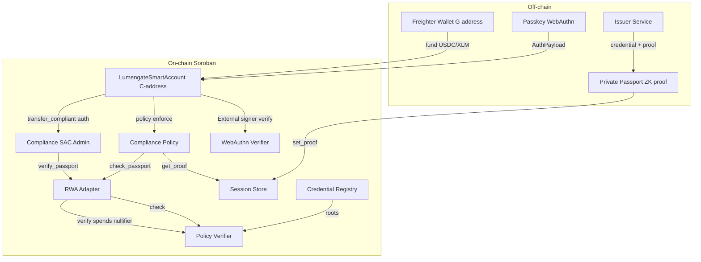
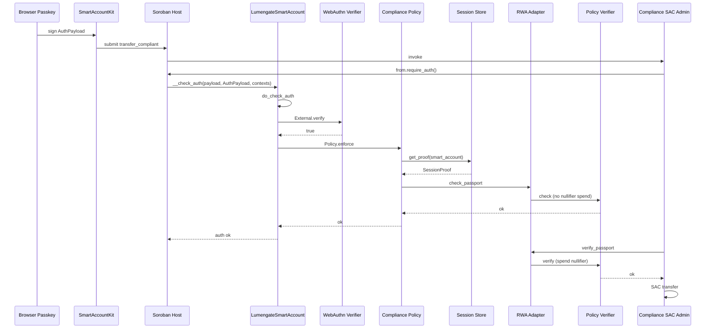
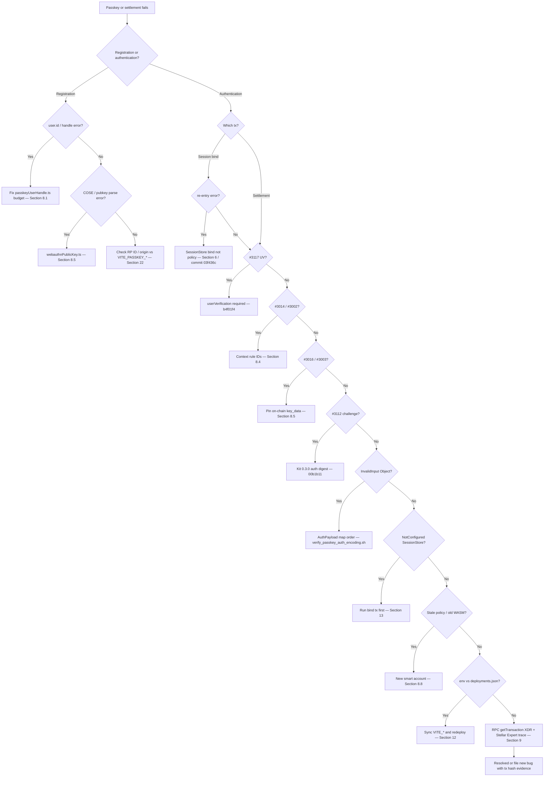
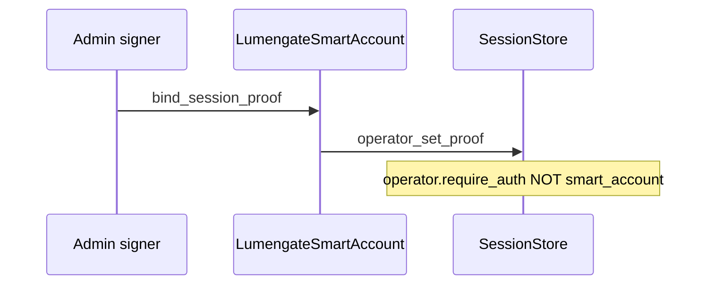
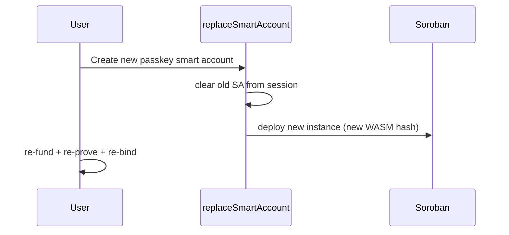
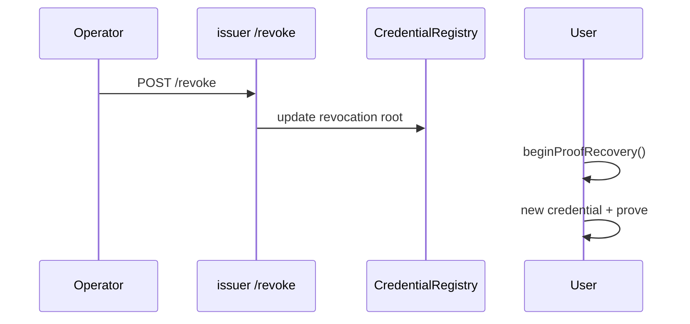
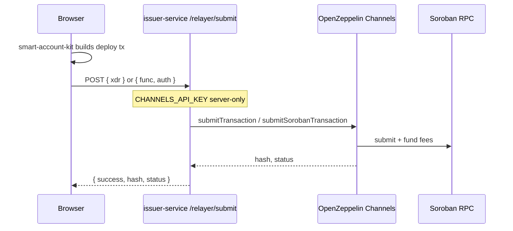

# Lumengate Passkey Smart Account — Canonical Implementation Guide

**Document class:** FINAL CANONICAL passkey / smart-account source (auth + ADRs + bug history)  
**Status:** Production architecture — see **§34** for post-freeze updates (sync 2026-06-27, commit `3e0ea77`)  
**Network:** Stellar Testnet  
**Behavioral source of truth:** `docs/CURRENT_ARCHITECTURE.md`  
**Canonical trio:** This file + `docs/CURRENT_ARCHITECTURE.md` + `docs/IMPLEMENTATION_STATUS_REPORT.md`

This document is not marketing, not a tutorial, and not a README substitute. Every claim below cites repository code, git history, deployed contract IDs, RPC/Horizon data, or upstream stellar-accounts / smart-account-kit implementations where applicable.

---

## Table of Contents

1. [Architecture Overview](#1-architecture-overview)
2. [Why Smart Accounts on Stellar](#2-why-smart-accounts-on-stellar)
3. [How Passkeys Actually Work](#3-how-passkeys-actually-work)
4. [Authorization Flow (Upstream-Aligned)](#4-authorization-flow-upstream-aligned)
5. [Every Contract](#5-every-contract)
6. [Session Store](#6-session-store)
7. [Compliance Policy](#7-compliance-policy)
8. [Every Major Bug Encountered](#8-every-major-bug-encountered)
9. [How Every Bug Was Proven](#9-how-every-bug-was-proven)
10. [Why Previous Fixes Failed](#10-why-previous-fixes-failed)
11. [Final Architecture](#11-final-architecture)
12. [Complete Deployment Guide](#12-complete-deployment-guide)
13. [Complete Smart Account Creation Flow](#13-complete-smart-account-creation-flow)
14. [Real Transaction Walkthrough](#14-real-transaction-walkthrough)
15. [Lessons Learned](#15-lessons-learned)
16. [Anti-Patterns](#16-anti-patterns)
17. [Reference Library](#17-reference-library)
18. [Quick Start](#18-quick-start)
19. [Engineering Timeline](#19-engineering-timeline)
20. [Engineering Decisions](#20-engineering-decisions)
21. [Upstream vs Lumengate Comparison](#21-upstream-vs-lumengate-comparison)
22. [Debugging Guide](#22-debugging-guide)
23. [Architecture Evolution](#23-architecture-evolution)
24. [Production Verification Checklist](#24-production-verification-checklist)
25. [Troubleshooting Decision Tree](#25-troubleshooting-decision-tree)
26. [Future Maintenance](#26-future-maintenance)
27. [AI Agent Guide](#27-ai-agent-guide)
28. [Smart Account Deep Audit](#28-smart-account-deep-audit)
29. [Document Synchronization](#29-document-synchronization)
30. [Architecture Decision Records (Auth)](#30-architecture-decision-records-auth)
31. [AI Agent Handbook (Extended)](#31-ai-agent-handbook-extended)
32. [Auth Sequence Diagrams (Supplement)](#32-auth-sequence-diagrams-supplement)
33. [Final Documentation Freeze](#33-final-documentation-freeze)
34. [Production updates (post-freeze sync)](#34-production-updates-post-freeze-sync)

---

## 1. Architecture Overview

Lumengate separates **wallet onboarding/funding** from **passkey authorization** of all protected actions.

### Product flow (final, verified in code)

```
Wallet (G-address, Freighter)
    ↓ onboarding, funding, fee payer only
Passkey (WebAuthn secp256r1)
    ↓ signs AuthPayload for smart account
Per-user Smart Account (C-address, LumengateSmartAccount WASM)
    ↓ __check_auth → Verifier + Policy
Session Store
    ↓ stores eligibility proof per smart account
Compliance Policy
    ↓ enforce() reads proof, calls check_passport (no nullifier spend)
Passport (ZK eligibility proof + public inputs)
    ↓ issued off-chain by issuer-service, verified on-chain
Settlement (ComplianceSacAdmin.transfer_compliant, RWA, DEX, payroll)
    ↓ verify_passport spends nullifier at settlement
Receipt (on-chain tx hash + NullifierSpent event + UI receipt)
```

### High-level diagram



### Role separation (verified)

| Actor | Authorizes | Does NOT authorize |
|-------|-----------|-------------------|
| Freighter wallet (`G…`) | Funding txs, wallet-only ops | `set_proof`, settlement, investment, transfer |
| Passkey | `session_store.set_proof`, settlement, all protected smart-account ops | — |
| Smart account | Host invokes `__check_auth` on protected calls | Cannot bypass policy or verifier |

Source: `app/src/context/AppContext.tsx` (`signAndSubmitSettlement`), `contracts/session_store/src/lib.rs` (`set_proof` requires `smart_account.require_auth()`).


**Repository cross-reference (Section 1):** `app/src/context/AppContext.tsx`, `contracts/session_store/src/lib.rs`, `deployments.json` | Commits: `03f436c`, `1f80276` | Tests: `scripts/regression_test.sh`

---

## 2. Why Smart Accounts on Stellar

### `__check_auth`

Soroban custom accounts implement `CustomAccountInterface::__check_auth`. When a contract address is used as an authorization source, the host calls this entrypoint with:

- `signature_payload`: 32-byte hash the signer must prove knowledge of
- `signatures`: `AuthPayload` (stellar-accounts 0.7+)
- `auth_contexts`: vector of `Context` describing every node in the invocation tree

Lumengate delegates entirely to the pinned stellar-accounts 0.7.2 implementation:

```87:94:contracts/lumengate_smart_account/src/lib.rs
    fn __check_auth(
        e: Env,
        signature_payload: Hash<32>,
        signatures: AuthPayload,
        auth_contexts: Vec<Context>,
    ) -> Result<(), Self::Error> {
        do_check_auth(&e, &signature_payload, &signatures, &auth_contexts)
    }
```

Dependency: `stellar-accounts = "=0.7.2"` in root `Cargo.toml`.

### External Signers

Passkeys are not Ed25519 keys on Stellar. They are registered as:

```rust
Signer::External(webauthn_verifier_address, key_data)
```

where `key_data` = 65-byte uncompressed secp256r1 public key + credential ID bytes.

Source: `contracts/lumengate_smart_account/src/lib.rs` (`add_passkey`), `app/src/lib/smartAccount.ts` (`buildPasskeyKeyData`).

### Context Rules

Smart accounts match each auth context to a context rule (Default, CallContract, CreateContract). Lumengate installs one **Default** rule at deploy with passkey signer + compliance policy.

Source: `contracts/lumengate_smart_account/src/lib.rs` (`__constructor`).

### Policy Enforcement

Installed policies receive `enforce(context, authenticated_signers, context_rule, smart_account)` during `do_check_auth`. Lumengate's `CompliancePolicy` reads session proof and calls `RwaAdapter.check_passport`.

### WebAuthn

The shared `WebauthnVerifierContract` verifies XDR-encoded `WebAuthnSigData` against the auth digest. Requires UV bit in authenticator data (error `#3117` if missing).

Source: `contracts/webauthn_verifier/src/lib.rs`, commit `b4f01f4`.

### SmartAccountKit

Frontend uses vendored `smart-account-kit@0.3.0` (`app/vendor/smart-account-kit/package.json`) for deploy, passkey registration, AuthPayload construction, and `signAndSubmit`.

Custom auth payload code was removed in commit `00b1b11`.

### Session Proof

UltraHonk ZK proof (14,592 bytes) + public inputs (192 bytes for settlement: root, rev_root, policy_id, asset_id, action_id, nullifier).

Source: `app/src/lib/contracts.ts` (`ULTRA_HONK_PROOF_BYTES`, `PUBLIC_INPUTS_BYTES`).

### Session Store

Separate contract holding `(proof, public_inputs)` keyed by smart-account address. Eliminates compliance-policy re-entry during passkey bind.

Source: commit `03f436c`, `contracts/session_store/src/lib.rs`.


**Repository cross-reference (Section 2):** `contracts/lumengate_smart_account/src/lib.rs`, `Cargo.toml` (stellar-accounts pin), `app/vendor/smart-account-kit/package.json` | Commits: `03f436c`, `00b1b11`, `63f9d17` | Upstream: stellar-accounts 0.7.2 crate

---

## 3. How Passkeys Actually Work

### Registration

1. User connects Freighter wallet.
2. `SmartAccountKit.createWallet` triggers WebAuthn registration via `@simplewebauthn/browser`.
3. Kit builds `userName` = `${passkeyUserName(wallet)}:${timestamp}:${random}` (kit suffix ≈39 bytes reserved).
4. `extractRegistrationPublicKey` parses COSE public key from attestation (`app/src/lib/webauthnPublicKey.ts`).
5. `buildPasskeyKeyData(pubkey, credentialId)` → on-chain `key_data`.
6. Kit deploys `LumengateSmartAccount` WASM with External signer + CompliancePolicy install params.

Sources: `app/src/lib/smartAccount.ts`, `app/src/lib/passkeyUserHandle.ts`, commit `d8b8d74`.

### Credential ID

Browser-generated opaque identifier. Stored in `key_data` bytes after the 65-byte pubkey. Used by kit/browser to select the correct passkey during authentication.

### Public key

65-byte uncompressed secp256r1 point (prefix `0x04`). Extracted from WebAuthn attestation COSE key `-2` coordinate pair in `webauthnPublicKey.ts`.

### COSE

Attested credential data contains CBOR-encoded COSE_Key. Lumengate decodes CBOR manually in `webauthnPublicKey.ts` (no external COSE library in contract path).

### `key_data`

On-chain bytes: `[65-byte pubkey][credential_id…]`.

Contract expectation (documented in verifier):

```15:18:contracts/webauthn_verifier/src/lib.rs
//! The `key_data` parameter is expected to contain the 65-byte uncompressed
//! secp256r1 public key followed by the credential ID bytes (if any) that can
//! be of a variable length.
```

### WebAuthn verifier

Shared contract `CAQK36HSHDHLH3XKAP6GTMPCPBFDP362A3V7XUEZRYKCD2LJBW76ACTH`. Parses `sig_data` as XDR `WebAuthnSigData`, extracts pubkey from `key_data[0..65]`, calls `stellar_accounts::verifiers::webauthn::verify`.

### Auth payload

stellar-accounts 0.7 `AuthPayload` ScVal map with **required key order** (verified by `verify_passkey_auth_encoding.sh`):

1. `context_rule_ids` (Vec<u32>)
2. `signers` (Map of External signer → XDR-encoded WebAuthn sig map)

Guarded by `scripts/verify_passkey_auth_encoding.sh` (wrong key order reproduces `Error(Object, InvalidInput)`).

### Auth digest

Kit computes `sha256(signature_payload_xdr || context_rule_ids_xdr)` per stellar-accounts 0.7. WebAuthn assertion signs this digest (via client data JSON challenge).

Source: commits `0fea99b`, `7cf6c02`; removed custom implementation in `00b1b11`.

### UV bit

`authenticator_data` flags bit 2 (User Verified). Required by stellar-accounts 0.7.2 WebAuthn verifier.

Enforced in frontend:

```93:98:app/src/lib/smartAccount.ts
/** stellar-accounts 0.7.2 WebAuthn verifier requires the UV bit in authenticator_data (#3117). */
function requireUserVerificationOnAuth(
  optionsJSON: PublicKeyCredentialRequestOptionsJSON,
): PublicKeyCredentialRequestOptionsJSON {
  return { ...optionsJSON, userVerification: 'required' };
}
```

### User verification

Browser prompts PIN/biometric (shown in production E2E screenshots). Maps to UV bit in authenticator data.

### RP ID

Production: `VITE_PASSKEY_RP_ID=lumengatex.vercel.app` (`.env`, `app/.env.example`).

Kit uses `config.passkeyRpId ?? window.location.hostname`.

### Origin

Production: `VITE_PASSKEY_ORIGIN=https://lumengatex.vercel.app`.

WebAuthn client data JSON origin must match registration origin.


**Repository cross-reference (Section 3):** `app/src/lib/smartAccount.ts`, `app/src/lib/passkeyUserHandle.ts`, `app/src/lib/webauthnPublicKey.ts`, `contracts/webauthn_verifier/src/lib.rs` | Commits: `d8b8d74`, `b4f01f4`, `d670590` | Tests: `scripts/verify_passkey_auth_encoding.sh`

---

## 4. Authorization Flow (Upstream-Aligned)

### Settlement execution graph (two transactions)

Lumengate performs **two separate passkey-signed transactions** (verified: commit `1e01175` split ops; `AppContext.signAndSubmitSettlement`):

**Transaction A — Session proof bind**

```
Browser (passkey PIN/UV)
  → SmartAccountKit.signAndSubmit
    → SessionStore.set_proof(smart_account, proof, public_inputs)
      → smart_account.require_auth()
        → LumengateSmartAccount.__check_auth
          → do_check_auth
            → WebauthnVerifier.verify (External signer)
            → CompliancePolicy.enforce
              → is_session_bind_context → early return (no get_proof)
```

**Transaction B — USDC settlement**

```
Browser (passkey PIN/UV)
  → SmartAccountKit.signAndSubmit
    → ComplianceSacAdmin.transfer_compliant(from=smart_account, to, amount, proof, public_inputs)
      → smart_account.require_auth()
        → LumengateSmartAccount.__check_auth
          → do_check_auth
            → WebauthnVerifier.verify
            → CompliancePolicy.enforce
              → SessionStore.get_proof
              → RwaAdapter.check_passport (spend_nullifier=false)
      → RwaAdapter.verify_passport (spend_nullifier=true, spends nullifier)
      → SAC transfer USDC
      → UsdcTransferGated event
```

### Mermaid sequence (settlement tx B)




**Repository cross-reference (Section 4):** `app/src/context/AppContext.tsx` (`signAndSubmitSettlement`), `app/src/lib/contracts.ts`, `contracts/compliance_policy/src/lib.rs`, `contracts/compliance_sac_admin/src/lib.rs` | Commits: `1e01175`, `03f436c` | Verified tx: Section 14

---

## 5. Every Contract

Current Lumengate production testnet IDs from `deployments.json` (commit `03f436c`).

### LumengateSmartAccount

| Field | Value |
|-------|-------|
| **Type** | WASM upload (per-user instances) |
| **WASM hash** | `df911f9fd998495cb41bd39f4254b70acfde8dc6e86f230fb139481e3247b969` |
| **Purpose** | Per-user smart account with passkey External signer + installed compliance policy |
| **Storage** | stellar-accounts `SmartAccountStorageKey` (context rules, signers, policies) |
| **Entry points** | `__constructor`, `add_passkey`, `get_context_rules` (kit shim), `bind_session_proof`, `__check_auth` |
| **Relationships** | External → WebAuthnVerifier; Policy → CompliancePolicy; bind → SessionStore |

### SessionStore

| Field | Value |
|-------|-------|
| **ID** | `CBNDCK32HPC5ADIYF7ZP4R4Q4PIXH3SFLITV66DXDIG4THYHWKO7IPAI` |
| **Purpose** | Store session eligibility proof per smart account |
| **Storage** | Persistent `(Symbol("proof"), smart_account) → SessionProof` |
| **Entry points** | `set_proof`, `operator_set_proof`, `get_proof` |
| **Relationships** | Read by CompliancePolicy; written by passkey or admin operator path |

### CompliancePolicy

| Field | Value |
|-------|-------|
| **ID** | `CDAQ5KFAFAO5F33AD62V7RRJO2PDLXDKRPGLUZN72Z7KGDXWIEBBLJXF` |
| **Purpose** | Policy installed on smart account; gates auth via session proof + eligibility check |
| **Storage** | Persistent `(Symbol("cfg"), smart_account) → CompliancePolicyParams` |
| **Entry points** | `install`, `uninstall`, `enforce` (Policy trait) |
| **Relationships** | → SessionStore, → RwaAdapter |

### WebauthnVerifierContract

| Field | Value |
|-------|-------|
| **ID** | `CAQK36HSHDHLH3XKAP6GTMPCPBFDP362A3V7XUEZRYKCD2LJBW76ACTH` |
| **Purpose** | Shared secp256r1 WebAuthn signature verification |
| **Storage** | Stateless |
| **Entry points** | `verify`, `canonicalize_key`, `batch_canonicalize_key` |
| **Relationships** | Called as External signer verifier from smart accounts |

### RwaAdapter

| Field | Value |
|-------|-------|
| **ID** | `CACZ4O3EFBCNUXNSW5ZKPLUVMVU3PJZN4E243PG3I6A3PZP5YVGNDY3C` |
| **Purpose** | SEP-57-style adapter; routes to PolicyVerifier |
| **Storage** | Instance `verifier` address |
| **Entry points** | `verify_passport` (spend nullifier), `check_passport` (no spend), `verify`, `is_eligible` |
| **Relationships** | → PolicyVerifier; called by CompliancePolicy and ComplianceSacAdmin |

### PolicyVerifier

| Field | Value |
|-------|-------|
| **ID** | `CBSWGZFEPQXU2OQGTBACBFZ6UP2SXNKDJAIDMFJE245R3AXOMHXXI5TA` |
| **Purpose** | UltraHonk proof verification + nullifier tracking |
| **Storage** | Persistent policy→verifier map; spent nullifier keys |
| **Entry points** | `verify`, `check`, `verify_and_record`, policy registration |
| **Events** | `NullifierSpent` (via `EligibilityVerified` / spent key write) |
| **Relationships** | → UltraHonk verifier contracts; reads CredentialRegistry roots indirectly via proof |

### CredentialRegistry

| Field | Value |
|-------|-------|
| **ID** | `CBRAQMKRX3ACWU3R4MZ6HQLFZSCY5BJGALI5AQE27NGKDHCGUSXK7U7F` |
| **Purpose** | On-chain Merkle roots for passport credentials |
| **Storage** | Instance `issuer_reg`; persistent `root`, `rev_root`, `note_root` |
| **Entry points** | `get_roots`, root update admin fns |
| **Relationships** | IssuerRegistry; roots embedded in ZK public inputs |

### ComplianceSacAdmin

| Field | Value |
|-------|-------|
| **ID** | `CDZFKXPN7ANNQLPHSQNESW3LVOQK66V53S5Z2XZNRMDTEZEQG5QARRSD` |
| **Purpose** | Proof-gated USDC/EURC SAC transfers |
| **Storage** | Instance adapter, sac, eurc_sac, policy_id |
| **Entry points** | `transfer_compliant`, `transfer_compliant_eurc`, `balance`, `sac_address` |
| **Events** | `UsdcTransferGated` |
| **Relationships** | → RwaAdapter (verify_passport at settlement) |

### Other deployed contracts (settlement ecosystem)

| Contract | ID | Role |
|----------|-----|------|
| IssuerRegistry | `CBOG4MRPEGNFZJJ5QKYOTYPJMDYGZ5E5OOOE3CZKQWADEOK4U6AR36WY` | Issuer allowlist |
| RwaToken | `CBVUK5UPY5Q3RNGD5ZOPB44FAOZUOJXJWGDAHQJBF3TD2P3XLBHXJR22` | RWA settlement |
| CompliantDEX | `CAWAEZAEULQBHYH3VBVX6EUYIS7K43NN4YMZ4AMEBUC52XAGGKOUJEOH` | DEX with adapter gate |
| CompliantPayroll | `CBUCACQX2BBNHV3R4ERQMCQVBQQXM6DAPBPNOALDMFJRI3OTFM4L5EIZ` | Payroll with adapter gate |
| AuditorRegistry | `CAO7QJ26C2ZIZLACBLJSJ3BXIKYNE767P7KVFVMQRULR3Z7RAAPEDZ67` | Auditor viewing keys |
| SessionKeyPolicy | `CBMISD65SUNFHDGKT4S3YJJ3INJQ3NRXOZGUDAG235JVQHKWYWWRWFJH` | Deployed; not wired into Lumengate compliance deploy |
| GovernanceTimelock | `CC7NP3NISCNFNPUGWE6IZZFP4EPPIFX66HV45KNAW3IC3XJ2DK2W4P2I` | Deployed; not in settlement path |


**Repository cross-reference (Section 5):** `contracts/*/src/lib.rs`, `deployments.json`, `app/.env.example` | Scripts: `scripts/deploy_v3_contracts.sh`, `scripts/deploy_passkey_stack.sh` | Commit: `03f436c`

---

## 6. Session Store

### Why it exists

Before commit `03f436c`, passkey bind invoked `compliance_policy.set_session_proof` while that same policy was installed on the smart account's default context rule. During `__check_auth`, stellar-accounts `do_check_auth` called `PolicyClient.enforce()` on the policy already on the Soroban call stack.

Soroban rejected this with:

- `ScErrorType::Context`, `ScErrorCode::InvalidAction`
- Message: `"Contract re-entry is not allowed"`

Evidence: agent debugging transcript; commit `03f436c`; `app/src/lib/contracts.ts` re-entry hint.

### Why CompliancePolicy should not own session proofs

When the policy contract is both:

1. The **installed policy** evaluated during `__check_auth`, and
2. The **invoke target** of the authorized operation,

`enforce()` re-enters the same contract frame. Soroban `ContractReentryMode::Prohibited` blocks this.

OpenZeppelin/stellar-accounts pattern: policies evaluate context; they are not typically the root invoke target of the same authorized call that triggers their enforcement.

### How it eliminated re-entry

Split architecture (commit `03f436c`):

| Before | After |
|--------|-------|
| Passkey bind → `compliance_policy.set_session_proof` | Passkey bind → `session_store.set_proof` |
| Policy stored proof locally | Policy reads via `session_store.get_proof` |
| `enforce()` always ran full check or was hacked to skip | `enforce()` early-returns only for `session_store.set_proof` context |

`set_proof` still invokes `smart_account.require_auth()` → full passkey path. Policy `enforce()` is still called (matching upstream stellar-accounts behavior) but returns immediately for bind context without nested policy work.

Source: `contracts/compliance_policy/src/lib.rs` lines 71–73, 100–111.


**Repository cross-reference (Section 6):** `contracts/session_store/src/lib.rs`, `contracts/compliance_policy/src/lib.rs`, `app/src/lib/contracts.ts` (`buildBindSessionProofTransaction`) | Commits: `03f436c`, `a7b47ac` (reverted pattern)

---

## 7. Compliance Policy

### How `policy.enforce()` works

From `contracts/compliance_policy/src/lib.rs`:

1. Load `CompliancePolicyParams { adapter, policy_id, session_store }` for `(cfg, smart_account)`.
2. If context matches `session_store.set_proof` → **return** (bind path).
3. Call `session_store.get_proof(smart_account)`.
4. Call `adapter.check_passport(policy_id, proof, public_inputs)`.
5. Panic `VerificationFailed` (#2) if not ok.

`check_passport` uses PolicyVerifier `"check"` — verifies ZK proof **without** spending nullifier (commit `1f80276`).

Settlement contracts use `verify_passport` → `"verify"` — spends nullifier once.

### Context rules

Managed by stellar-accounts inside smart account storage. Lumengate deploys:

- **Rule ID 0**, type **Default**, name `"default"`
- Signers: one External passkey
- Policies: map `{ compliancePolicyId → CompliancePolicyParams }`

Read from chain via `get_context_rule` / kit shim `get_context_rules`.

Source: `contracts/lumengate_smart_account/src/lib.rs`, `app/src/lib/onChainContextRules.ts`.

### Default Rule

Matches all contract invocations unless a more specific CallContract rule matches. Lumengate uses only Default rule 0 in production deploy path.

### CallContract Rule

stellar-accounts supports per-contract rules. Lumengate does **not** install CallContract rules in the current deploy path (verified: `__constructor` only adds Default).

Kit/stellar-accounts may resolve CallContract rules when auth contexts include contract-specific nodes; resolution algorithm from kit 0.3.0 (commit `20a5b59`).

### Signer matching

`do_check_auth` matches `AuthPayload.signers` External entry to installed signers by `(verifier_address, key_data)` bytes equality.

Failures:

- `#3016` UnauthorizedSigner — no matching signer
- `#3003` ExternalSignatureVerificationFailed — verifier returned false

Frontend must use **exact on-chain key_data** (commit `1e2aa17`, `8299d60`).


**Repository cross-reference (Section 7):** `contracts/compliance_policy/src/lib.rs`, `contracts/rwa_adapter/src/lib.rs`, `app/src/lib/onChainContextRules.ts`, `app/src/lib/smartAccount.ts` | Commits: `1f80276`, `20a5b59`, `8299d60`

---

## 8. Every Major Bug Encountered

Chronological (git log, June 24–25 2026). Format: Bug → Root Cause → Evidence → Wrong Fix → Correct Fix → Final Result.

### 8.1 WebAuthn user handle exceeds 64 bytes

| | |
|---|---|
| **Bug** | Passkey registration fails |
| **Root cause** | Kit appends `:timestamp:random` to full Stellar G-address; exceeds WebAuthn `user.id` 64-byte limit |
| **Evidence** | Commits `d8b8d74`, `2c8e3a5`; `passkeyUserHandle.ts` |
| **Wrong fix** | None documented |
| **Resolution** | Short deterministic 25-char hex hash + 39-byte suffix reserve |
| **Result** | Registration succeeds |

### 8.2 smart-account-kit `get_context_rules` removed in stellar-accounts 0.7.2

| | |
|---|---|
| **Bug** | Policy install / signing fails after SDK upgrade |
| **Root cause** | Bulk getter removed upstream; kit still calls it |
| **Evidence** | Commits `63f9d17`, `77eea89`; comment in `lib.rs` line 37 |
| **Wrong fix** | None documented |
| **Resolution** | Shim `get_context_rules` in LumengateSmartAccount |
| **Result** | Kit deploy/sign unblocked |

### 8.3 Wrong AuthPayload (pre-0.7 / wrong map order / XDR wrap)

| | |
|---|---|
| **Bug** | `Error(Auth, InvalidAction)` / `Error(Object, InvalidInput)` |
| **Root cause** | (a) Pre-0.7 signing; (b) map key order `signers` before `context_rule_ids`; (c) wrapping map in `scvBytes` broke host decode |
| **Evidence** | Commits `0fea99b`, `9f461f7`, `7cf6c02`, `00b1b11`; `verify_passkey_auth_encoding.sh` |
| **Wrong fix** | `9f461f7` XDR bytes wrap — passed shape validation, failed auth |
| **Resolution** | smart-account-kit 0.3.0 AuthPayload; stellar-accounts-required map key order; delete custom `passkeyAuthPayloadV07.ts` |
| **Result** | Host accepts AuthPayload shape |

### 8.4 Wrong ContextRuleIds

| | |
|---|---|
| **Bug** | `#3014` ContextRuleIdsLengthMismatch; `#3002` UnvalidatedContext |
| **Root cause** | Count mismatch with invocation tree; `scValToNative` enum shape; fallback to rule 0 |
| **Evidence** | Commits `4ba35a6`, `3d3386d`, `8299d60`, `20a5b59` |
| **Wrong fix** | Hardcoded/default rule 0 fallback |
| **Resolution** | Tree-aligned rule IDs; enum normalization in `onChainContextRules.ts`; smart-account-kit 0.3.0 resolution |
| **Result** | Context rules match auth contexts |

### 8.5 Wrong key_data / COSE parsing

| | |
|---|---|
| **Bug** | `#3016`, `#3003`, "No signer found for credential ID" |
| **Root cause** | Mocked/recomputed key_data; Buffer polyfill issues; scValToNative mangled bytes |
| **Evidence** | Commits `1e2aa17`, `36a1b85`, `99b14bf`, `d670590`, `ba82091` |
| **Wrong fix** | Off-chain recomputation of key_data |
| **Resolution** | Pin exact on-chain bytes; COSE parse from attestation; `coerceKeyDataBuffer` |
| **Result** | Signer lookup matches deploy bytes |

### 8.6 VerifiedBitNotSet (#3117)

| | |
|---|---|
| **Bug** | WebAuthn verification fails after AuthPayload fixed |
| **Root cause** | Kit default `userVerification: "preferred"`; stellar-accounts 0.7.2 requires UV bit |
| **Evidence** | Commit `b4f01f4`; error `Error(Contract, #3117)` |
| **Wrong fix** | Generic "Passkey authorization failed" messaging |
| **Resolution** | `userVerification: 'required'` on register and auth |
| **Result** | Verifier accepts assertion (PIN/biometric prompt shown in E2E) |

### 8.7 CompliancePolicy re-entry

| | |
|---|---|
| **Bug** | `"contract re-entry is not allowed"` → `Error(Auth, InvalidAction)` on session bind |
| **Root cause** | Bind target = installed policy contract |
| **Evidence** | Transcript; smart account `CDTS52OI…` on WASM `296b978e…` |
| **Wrong fix** | (1) Freighter admin bind (`c85dffe`) — rejected; (2) `lumengate_do_check_auth` skip enforce (`a7b47ac`) — not in stellar-accounts `do_check_auth` |
| **Resolution** | SessionStore split (`03f436c`); stellar-accounts `do_check_auth` restored |
| **Result** | Passkey bind succeeds; production E2E settlement verified |

### 8.8 Old WASM / old smart account

| | |
|---|---|
| **Bug** | Fixed code deployed but user account still fails |
| **Root cause** | WASM fixed at deploy; upload does not upgrade existing C-addresses |
| **Evidence** | Transcript; `isSmartAccountPolicyStaleOnChain` |
| **Wrong fix** | Env-only updates without new account |
| **Resolution** | Create new passkey smart account; stale policy detection UI |
| **Result** | New accounts on WASM `df911f9f…` work |

### 8.9 Settlement sequencing

| | |
|---|---|
| **Bug** | Settlement fails without bound proof; multi-op tx rejected |
| **Root cause** | Missing session proof; two ops in one passkey tx |
| **Evidence** | Commits `fefd8ec`, `1e01175`, `92390f3` |
| **Wrong fix** | Single tx with bind + settle |
| **Resolution** | Two txs: bind then settle (`AppContext.signAndSubmitSettlement`) |
| **Result** | Verified flow |

### 8.10 Policy verify_passport consumed nullifier during enforce

| | |
|---|---|
| **Bug** | Settlement fails after enforce() |
| **Root cause** | Policy called `verify_passport` (spends nullifier) during auth check |
| **Evidence** | Commit `1f80276` |
| **Wrong fix** | Redeploy policy only |
| **Resolution** | `check_passport` in enforce; `verify_passport` only at settlement |
| **Result** | Nullifier spent once at settlement |


**Repository cross-reference (Section 8):** Git log (`git log --grep=passkey`), `app/src/lib/contracts.ts` (`formatSorobanUserError`) | Commits: see Section 19 timeline

---

## 9. How Every Bug Was Proven

| Bug | Proof method |
|-----|--------------|
| User handle 64-byte | WebAuthn registration error; unit-style assert in `passkeyUserHandle.ts` |
| get_context_rules | Contract invoke failure during kit deploy; fixed by shim returning data |
| AuthPayload shape | Soroban re-simulation: required map key order → OK; wrong order → `Error(Object, InvalidInput)` (`verify_passkey_auth_encoding.sh`) |
| ContextRuleIds | On-chain error `#3014` / `#3002` in failed tx XDR; hints in `formatSorobanUserError` |
| key_data mismatch | On-chain signer bytes vs client bytes diff; `#3016` / `#3003` |
| VerifiedBitNotSet | `Error(Contract, #3117)` in RPC failed tx diagnostics |
| Re-entry | RPC/diagnostic: `"contract re-entry is not allowed"`; Stellar Expert nested trace shows policy enforce inside policy invoke |
| Old WASM | Contract WASM hash query on C-address ≠ `deployments.json` hash |
| Sequencing | `"Transaction contains more than one operation"`; `NotConfigured` on get_proof |

**Failed transaction diagnostics:** `readFailedTransactionDiagnostics` in `smartAccount.ts` calls Soroban RPC `getTransaction` and inspects XDR.

**Successful transaction:** Section 14 (RPC + Horizon verified).


**Repository cross-reference (Section 9):** `app/src/lib/smartAccount.ts` (`readFailedTransactionDiagnostics`), `scripts/verify_passkey_auth_encoding.sh`, Soroban RPC, Horizon

---

## 10. Why Previous Fixes Failed

### Skip `policy.enforce()` (`a7b47ac`)

**Looked correct because:** Bind succeeded; error disappeared.  
**Was wrong because:** Not present in stellar-accounts 0.7.2 `do_check_auth` source path used by Lumengate; bypasses policy layer entirely for bind context; masked topology bug instead of fixing it.  
**Superseded by:** SessionStore split (`03f436c`).

### Freighter admin bind (`c85dffe`)

**Looked correct because:** Avoided re-entry by not using passkey on bind.  
**Was wrong because:** Product requirement: passkey must authorize bind. Wallet is funding-only.

### XDR-wrapped AuthPayload (`9f461f7`)

**Looked correct because:** Passed some host validation checks.  
**Was wrong because:** `__check_auth` expects raw `AuthPayload` map, not bytes wrapper.

### Default context rule 0 fallback

**Looked correct because:** Most accounts only have rule 0.  
**Was wrong because:** Violates stellar-accounts matching algorithm; fails on tree depth > 1.

### Upload new WASM without new account

**Looked correct because:** `deployments.json` shows new hash.  
**Was wrong because:** Existing C-addresses retain old WASM bytecode permanently.

### CompliancePolicy storing session proof

**Looked correct because:** Single contract simpler to deploy.  
**Was wrong because:** Creates self-referential policy topology forbidden by Soroban re-entry rules.


**Repository cross-reference (Section 10):** Commits: `a7b47ac`, `c85dffe`, `9f461f7`, `03f436c` | Compare: Section 21 upstream table

---

## 11. Final Architecture

### Production topology (testnet, 2026-06-25)

```
Freighter G-wallet
  └─ funds → Smart Account CBOCG7LF… (example from successful tx)

Smart Account (WASM df911f9f…)
  ├─ Signer: External(CAQK36… WebAuthn, key_data=65B pubkey + credId)
  └─ Policy 0: CompliancePolicy(CDAQ5KFA…)
        params: { adapter: CACZ4O3…, policy_id: 1, session_store: CBNDCK32… }

Passkey bind tx → SessionStore.set_proof
Settlement tx → ComplianceSacAdmin.transfer_compliant
  → auth: __check_auth → verify + enforce(check_passport)
  → settle: verify_passport + SAC transfer
```

### Removed / forbidden in final architecture

- `lumengate_do_check_auth` (removed in `03f436c`)
- `passkeyAuthPayloadV07.ts` (removed in `00b1b11`)
- `compliance_policy.set_session_proof` (removed in `03f436c`)
- Shared `LUMENGATE_SMART_ACCOUNT_ID` env (removed by `deploy_v3_contracts.sh`)
- Wallet authorization of protected ops

### Version pins (verified)

| Component | Version |
|-----------|---------|
| stellar-accounts | 0.7.2 |
| smart-account-kit | 0.3.0 (vendored) |
| soroban-sdk | 26.0.1 (from `.env` toolchain section) |


**Repository cross-reference (Section 11):** `deployments.json`, `contracts/lumengate_smart_account/src/lib.rs`, commit `03f436c` | Stale list: `app/src/lib/smartAccount.ts` (`LEGACY_COMPLIANCE_POLICY_IDS`)

---

## 12. Complete Deployment Guide

### Prerequisites

- Stellar CLI 3.2.0, Rust wasm32 target, built contracts (`scripts/build_contracts.sh`)
- Funded deployer + admin keys in `.env`
- Prior deploy of issuer stack (issuer_registry, policy_verifier, rwa_adapter, etc.)

### Deploy order

**Phase 1 — Passkey stack** (`scripts/deploy_passkey_stack.sh`):

1. CredentialRegistry
2. WebauthnVerifier
3. SessionKeyPolicy
4. GovernanceTimelock

**Phase 2 — V3 compliance stack** (`scripts/deploy_v3_contracts.sh`):

1. AuditorRegistry
2. CompliantDEX
3. CompliantPayroll
4. SessionStore
5. CompliancePolicy
6. Upload LumengateSmartAccount WASM (hash only, no shared contract ID)
7. Register auditor (optional invoke)

**Phase 3 — Per user (runtime, not deploy script):**

- Frontend `SmartAccountKit.createWallet` deploys smart account instance from WASM hash.

### Dependencies

```
CredentialRegistry → IssuerRegistry
CompliancePolicy → SessionStore (read) + RwaAdapter (check)
SmartAccount → WebauthnVerifier + CompliancePolicy + SessionStore (bind)
ComplianceSacAdmin → RwaAdapter (verify at settle)
RwaAdapter → PolicyVerifier
PolicyVerifier → UltraHonk verifiers + CredentialRegistry roots (via proof)
```

### Environment variables

#### Root `.env` (backend/scripts)

| Variable | Purpose |
|----------|---------|
| `SESSION_STORE_ID` | SessionStore contract |
| `COMPLIANCE_POLICY_ID` | CompliancePolicy contract |
| `LUMENGATE_SMART_ACCOUNT_WASM_HASH` | Smart account WASM |
| `WEBAUTHN_VERIFIER_ID` | Shared verifier |
| `RWA_ADAPTER_ID` | Adapter |
| `POLICY_ID` | Eligibility policy id (1) |
| `DEPLOYER_SECRET_KEY`, `CONTRACT_ADMIN_*` | Deploy auth |

#### Frontend `VITE_*` (baked at build)

All keys in `app/.env.example`. Critical for passkey path:

| Variable | Current production testnet value (`deployments.json`) |
|----------|------------------------|
| `VITE_SESSION_STORE_ID` | `CBNDCK32HPC5ADIYF7ZP4R4Q4PIXH3SFLITV66DXDIG4THYHWKO7IPAI` |
| `VITE_COMPLIANCE_POLICY_ID` | `CDAQ5KFAFAO5F33AD62V7RRJO2PDLXDKRPGLUZN72Z7KGDXWIEBBLJXF` |
| `VITE_LUMENGATE_SMART_ACCOUNT_WASM_HASH` | `df911f9fd998495cb41bd39f4254b70acfde8dc6e86f230fb139481e3247b969` |
| `VITE_WEBAUTHN_VERIFIER_ID` | `CAQK36HSHDHLH3XKAP6GTMPCPBFDP362A3V7XUEZRYKCD2LJBW76ACTH` |
| `VITE_PASSKEY_RP_ID` | `lumengatex.vercel.app` |
| `VITE_PASSKEY_ORIGIN` | `https://lumengatex.vercel.app` |
| `VITE_ISSUER_SERVICE_URL` | Production: `https://lumengate-issuer.onrender.com` |

`app/src/lib/config.ts` warns and overrides stale `VITE_*` when they differ from `deployments.json`.

#### Vercel production

Must match `deployments.json` IDs above. `VITE_*` require redeploy after env change (Vite bakes at build time).

### Issuer service

Off-chain passport issuance; provides ZK proof + public inputs to frontend. Port 3001 local; Render URL in production.

### Verification after deploy

```bash
cargo test
cd app && npm test && npm run build
bash scripts/verify_passkey_auth_encoding.sh
bash scripts/regression_test.sh
```


**Repository cross-reference (Section 12):** `scripts/deploy_passkey_stack.sh`, `scripts/deploy_v3_contracts.sh`, `scripts/build_contracts.sh`, `.env`, `app/.env.example`, `app/src/lib/config.ts`

---

## 13. Complete Smart Account Creation Flow

Step-by-step from empty wallet to successful settlement.

### Step 1 — Connect wallet

User connects Freighter (`G…` address). Wallet used for onboarding and funding only.

### Step 2 — Create passkey smart account

1. `createPersonalSmartAccount(config, walletAddress)` in `smartAccount.ts`
2. Kit registers passkey (UV required, short user handle)
3. Kit deploys LumengateSmartAccount with:
   - `Signer::External(webauthnVerifier, keyData)`
   - `policies[compliancePolicyId] = { adapter, policy_id, session_store }`
   - `salt = hash(credentialId)` → unique C-address
4. Store `smartAccountAddress`, `credentialId`, `passkeyKeyDataHex` in IndexedDB

### Step 3 — Fund smart account

Freighter sends USDC/XLM to smart account deposit address (`settlementAddress` in AppContext). Uses wallet `signAndSubmit`, not passkey.

### Step 4 — Issue passport

1. Frontend calls issuer-service with wallet field / credential request
2. User receives private passport credential + can generate ZK proof
3. On-chain roots from CredentialRegistry used in public inputs

### Step 5 — Bind session proof (passkey tx 1)

1. `buildBindSessionProofTransaction` → `session_store.set_proof`
2. `submitWithSmartAccount` → passkey UV prompt
3. `__check_auth` → verify + enforce (bind context early return)
4. Session proof stored in SessionStore

### Step 6 — Settlement (passkey tx 2)

1. Build `transfer_compliant` (or RWA/DEX/payroll) with proof in args
2. `signAndSubmitSettlement` → passkey UV prompt
3. `__check_auth` → verify + enforce → `check_passport`
4. Contract calls `verify_passport` → nullifier spent
5. SAC transfer executes

### Step 7 — Receipt

UI shows settlement tx hash, compliance status, NullifierSpent event, auditor export options.


**Repository cross-reference (Section 13):** `app/src/lib/smartAccount.ts`, `app/src/context/AppContext.tsx`, `issuer-service/` | E2E: production browser flow documented Section 14

---

## 14. Real Transaction Walkthrough

### Successful USDC settlement (verified via Horizon + Soroban RPC)

| Field | Value |
|-------|-------|
| **Transaction hash** | `46c8471c5a536940443f8f172e9193603b87743317ee6ad61b34e712fe1b16f0` |
| **Stellar Expert** | https://stellar.expert/explorer/testnet/tx/46c8471c5a536940443f8f172e9193603b87743317ee6ad61b34e712fe1b16f0 |
| **Status** | SUCCESS |
| **Ledger** | 3278199 |
| **Timestamp** | 2026-06-25T16:30:51Z |
| **Fee payer / source** | `GAAH4OT36RRCCAGKARGPN2HLHT2NOBVFHO4GUHA6CF7UKQ4MMV24WQ4N` (SmartAccountKit deployer) |
| **Fee charged** | 407118 stroops |

### Invoke parameters (Horizon decode)

| Parameter | Value |
|-----------|-------|
| **Contract** | `CDZFKXPN7ANNQLPHSQNESW3LVOQK66V53S5Z2XZNRMDTEZEQG5QARRSD` (ComplianceSacAdmin) |
| **Function** | `transfer_compliant` |
| **from** | `CBOCG7LFLNPXXN2LOLTZ2XT2DQQ3XRLFCWTSIVNOU7VF6VACVZDOWAAM` (user smart account) |
| **to** | `GCAERJ6ED7NTUSPTYFTWZAGESNDMEAAFZV4LSS4DD277LMCAOKZUCQ4R` (treasury) |
| **amount** | 5000000 stroops (= 0.5 USDC, 7 decimals) |

### Execution graph (from Stellar Expert trace, production E2E)

1. **ComplianceSacAdmin.transfer_compliant** invoked with smart account as `from`.
2. **`from.require_auth()`** → host calls smart account `__check_auth`.
3. **`__check_auth` / do_check_auth:**
   - Resolves context rule IDs for invocation tree.
   - **WebauthnVerifier.verify** (`CAQK36…`) → returns `true` (passkey signature valid, UV set).
   - **CompliancePolicy.enforce** (`CDAQ5KFA…`):
     - Not a bind context → full enforce path.
     - **SessionStore.get_proof** → returns bound session proof.
     - **RwaAdapter.check_passport** → **PolicyVerifier.check** (ZK verify, no nullifier spend).
4. Auth succeeds; **ComplianceSacAdmin** continues:
   - **RwaAdapter.verify_passport** → **PolicyVerifier.verify** → nullifier spent.
   - **SAC transfer** USDC to treasury.
5. **Events:** `NullifierSpent` / eligibility recorded (shown in UI receipt); `UsdcTransferGated` from ComplianceSacAdmin.

### Why each step happened

| Step | Reason |
|------|--------|
| Kit deployer as fee payer | `SmartAccountKit` uses fixed deployer keypair for simulation/submit (`SMART_ACCOUNT_KIT_DEPLOYER_PUBLIC_KEY`) |
| Smart account `from` | Product design: passkey account holds USDC and authorizes transfer |
| `check_passport` in enforce | Policy must verify eligibility without consuming nullifier before settlement |
| `verify_passport` in settlement | Settlement consumes nullifier once (double-spend protection) |
| Passkey prompt | External signer requires WebAuthn assertion with UV |

### Session bind transaction

**Unknown:** Separate bind tx hash not recorded in `deployments.json` or git. Bind occurred before settlement tx (required by `signAndSubmitSettlement` ordering). UI state "Ready for one settlement" confirms bind succeeded.


**Repository cross-reference (Section 14):** Horizon API, Soroban RPC `getTransaction`, Stellar Expert explorer | Tx: `46c8471c5a536940443f8f172e9193603b87743317ee6ad61b34e712fe1b16f0`

---

## 15. Lessons Learned

### Engineering

- Fix topology, not symptoms. Re-entry required architectural split, not skip-enforce.
- WASM upload ≠ instance upgrade. Always create new smart account after WASM/policy changes.
- Two transactions for bind + settle. Soroban passkey auth does not support multi-op bind+settle in one tx (commit `1e01175`).
- Pin exact on-chain bytes for `key_data`. Never recompute from pubkey + credId alone without verifying against chain.
- Guard AuthPayload map order with automated script (`verify_passkey_auth_encoding.sh`).

### Stellar / Soroban

- `ContractReentryMode::Prohibited` blocks policy re-entry during `__check_auth`.
- Auth context count must match invocation tree depth (`#3014`).
- Custom accounts delegate to stellar-accounts `do_check_auth` — Lumengate does not fork this path (commit `03f436c`).
- Fee payer can differ from auth source (kit deployer pattern).

### WebAuthn

- UV bit required by stellar-accounts 0.7.2 verifier (`#3117`).
- RP ID must match deployment domain (`lumengatex.vercel.app`).
- User handle must fit 64 bytes after kit suffix.
- COSE parsing must produce exact 65-byte uncompressed pubkey.

### Soroban policy design

- Separate **check** (auth time) from **verify** (settlement time) for nullifier semantics.
- Policy contracts should not be the invoke target of operations they enforce during the same auth stack.


**Repository cross-reference (Section 15):** Derived from Sections 8–10 and commits `03f436c`, `1e01175`, `1f80276`

---

## 16. Anti-Patterns

Never implement again (all caused production failures):

| Anti-pattern | Why forbidden |
|--------------|---------------|
| CompliancePolicy as session proof store | Causes re-entry |
| Skip `policy.enforce()` in custom `__check_auth` | Not present in stellar-accounts `do_check_auth`; bypasses policy |
| Replace passkey with wallet for bind/settle | Violates product auth model |
| Hardcoded `contextRuleIds: [0, 0]` without tree alignment | `#3014` / `#3002` |
| Mock signer lookup / fake `key_data` | `#3016` / `#3003` |
| Custom AuthPayload encoder after kit 0.3.0 | Broke on host decode |
| XDR-wrap AuthPayload in `scvBytes` | Passed shape check, failed auth |
| Freighter admin bind for session proof | Wrong authorization path |
| Single tx bind + settle | Host rejects multi-op |
| `verify_passport` inside policy enforce | Consumes nullifier before settlement |
| Shared smart account contract ID for all users | Removed; per-user WASM deploy only |
| `LUMENGATE_SMART_ACCOUNT_ID` env | Removed from architecture |
| Upload WASM expecting existing accounts to upgrade | WASM immutable per instance |
| `userVerification: 'preferred'` | `#3117` VerifiedBitNotSet |
| Full G-address as WebAuthn user.id | Exceeds 64 bytes |


**Repository cross-reference (Section 16):** Anti-patterns map to commits in Section 19; enforcement: `scripts/regression_test.sh` (shared smart account ID guard)

---

## 17. Reference Library

### Lumengate repository

| Path | Content |
|------|---------|
| `contracts/lumengate_smart_account/src/lib.rs` | Smart account + stellar-accounts `do_check_auth` delegation |
| `contracts/session_store/src/lib.rs` | Session proof storage |
| `contracts/compliance_policy/src/lib.rs` | Policy enforce logic |
| `contracts/webauthn_verifier/src/lib.rs` | WebAuthn verifier |
| `contracts/compliance_sac_admin/src/lib.rs` | USDC/EURC settlement |
| `contracts/rwa_adapter/src/lib.rs` | check vs verify passport |
| `contracts/policy_verifier/src/lib.rs` | ZK + nullifier |
| `app/src/lib/smartAccount.ts` | Kit integration |
| `app/src/lib/contracts.ts` | Tx builders + error hints |
| `app/src/lib/onChainContextRules.ts` | Context rule reads |
| `app/src/lib/passkeyUserHandle.ts` | User handle budget |
| `app/src/lib/webauthnPublicKey.ts` | COSE parsing |
| `app/src/context/AppContext.tsx` | Settlement orchestration |
| `scripts/deploy_passkey_stack.sh` | Passkey stack deploy |
| `scripts/deploy_v3_contracts.sh` | Session/compliance deploy |
| `scripts/verify_passkey_auth_encoding.sh` | AuthPayload guard |
| `deployments.json` | Current production contract IDs |
| `app/.env.example` | Frontend env template |

### Git commits (auth debugging)

`d8b8d74`, `2c8e3a5`, `63f9d17`, `77eea89`, `0fea99b`, `9f461f7`, `7cf6c02`, `00b1b11`, `4ba35a6`, `3d3386d`, `8299d60`, `20a5b59`, `1e2aa17`, `b4f01f4`, `a7b47ac`, `03f436c`, `1f80276`, `1e01175`, `fefd8ec`

### Upstream references

| Source | Location |
|--------|----------|
| stellar-accounts 0.7.2 | crates.io dependency; `do_check_auth`, `AuthPayload`, Policy trait |
| smart-account-kit 0.3.0 | `app/vendor/smart-account-kit/` |
| OpenZeppelin Stellar smart accounts | Reference architecture via stellar-accounts crate |
| Stellar Soroban auth docs | https://developers.stellar.org/docs/build/smart-contracts/authorization |
| WebAuthn spec | https://www.w3.org/TR/webauthn-3/ |

### Reference implementations (local)

| Path | Content |
|------|---------|
| `/home/devmo/reference-impls/smart-account-kit/` | Upstream kit source |
| `/home/devmo/reference-impls/passkey-kit/` | Passkey patterns |
| `/home/devmo/reference-impls/rs-soroban-ultrahonk/` | ZK verifier toolchain |

### Runtime evidence

| Evidence | Location |
|----------|----------|
| Successful settlement tx | `46c8471c5a536940443f8f172e9193603b87743317ee6ad61b34e712fe1b16f0` |
| Soroban RPC | `https://soroban-testnet.stellar.org` |
| Horizon | `https://horizon-testnet.stellar.org` |
| Agent debugging transcript | `.cursor/projects/home-devmo-Lumengate/agent-transcripts/a3568cd9-…jsonl` |

### Research docs

| Path | Status |
|------|--------|
| `research/stellar-docs-clone/docs/` | Referenced in project; clone may be sparse in workspace |


**Repository cross-reference (Section 17):** Full path index; `/home/devmo/reference-impls/smart-account-kit/` for upstream kit comparison

---

## 18. Quick Start

Rebuild passkey → smart account → session store → compliance → passport → real settlement on testnet.

### 1. Configure environment

```bash
cp app/.env.example app/.env.local
# Set VITE_* from deployments.json (or use defaults in .env.example)
```

### 2. Build and test contracts

```bash
bash scripts/build_contracts.sh
cargo test
bash scripts/verify_passkey_auth_encoding.sh
```

### 3. Deploy infrastructure (if not already deployed)

```bash
# Requires issuer stack already in deployments.json
bash scripts/deploy_passkey_stack.sh
bash scripts/deploy_v3_contracts.sh
# Updates .env, deployments.json, app/.env.*
```

### 4. Start services

```bash
# Terminal 1 — issuer
cd issuer-service && npm start

# Terminal 2 — frontend
cd app && npm run dev
# Or production: deploy to Vercel with VITE_* env vars
```

### 5. Create smart account (browser)

1. Open app (local or https://lumengatex.vercel.app)
2. Connect Freighter wallet
3. Create passkey smart account (biometric/PIN registration)
4. Copy smart account deposit address
5. Fund with USDC via wallet

### 6. Issue passport

1. Complete verification flow → issuer returns credential
2. Generate eligibility proof in UI

### 7. Bind session proof

1. Initiate settlement (e.g. Send 0.5 USDC)
2. First passkey prompt → binds proof to SessionStore
3. Wait for success

### 8. Settle

1. Second passkey prompt → settlement tx
2. Confirm receipt with tx hash on Stellar Expert

### 9. Verify on-chain

```bash
# Check tx success
curl -s "https://horizon-testnet.stellar.org/transactions/<TX_HASH>" | jq '.successful'

# Run regression
bash scripts/regression_test.sh
```

### Current production testnet IDs (quick reference)

```
SESSION_STORE=CBNDCK32HPC5ADIYF7ZP4R4Q4PIXH3SFLITV66DXDIG4THYHWKO7IPAI
COMPLIANCE_POLICY=CDAQ5KFAFAO5F33AD62V7RRJO2PDLXDKRPGLUZN72Z7KGDXWIEBBLJXF
WEBAUTHN_VERIFIER=CAQK36HSHDHLH3XKAP6GTMPCPBFDP362A3V7XUEZRYKCD2LJBW76ACTH
COMPLIANCE_SAC_ADMIN=CDZFKXPN7ANNQLPHSQNESW3LVOQK66V53S5Z2XZNRMDTEZEQG5QARRSD
RWA_ADAPTER=CACZ4O3EFBCNUXNSW5ZKPLUVMVU3PJZN4E243PG3I6A3PZP5YVGNDY3C
SMART_ACCOUNT_WASM=df911f9fd998495cb41bd39f4254b70acfde8dc6e86f230fb139481e3247b969
```

### If auth fails

1. Check smart account WASM hash on-chain vs `deployments.json`
2. Check compliance policy ID in context rule 0 vs env
3. Create **new** passkey smart account if stale
4. Read RPC error via `formatSorobanUserError` hints in UI
5. Consult Section 8 of this document

---


**Repository cross-reference (Section 18):** `app/.env.example`, `deployments.json`, `scripts/regression_test.sh`, `scripts/verify_passkey_auth_encoding.sh`

---

## 19. Engineering Timeline

Complete evolution of the passkey smart-account implementation, ordered by git commit timestamps. Dates are from `git log` author dates. Investigation details not recorded in commit messages are marked **Unknown from repository history.**

### Milestone chain (summary)

```
Registration (d1ada93, d8b8d74, 2c8e3a5)
  ↓
Kit compatibility shim (63f9d17, 77eea89, c6b53fa)
  ↓
Settlement sequencing (fefd8ec, 1e01175, 92390f3)
  ↓
check_passport vs verify_passport (1f80276)
  ↓
AuthPayload migration (0fea99b → 7cf6c02 → 00b1b11)
  ↓
ContextRuleIds / key_data (4ba35a6 → 8299d60 → 20a5b59)
  ↓
VerifiedBitNotSet (#3117) (1e2aa17, b4f01f4)
  ↓
CompliancePolicy re-entry (discovered pre-03f436c; wrong path a7b47ac)
  ↓
SessionStore architecture (03f436c)
  ↓
Production settlement verified (tx 46c8471c…, 2026-06-25T16:30:51Z)
```

### Timeline entries

#### M1 — Initial passkey + smart account session binding

| Field | Value |
|-------|-------|
| **Date** | 2026-06-24 05:37:10 +0300 |
| **Commit** | `d1ada93` |
| **Problem** | Introduce passkeys, note roots, privacy pool, smart account session binding (commit message) |
| **Investigation** | Unknown from repository history |
| **Wrong hypothesis** | Unknown from repository history |
| **Why it failed** | N/A (initial feature) |
| **Evidence** | `git show d1ada93 --stat` adds `app/src/lib/smartAccount.ts`, `contracts/compliance_policy/src/lib.rs`, passkey stack contracts |
| **Final solution** | First integrated passkey smart-account path in repository |
| **Files modified** | `app/src/lib/smartAccount.ts`, `contracts/compliance_policy/src/lib.rs`, `contracts/governance_timelock/`, `app/src/lib/passkeys.ts` (since refactored) |

#### M2 — WebAuthn user handle exceeds 64 bytes

| Field | Value |
|-------|-------|
| **Date** | 2026-06-24 23:56:09 +0300; follow-up 2026-06-25 00:10:26 +0300 |
| **Commit** | `d8b8d74`, `2c8e3a5` |
| **Problem** | Passkey registration fails when kit appends `:timestamp:random` to full wallet address |
| **Investigation** | Measured kit suffix budget; WebAuthn `user.id` 64-byte limit |
| **Wrong hypothesis** | Unknown from repository history |
| **Why it failed** | N/A |
| **Evidence** | `app/src/lib/passkeyUserHandle.ts` (`PASSKEY_USER_HANDLE_SUFFIX_RESERVE = 39`) |
| **Final solution** | Short deterministic hex user name; clamp registration `user.id` to 64 bytes |
| **Files modified** | `app/src/lib/passkeyUserHandle.ts`, `app/src/lib/smartAccount.ts` |

#### M3 — smart-account-kit calls removed `get_context_rules`

| Field | Value |
|-------|-------|
| **Date** | 2026-06-25 00:03:54 +0300; 00:18:10 +0300 |
| **Commit** | `63f9d17`, `77eea89` |
| **Problem** | Policy install / signing fails after stellar-accounts 0.7.2 upgrade |
| **Investigation** | Kit still invokes bulk getter removed upstream |
| **Wrong hypothesis** | Unknown from repository history |
| **Why it failed** | N/A |
| **Evidence** | Comment in `contracts/lumengate_smart_account/src/lib.rs` line 37 |
| **Final solution** | Lumengate-only shim `get_context_rules` on smart account contract |
| **Files modified** | `contracts/lumengate_smart_account/src/lib.rs`, deploy WASM rebuild |

#### M4 — Compliance policy at deploy + settlement sequencing

| Field | Value |
|-------|-------|
| **Date** | 2026-06-25 00:34:37 – 01:17:27 +0300 |
| **Commit** | `c6b53fa`, `fefd8ec`, `1e01175`, `92390f3` |
| **Problem** | Policy not installed at constructor; settlement without bound proof; multi-op passkey tx rejected |
| **Investigation** | Soroban host error for multi-op; missing session proof before auth |
| **Wrong hypothesis** | Single transaction for bind + settle |
| **Why it failed** | Host rejects multiple operations in one passkey-signed transaction (commit `1e01175`) |
| **Evidence** | `AppContext.signAndSubmitSettlement` two-step flow |
| **Final solution** | Install policy in `__constructor`; split bind and settle into two txs |
| **Files modified** | `contracts/lumengate_smart_account/src/lib.rs`, `app/src/context/AppContext.tsx` |

#### M5 — check_passport vs verify_passport (nullifier semantics)

| Field | Value |
|-------|-------|
| **Date** | 2026-06-25 01:30:31 +0300 |
| **Commit** | `1f80276` |
| **Problem** | Policy `enforce()` consumed nullifier during auth; settlement failed afterward |
| **Investigation** | Commit body: redeploy policy so auth checks eligibility without consuming nullifiers |
| **Wrong hypothesis** | Redeploy policy only without changing enforce path |
| **Why it failed** | `verify_passport` spends nullifier; cannot run at auth and settlement |
| **Evidence** | `contracts/rwa_adapter/src/lib.rs` (`check_passport` vs `verify_passport`); `contracts/compliance_policy/src/lib.rs` |
| **Final solution** | `enforce()` calls `check_passport`; settlement calls `verify_passport` |
| **Files modified** | `contracts/compliance_policy/src/lib.rs`, `deployments.json`, env files |

#### M6 — AuthPayload stellar-accounts 0.7 migration

| Field | Value |
|-------|-------|
| **Date** | 2026-06-25 02:26:45 – 06:59:10 +0300 |
| **Commit** | `0fea99b`, `9f461f7`, `7cf6c02`, `00b1b11`, `15b2f96`, `95baf61` |
| **Problem** | `Error(Auth, InvalidAction)` then `Error(Object, InvalidInput)` on passkey bind |
| **Investigation** | Auth digest + AuthPayload map shape; re-simulation in `verify_passkey_auth_encoding.sh` |
| **Wrong hypothesis** | Wrap AuthPayload as XDR bytes (`9f461f7`) — passed shape checks, failed `__check_auth` decode |
| **Why it failed** | Host expects raw ScVal map with `context_rule_ids` before `signers` |
| **Evidence** | `scripts/verify_passkey_auth_encoding.sh`; commit messages |
| **Final solution** | Vendor smart-account-kit 0.3.0; remove custom `passkeyAuthPayloadV07.ts` |
| **Files modified** | `app/vendor/smart-account-kit/`, deleted custom auth encoder |

#### M7 — ContextRuleIds and key_data mismatches

| Field | Value |
|-------|-------|
| **Date** | 2026-06-25 03:00:04 – 06:09:28 +0300 |
| **Commit** | `4ba35a6`, `3d3386d`, `8299d60`, `20a5b59`, `99b14bf`, `36a1b85`, `1e2aa17`, `d670590` |
| **Problem** | `#3014`, `#3002`, `#3016`, `#3003` during passkey auth |
| **Investigation** | Auth context tree counting; `scValToNative` enum shapes; on-chain vs client `key_data` bytes |
| **Wrong hypothesis** | Default rule 0 fallback for all contexts |
| **Why it failed** | Violates stellar-accounts context-rule matching when tree depth > 1 |
| **Evidence** | `app/src/lib/onChainContextRules.ts`; `formatSorobanUserError` hints |
| **Final solution** | Tree-aligned rule IDs; XDR decode; pin on-chain `key_data`; COSE attestation validation |
| **Files modified** | `app/src/lib/onChainContextRules.ts`, `app/src/lib/smartAccount.ts`, `app/src/lib/webauthnPublicKey.ts` |

#### M8 — VerifiedBitNotSet (#3117)

| Field | Value |
|-------|-------|
| **Date** | 2026-06-25 07:09:41 +0300 |
| **Commit** | `b4f01f4` (builds on `1e2aa17`) |
| **Problem** | `Error(Contract, #3117)` after AuthPayload fixes |
| **Investigation** | stellar-accounts 0.7.2 WebAuthn verifier requires UV bit in authenticator_data |
| **Wrong hypothesis** | Treat as generic passkey failure |
| **Why it failed** | Kit default `userVerification: "preferred"` allows assertions without UV |
| **Evidence** | Commit `b4f01f4`; `app/src/lib/smartAccount.ts` `requireUserVerificationOnAuth` |
| **Final solution** | Force `userVerification: 'required'` on register and auth |
| **Files modified** | `app/src/lib/smartAccount.ts` |

#### M9 — CompliancePolicy re-entry (wrong workaround then architectural fix)

| Field | Value |
|-------|-------|
| **Date** | 2026-06-25 06:19:38 – 19:18:23 +0300 |
| **Commit** | `c85dffe` (rejected path), `a7b47ac` (superseded), `03f436c` (final) |
| **Problem** | `"contract re-entry is not allowed"` on passkey session bind |
| **Investigation** | Passkey bind targeted installed compliance policy; `do_check_auth` re-entered policy during `enforce()` |
| **Wrong hypothesis** | (1) Freighter admin bind; (2) skip `policy.enforce()` in custom `__check_auth` |
| **Why it failed** | (1) Violates passkey-only protected ops; (2) not in stellar-accounts `do_check_auth` |
| **Evidence** | RPC diagnostics; example account `CDTS52OI…` on WASM `296b978e…` (debugging transcript) |
| **Final solution** | SessionStore contract; bind → `session_store.set_proof`; restore stellar-accounts `do_check_auth` |
| **Files modified** | `contracts/session_store/`, `contracts/compliance_policy/src/lib.rs`, `contracts/lumengate_smart_account/src/lib.rs`, frontend env + tx builders |

#### M10 — Production passkey settlement verified on-chain

| Field | Value |
|-------|-------|
| **Date** | 2026-06-25T16:30:51Z (Horizon `created_at`) |
| **Commit** | Application state at `03f436c` |
| **Problem** | N/A — verification milestone |
| **Investigation** | Horizon + Soroban RPC on settlement tx |
| **Wrong hypothesis** | N/A |
| **Why it failed** | N/A |
| **Evidence** | Tx `46c8471c5a536940443f8f172e9193603b87743317ee6ad61b34e712fe1b16f0`; Section 14 |
| **Final solution** | Current Lumengate production architecture (Section 11) |
| **Files modified** | N/A (runtime verification) |

**Repository cross-reference (Section 19):** `git log --format='%h|%ci|%s'` | Commits listed above | Agent transcript: `.cursor/projects/home-devmo-Lumengate/agent-transcripts/a3568cd9-…jsonl` (debugging notes for re-entry; not all investigation steps committed)

---

## 20. Engineering Decisions

Each entry documents a decision recorded in repository code or commit messages. Alternatives not mentioned in git history are marked **Unknown from repository history.**

### D1 — SessionStore as separate contract

| | |
|---|---|
| **Decision** | Store session proofs in `SessionStore`, not in `CompliancePolicy` |
| **Reason** | Passkey bind invoked installed policy contract → Soroban re-entry during `do_check_auth` (commit `03f436c`) |
| **Alternatives considered** | Skip `policy.enforce()` (`a7b47ac`); Freighter admin bind (`c85dffe`) |
| **Why rejected** | Skip-enforce not in stellar-accounts path; admin bind violates passkey-only protected ops |
| **Final choice** | `session_store.set_proof` + policy reads via `get_proof` |
| **Long-term impact** | Extra deploy dependency; eliminates re-entry class; requires `VITE_SESSION_STORE_ID` everywhere |

**Files:** `contracts/session_store/src/lib.rs`, `contracts/compliance_policy/src/lib.rs`, commit `03f436c`

### D2 — CompliancePolicy no longer stores proofs

| | |
|---|---|
| **Decision** | Remove `set_session_proof` from compliance policy |
| **Reason** | Policy cannot be both enforcement hook and bind invoke target (Section 6) |
| **Alternatives considered** | Keep proof on policy with skip-enforce hack |
| **Why rejected** | Masked root cause; non-upstream auth path |
| **Final choice** | Policy stores only `CompliancePolicyParams` including `session_store` address |
| **Long-term impact** | Policy redeploy does not migrate proofs; users re-bind after policy change |

**Files:** `contracts/compliance_policy/src/lib.rs`, commit `03f436c`

### D3 — Restore stellar-accounts `do_check_auth` (no Lumengate fork)

| | |
|---|---|
| **Decision** | `__check_auth` delegates to `stellar_accounts::smart_account::do_check_auth` only |
| **Reason** | Custom `lumengate_do_check_auth` skip-enforce was superseded by SessionStore fix |
| **Alternatives considered** | Conditional skip in custom `__check_auth` |
| **Why rejected** | Not present in stellar-accounts 0.7.2 implementation Lumengate pins |
| **Final choice** | Full delegation (current `lib.rs` lines 87–94) |
| **Long-term impact** | Auth behavior tracks stellar-accounts upgrades; upgrade testing mandatory |

**Files:** `contracts/lumengate_smart_account/src/lib.rs`, commit `03f436c`

### D4 — smart-account-kit 0.3.0 replaces custom AuthPayload encoder

| | |
|---|---|
| **Decision** | Vendor kit 0.3.0; delete custom passkey auth payload module |
| **Reason** | Custom encoder caused host decode failures after stellar-accounts 0.7 migration |
| **Alternatives considered** | Continue patching custom encoder (`0fea99b`–`7cf6c02`) |
| **Why rejected** | Wrong map order and XDR-wrap paths failed on-chain |
| **Final choice** | `app/vendor/smart-account-kit@0.3.0` (commits `00b1b11`, `15b2f96`) |
| **Long-term impact** | Kit upgrades require regression + `verify_passkey_auth_encoding.sh` |

### D5 — Passkey is the only protected-operation signer

| | |
|---|---|
| **Decision** | Wallet (`G…`) funds only; passkey authorizes bind + settlement |
| **Reason** | Product flow in `AppContext`; `set_proof` requires `smart_account.require_auth()` |
| **Alternatives considered** | Freighter admin bind (`c85dffe`) |
| **Why rejected** | Commit reverted by passkey-only requirement (`1f80276`, `00b1b11`) |
| **Final choice** | `submitWithSmartAccount` for protected txs; wallet for funding |
| **Long-term impact** | All protected UX must use kit signing path |

**Files:** `app/src/context/AppContext.tsx`, `contracts/session_store/src/lib.rs`

### D6 — Wallet funds only

| | |
|---|---|
| **Decision** | Freighter signs funding txs; not settlement auth |
| **Reason** | Separation documented in Section 1; `fundSmartAccountUsdc` uses wallet `signAndSubmit` |
| **Alternatives considered** | Unknown from repository history |
| **Why rejected** | N/A |
| **Final choice** | Dual-path signing in `AppContext` |
| **Long-term impact** | Users need both wallet balance and passkey for full flow |

### D7 — check_passport at auth, verify_passport at settlement

| | |
|---|---|
| **Decision** | Policy `enforce()` → `check_passport`; settlement → `verify_passport` |
| **Reason** | Nullifier must be spent once at settlement (commit `1f80276`) |
| **Alternatives considered** | `verify_passport` in enforce |
| **Why rejected** | Consumes nullifier before settlement invoke |
| **Final choice** | `RwaAdapter` dual entrypoints |
| **Long-term impact** | Any new settlement contract must preserve this split |

**Files:** `contracts/rwa_adapter/src/lib.rs`, `contracts/compliance_policy/src/lib.rs`, `contracts/compliance_sac_admin/src/lib.rs`

### D8 — Two transactions (bind then settle)

| | |
|---|---|
| **Decision** | Separate passkey txs for bind and settlement |
| **Reason** | Multi-op passkey tx rejected (commit `1e01175`) |
| **Alternatives considered** | Single tx with two operations |
| **Why rejected** | Documented failure in commit message |
| **Final choice** | `signAndSubmitSettlement` sequential submit |
| **Long-term impact** | Two passkey prompts per settlement; UX must communicate this |

### D9 — Pin exact on-chain key_data

| | |
|---|---|
| **Decision** | Read/store exact External signer bytes from chain for auth |
| **Reason** | Mocked key_data caused `#3016` / `#3003` (commit `1e2aa17`) |
| **Alternatives considered** | Recompute from pubkey + credentialId |
| **Why rejected** | Byte mismatch vs deploy storage |
| **Final choice** | `passkeyKeyDataHex`, `coerceKeyDataBuffer`, on-chain rule reads |
| **Long-term impact** | Credential rotation requires smart account signer update |

### D10 — smart-account-kit context rule resolution (no hardcoded fallback)

| | |
|---|---|
| **Decision** | Use kit/tree-aligned context rule IDs; remove default rule 0 fallback |
| **Reason** | `#3014` / `#3002` from mismatched contexts (commits `4ba35a6`, `20a5b59`) |
| **Alternatives considered** | Hardcoded `[0]` or rule 0 fallback |
| **Why rejected** | Fails when auth context tree depth > 1 |
| **Final choice** | `onChainContextRules.ts` + kit 0.3.0 |
| **Long-term impact** | New invoke trees require context rule audit |

### D11 — Per-user smart account WASM deploy (no shared contract ID)

| | |
|---|---|
| **Decision** | Upload WASM hash; each user gets unique C-address via kit deploy |
| **Reason** | `deploy_v3_contracts.sh` removes `LUMENGATE_SMART_ACCOUNT_ID` from env |
| **Alternatives considered** | Shared smart account contract for all users |
| **Why rejected** | Regression test guards against shared ID in `.env` |
| **Final choice** | `createWallet` with `salt = hash(credentialId)` |
| **Long-term impact** | Stale WASM/policy requires new account, not env-only fix |

**Repository cross-reference (Section 20):** Commits cited per decision | Compare Section 21

---

## 21. Upstream vs Lumengate Comparison

This table compares the pinned upstream model (stellar-accounts 0.7.2, smart-account-kit 0.3.0, OpenZeppelin Stellar smart-account patterns via those crates) to the current Lumengate production implementation at commit `03f436c`.

| Component | Upstream (stellar-accounts / smart-account-kit) | Lumengate | Difference | Reason | Compatible with upstream? | Notes |
|-----------|--------------------------------------------------|-----------|------------|--------|---------------------------|-------|
| SmartAccount | Generic smart account WASM + storage keys | `LumengateSmartAccount` wraps stellar-accounts traits | Custom contract name + kit shim `get_context_rules` | Kit still calls removed bulk getter (`63f9d17`) | Partial — traits match; extra shim method | Shim is Lumengate-specific |
| `do_check_auth` | `stellar_accounts::smart_account::do_check_auth` | Direct delegation, no fork | None in final architecture | Re-entry fix removed custom skip (`03f436c`) | Yes | Lines 87–94 `lib.rs` |
| Context Rules | Default / CallContract / CreateContract | Default rule 0 only at deploy | Lumengate deploy path installs Default only | Simplicity for single compliance policy | Yes | CallContract supported by upstream if added |
| Policies | Pluggable `Policy` trait | `CompliancePolicy` + optional SessionKeyPolicy deployed | Lumengate-specific compliance logic | Product: ZK passport gating | Partial — implements upstream Policy trait | SessionKeyPolicy not wired to deploy |
| External Signers | `Signer::External(verifier, key_data)` | Passkey via WebAuthn verifier | Same model | Passkeys are External signers | Yes | `buildPasskeyKeyData` |
| Session Proof | Not defined upstream | UltraHonk proof in SessionStore | Lumengate-specific | Eligibility gating for RWA/settlement | N/A — product layer | Upstream has no session proof concept |
| Passkey | smart-account-kit WebAuthn flow | Kit 0.3.0 vendored + UV override + short user handle | UV required; user handle budget | `#3117`; 64-byte limit | Partial — kit base + Lumengate hooks | `smartAccount.ts` webAuthn overrides |
| AuthPayload | stellar-accounts 0.7 map: `context_rule_ids`, `signers` | Kit-built; guarded by script | Lumengate adds verification script | Prevent map order regression | Yes when using kit 0.3.0 | No custom encoder |
| WebAuthn | Shared verifier contract pattern | `WebauthnVerifierContract` from OZ/stellar-accounts template | Same verifier interface | Reusable network verifier | Yes | ID in `deployments.json` |
| Fee payer | Kit deployer keypair pattern | `SMART_ACCOUNT_KIT_DEPLOYER_PUBLIC_KEY` | Same | Kit simulation/submit source | Yes | Matches successful tx source account |
| Settlement | Upstream demo patterns vary | ComplianceSacAdmin + adapter + policy verifier | Lumengate compliance stack | Product: proof-gated USDC/EURC/RWA | N/A — product layer | Not part of upstream kit |
| Policy enforce | Generic policy hooks | Reads SessionStore; `check_passport` | Lumengate-specific enforce body | Compliance + nullifier split | Partial — trait match, custom logic | Early return for bind context |
| Nullifier | Not in upstream smart accounts | PolicyVerifier spent keys | Lumengate ZK lifecycle | Double-spend prevention | N/A | `check` vs `verify` split (`1f80276`) |
| SessionStore | Not in upstream | Separate Soroban contract | Lumengate-only | Eliminate policy re-entry | N/A | Commit `03f436c` |

**Repository cross-reference (Section 21):** `Cargo.toml`, `app/vendor/smart-account-kit/`, `/home/devmo/reference-impls/smart-account-kit/`, `contracts/compliance_policy/src/lib.rs`

---

## 22. Debugging Guide

Errors below are documented in `app/src/lib/contracts.ts` (`formatSorobanUserError`), contract error enums, git commits, or RPC/Horizon traces. Reproduction steps not recorded in repository are marked **Unknown from repository history.**

### Error: VerifiedBitNotSet (#3117)

| Field | Detail |
|-------|--------|
| **Error** | `Error(Contract, #3117)` / VerifiedBitNotSet |
| **Meaning** | WebAuthn authenticator_data UV bit not set |
| **Root cause** | Assertion created with `userVerification: "preferred"` or skipped |
| **How to reproduce** | Sign with kit defaults before commit `b4f01f4` |
| **How to detect** | RPC failed tx; UI hint in `formatSorobanUserError` |
| **How to verify fix** | Passkey prompt requires PIN/biometric; auth succeeds |
| **Files** | `app/src/lib/smartAccount.ts` (`requireUserVerificationOnAuth`) |
| **Contracts** | `contracts/webauthn_verifier/src/lib.rs` → stellar-accounts `webauthn::verify` |
| **Resolution** | Set `userVerification: 'required'` on register and auth |
| **Never do this** | Ignore #3117 as generic auth failure |

### Error: UnauthorizedSigner (#3016)

| Field | Detail |
|-------|--------|
| **Error** | `Error(Contract, #3016)` |
| **Meaning** | AuthPayload signer not found in installed signers |
| **Root cause** | Wrong `key_data` bytes vs on-chain External signer |
| **How to reproduce** | Use mocked/recomputed key_data (pre-`1e2aa17`) |
| **How to detect** | `#3016` in RPC; hint mentions credential ID |
| **How to verify fix** | Compare client `passkeyKeyDataHex` to on-chain rule 0 signer bytes |
| **Files** | `app/src/lib/onChainContextRules.ts`, `app/src/lib/smartAccount.ts` |
| **Contracts** | `LumengateSmartAccount` storage via stellar-accounts |
| **Resolution** | Pin exact on-chain `key_data` |
| **Never do this** | Recompute key_data without chain verification |

### Error: ContextRuleIdsLengthMismatch (#3014)

| Field | Detail |
|-------|--------|
| **Error** | `Error(Contract, #3014)` |
| **Meaning** | `context_rule_ids` length ≠ auth context count |
| **Root cause** | Hardcoded rule IDs; miscounted invocation tree |
| **How to reproduce** | Use wrong-length `context_rule_ids` vector |
| **How to detect** | RPC error; `formatSorobanUserError` hint |
| **Files** | `app/src/lib/onChainContextRules.ts`, kit auth-payload |
| **Contracts** | stellar-accounts `do_check_auth` |
| **Resolution** | Tree-aligned IDs; kit 0.3.0 resolution (commits `4ba35a6`, `20a5b59`) |
| **Never do this** | Hardcode `[0, 0]` without tree analysis |

### Error: UnvalidatedContext (#3002)

| Field | Detail |
|-------|--------|
| **Error** | `Error(Contract, #3002)` |
| **Meaning** | Auth context not matched to any installed rule |
| **Root cause** | Enum normalization failure; wrong rule type matching |
| **How to detect** | RPC; after `scValToNative` shape bugs |
| **Files** | `app/src/lib/onChainContextRules.ts` (`normalizeContextType`) |
| **Resolution** | Commit `3d3386d` normalization |
| **Never do this** | Assume `scValToNative` returns `{tag:...}` shape |

### Error: ExternalSignatureVerificationFailed (#3003)

| Field | Detail |
|-------|--------|
| **Error** | `Error(Contract, #3003)` |
| **Meaning** | WebAuthn verifier returned false |
| **Root cause** | Wrong sig_data, wrong auth digest, wrong pubkey, or UV |
| **How to detect** | RPC; verifier returns false in trace |
| **Files** | kit signing, `contracts/webauthn_verifier/src/lib.rs` |
| **Resolution** | Fix upstream of verifier: AuthPayload, UV, key_data, RP ID |
| **Never do this** | Bypass verifier |

### Error: ChallengeInvalid (#3112)

| Field | Detail |
|-------|--------|
| **Error** | `Error(Contract, #3112)` |
| **Meaning** | WebAuthn challenge does not match auth_digest |
| **Root cause** | Client signed wrong payload vs Soroban signature_payload + rule IDs |
| **How to detect** | `formatSorobanUserError` hint line 748–752 |
| **Files** | smart-account-kit auth-payload signing |
| **Resolution** | Use kit 0.3.0 auth digest path (`00b1b11`) |
| **Never do this** | Custom digest without stellar-accounts 0.7 algorithm |

### Error: InvalidAction / contract re-entry

| Field | Detail |
|-------|--------|
| **Error** | `Error(Context, InvalidAction)` + `"contract re-entry is not allowed"` |
| **Meaning** | Soroban prohibited re-entering contract on call stack |
| **Root cause** | Bind targeted installed CompliancePolicy (pre-`03f436c`) |
| **How to reproduce** | Passkey bind to `compliance_policy.set_session_proof` with policy installed |
| **How to detect** | RPC diagnostics; Stellar Expert nested trace |
| **Files** | pre-`03f436c` bind target; fixed in `contracts/session_store/` |
| **Resolution** | Bind to `session_store.set_proof` (commit `03f436c`) |
| **Never do this** | Skip `policy.enforce()` in custom `__check_auth` |

### Error: Error(Object, InvalidInput) — AuthPayload map order

| Field | Detail |
|-------|--------|
| **Error** | `Error(Object, InvalidInput)` on re-simulation |
| **Meaning** | Invalid ScVal map key ordering for AuthPayload |
| **Root cause** | `signers` entry before `context_rule_ids` |
| **How to reproduce** | `buildWrongOrderAuthPayloadMap` in `verify_passkey_auth_encoding.sh` |
| **How to verify** | Run `bash scripts/verify_passkey_auth_encoding.sh` |
| **Resolution** | `context_rule_ids` before `signers` (commit `7cf6c02`) |
| **Never do this** | XDR-wrap entire AuthPayload map in bytes |

### Error: Buffer.from(undefined) / key_data undefined

| Field | Detail |
|-------|--------|
| **Error** | JavaScript runtime error during signing |
| **Meaning** | key_data missing in browser signing path |
| **Root cause** | Buffer polyfill / undefined signer bytes (commit `36a1b85`) |
| **Files** | `app/src/lib/onChainContextRules.ts` (`coerceKeyDataBuffer`) |
| **Resolution** | Normalize key_data before auth |
| **Never do this** | Assume Node Buffer exists in browser without coercion |

### Error: NotConfigured (#1) — SessionStore

| Field | Detail |
|-------|--------|
| **Error** | SessionStore `Error::NotConfigured` (#1) |
| **Meaning** | No proof bound for smart account |
| **Root cause** | Settlement before bind tx; wrong smart account address |
| **Files** | `contracts/session_store/src/lib.rs`, `AppContext.signAndSubmitSettlement` |
| **Resolution** | Run bind tx first (Section 13 step 5) |
| **Never do this** | Skip bind and rely on proof only in settlement args |

### Error: Stale policy / WASM / context rule

| Field | Detail |
|-------|--------|
| **Error** | UI throws stale policy message; auth failures on old accounts |
| **Meaning** | On-chain rule 0 policy ID or WASM ≠ `deployments.json` |
| **Root cause** | WASM immutable per instance; policy redeploy without new account |
| **Files** | `app/src/lib/smartAccount.ts` (`isSmartAccountPolicyStaleOnChain`, `LEGACY_COMPLIANCE_POLICY_IDS`) |
| **Resolution** | Create new passkey smart account; fund new address |
| **Never do this** | Update env only and expect old C-address to upgrade |

### Error: Wrong RP ID / Origin

| Field | Detail |
|-------|--------|
| **Error** | WebAuthn registration/auth fails in browser |
| **Meaning** | RP ID or origin mismatch vs registration |
| **Root cause** | **Unknown from repository history** as distinct logged bug; preventive config in `.env.example` |
| **Files** | `VITE_PASSKEY_RP_ID`, `VITE_PASSKEY_ORIGIN`, `app/src/lib/smartAccount.ts` (`rpId`) |
| **Resolution** | Match production domain (`lumengatex.vercel.app`) |
| **Never do this** | Register on localhost, auth on production without re-register |

### Error: deployments.json / env mismatch

| Field | Detail |
|-------|--------|
| **Error** | Wrong contract invoked; stale policy checks pass/fail incorrectly |
| **Meaning** | `VITE_*` ≠ `deployments.json` production IDs |
| **Root cause** | Stale Vercel env or local `.env` |
| **Files** | `app/src/lib/config.ts` (`resolveContractId` warns and overrides) |
| **Resolution** | Sync env to `deployments.json`; redeploy Vercel for `VITE_*` |
| **Never do this** | Hardcode contract IDs in frontend code |

**Repository cross-reference (Section 22):** `app/src/lib/contracts.ts` lines 745–790; `scripts/verify_passkey_auth_encoding.sh`; Section 8 bug index

---

## 23. Architecture Evolution

Version boundaries derived from git commits and file states. Intermediate wrong paths are included where commits document them.

### Version 1 — Initial passkey + session binding on CompliancePolicy

**Commits:** `d1ada93` (2026-06-24), early `94b6a7b`  
**Shape:** Passkeys + smart account + compliance policy extended for session binding  
**Problems (documented later):** Policy stored session proof; bind could target policy; nullifier consumed in enforce before `1f80276` fix  

### Version 2 — Policy-at-deploy + passkey-only bind + AuthPayload migration

**Commits:** `c6b53fa`, `1f80276`, `fefd8ec`, `1e01175`, `0fea99b`–`00b1b11`  
**Shape:** Compliance policy in constructor; `check_passport` in enforce; two-tx bind/settle; kit 0.3.0 auth  
**Problems:** AuthPayload/key_data/context rule bugs; `#3117` UV; re-entry when bind still hit compliance policy  

### Version 3 — Re-entry workaround (superseded)

**Commit:** `a7b47ac` (2026-06-25 07:18:17 +0300)  
**Shape:** Custom `lumengate_do_check_auth` skipping `policy.enforce()` on bind context  
**Problems:** Not in stellar-accounts `do_check_auth`; masked topology bug; WASM `3bd5dd32…` does not upgrade existing accounts  
**Abandoned because:** Commit `03f436c` restored upstream auth and fixed topology  

### Final production architecture — SessionStore split

**Commit:** `03f436c` (2026-06-25 19:18:23 +0300)  
**Shape:** SessionStore + CompliancePolicy read path; stellar-accounts `do_check_auth`; WASM `df911f9f…`  
**Verified by:** Tx `46c8471c…` (2026-06-25T16:30:51Z)  

**Why Version 1–3 were abandoned:** Documented in Sections 8, 10, 19, 20 — re-entry, nullifier semantics, non-upstream auth bypass, WASM immutability.

**Repository cross-reference (Section 23):** `git log d1ada93..03f436c`; `LEGACY_COMPLIANCE_POLICY_IDS` in `smartAccount.ts`

---

## 24. Production Verification Checklist

Run before declaring a passkey smart-account deployment correct. Items marked **manual** require human/browser or external API steps.

### Build and unit verification

- [ ] `cargo test` — all contract tests pass
- [ ] `cd app && npm test` — TypeScript checks pass
- [ ] `cd app && npm run build` — production build succeeds
- [ ] `bash scripts/verify_passkey_auth_encoding.sh` — AuthPayload map order guard passes
- [ ] `bash scripts/regression_test.sh` — regression suite (note: 3 compliant settlement CLI tests may fail without session proof on test smart account — see regression output)

### Deployment configuration

- [ ] `deployments.json` contains current `session_store`, `compliance_policy`, `lumengate_smart_account_wasm_hash`
- [ ] Root `.env` matches `deployments.json` for `SESSION_STORE_ID`, `COMPLIANCE_POLICY_ID`, `LUMENGATE_SMART_ACCOUNT_WASM_HASH`
- [ ] `app/.env.production` / Vercel `VITE_*` match `deployments.json`
- [ ] `LUMENGATE_SMART_ACCOUNT_ID` / `VITE_LUMENGATE_SMART_ACCOUNT_ID` **absent** from `.env` (regression guard)
- [ ] `VITE_PASSKEY_RP_ID` matches deployed web origin

### On-chain infrastructure

- [ ] SessionStore contract ID live on testnet (invoke `get_proof` fails with NotConfigured — expected for empty store)
- [ ] CompliancePolicy contract ID live on testnet
- [ ] WebAuthn verifier ID matches smart account External signer verifier address
- [ ] LumengateSmartAccount WASM hash from upload matches `deployments.json`

### End-to-end flow (**manual** browser)

- [ ] New passkey registered (UV prompt on registration)
- [ ] New smart account C-address created (not reused pre-`03f436c` account)
- [ ] Smart account funded with USDC via Freighter wallet
- [ ] Passport issued via issuer-service
- [ ] Session proof bind succeeds (passkey prompt #1)
- [ ] Settlement succeeds (passkey prompt #2)
- [ ] UI receipt shows settlement tx hash

### External verification (**manual**)

- [ ] Horizon: `successful: true` for settlement tx hash
- [ ] Soroban RPC: `getTransaction` status `SUCCESS`
- [ ] Stellar Expert: trace shows `__check_auth` → Webauthn verify → CompliancePolicy enforce → SessionStore get_proof → check_passport → verify_passport
- [ ] Nullifier spent event visible (PolicyVerifier / UI receipt timeline)
- [ ] SessionStore holds proof for smart account (indirectly verified by successful enforce path)

**Repository cross-reference (Section 24):** `scripts/regression_test.sh`, Section 14 tx example, `deployments.json`

---

## 25. Troubleshooting Decision Tree

Use with Section 22 for detail. Start at the failure surface observed in UI or RPC.



**Repository cross-reference (Section 25):** Section 22 error table; `formatSorobanUserError` in `contracts.ts`

---

## 26. Future Maintenance

Update this guide when any of the following change. If a change is not reflected here, the guide is stale.

| Trigger | Required updates | Verification |
|---------|------------------|--------------|
| smart-account-kit version bump | Section 2, 11, 20 D4, 21, 18; rerun `verify_passkey_auth_encoding.sh` + browser E2E | Compare `app/vendor/smart-account-kit/package.json` to upstream release notes |
| stellar-accounts crate bump | Section 2, 7, 11, 21; rebuild WASM; audit `do_check_auth` diff | `cargo tree -p stellar-accounts` |
| WebAuthn verifier behavior change | Section 3, 22 (#3117, #3112) | Contract tests + passkey E2E |
| New `lumengate_smart_account` WASM hash | Sections 5, 11, 12, 14, 18, 24; `deployments.json`; all env files; Vercel redeploy | New smart accounts required; document hash in Section 19 |
| SessionStore / CompliancePolicy redeploy | Sections 5–7, 12, 21, 24; env sync | Stale account detection; LEGACY list if superseded |
| AuthPayload / context rule algorithm change | Sections 3–4, 8, 19–22, 27 | `verify_passkey_auth_encoding.sh` + failed tx reproduction |
| Passkey flow change (bind/settle sequencing) | Sections 1, 4, 13, 20 D8, 24 | Two-tx assumption is load-bearing |
| New settlement contract | Sections 4–5, 7, 21; preserve check/verify nullifier split | On-chain trace review |
| Successful production tx superseded | Section 14 walkthrough with new tx hash + Horizon/RPC evidence | Do not replace without verified tx |
| Context rule topology change | Sections 7, 20 D10, 23 | On-chain `get_context_rule` inspection |

**Maintenance owners should:** commit guide updates in the same PR as architecture changes; never update env without `deployments.json`; never claim production verification without tx hash evidence.

**Repository cross-reference (Section 26):** This file; `deployments.json`; `app/.env.example`

---

## 27. AI Agent Guide

Rules for AI agents modifying this repository's passkey smart-account path. Violations caused production failures documented in Sections 8–10 and 19.

### Hard rules

1. **Never rewrite SmartAccount auth** — `__check_auth` must delegate to `stellar_accounts::smart_account::do_check_auth` only (`contracts/lumengate_smart_account/src/lib.rs`).
2. **Never bypass `do_check_auth`** — no skip-enforce, no custom auth entrypoints (anti-pattern: commit `a7b47ac`).
3. **Never replace smart-account-kit** with custom AuthPayload encoders after commit `00b1b11`.
4. **Never invent `context_rule_ids`** — use kit 0.3.0 + tree alignment; no hardcoded `[0]` fallbacks.
5. **Never recompute `key_data`** without reading exact on-chain External signer bytes.
6. **Never bypass SessionStore** — passkey bind targets `session_store.set_proof`, not compliance policy.
7. **Never change AuthPayload map structure** — order: `context_rule_ids` then `signers`; run `verify_passkey_auth_encoding.sh`.
8. **Always compare with upstream** — stellar-accounts 0.7.2 + smart-account-kit 0.3.0 before merging auth changes.
9. **Always inspect deployed contracts** — read `deployments.json`, on-chain context rule 0, WASM hash before modifying env or frontend IDs.
10. **Always verify with Stellar Expert + RPC** before claiming success — require tx hash, `successful: true`, expected call trace.
11. **Never declare a fix without reproducing the issue** — capture failing RPC XDR/error code first.

### Recommended agent workflow

```
1. Read this guide Sections 11, 19, 20, 21
2. Read deployments.json + target source files cited in Section 17
3. git log --oneline <file> for the area being changed
4. If auth-related: run verify_passkey_auth_encoding.sh + cargo test
5. If deploy-related: update deployments.json, .env, app/.env.example, Vercel docs in Section 12
6. Document new bugs in Section 8 format with commit + evidence
7. Do not merge workarounds listed in Section 16
```

### Product invariants (do not change without explicit product decision)

- Wallet (`G…`) funds only; passkey authorizes protected operations.
- Two transactions: session bind, then settlement.
- `check_passport` at policy enforce; `verify_passport` at settlement.
- Per-user smart account instances; no shared `LUMENGATE_SMART_ACCOUNT_ID`.

### When stuck

Use Section 25 decision tree → Section 22 error entry → git commits in Section 19 for that error class.

If root cause is **Unknown from repository history**, state that explicitly in PR notes; do not guess.

**Repository cross-reference (Section 27):** Entire guide; `scripts/regression_test.sh` shared-ID guard; commit `03f436c` as current baseline

---

*Document maintained for Lumengate repository state at commit `03f436c`. Update per Section 26 when architecture, deployments, or upstream pins change.*

---

## 28. Smart Account Deep Audit

Stage-by-stage audit of the passkey smart-account path as implemented @ `03f436c`. Cross-reference: `LUMENGATE_ENGINEERING_BIBLE.md` Section 34; product summary `MASTER_PRODUCT_AUDIT.md` Section 31.

### Stage 1 — Wallet (funding only)

| | |
|---|---|
| **Purpose** | Connect Freighter G-address; pay fees; fund smart account |
| **Code** | `AppContext.connect()` → `@creit.tech/stellar-wallets-kit` |
| **Contracts** | None at connect |
| **Status** | **VERIFIED** |

Wallet must **not** authorize protected settlement — product invariant Section 27.

### Stage 2 — Passkey

| | |
|---|---|
| **Purpose** | WebAuthn secp256r1 signer for smart account |
| **Code** | `smartAccount.ts` — UV required (`userVerification: 'required'`) |
| **Contracts** | Signer maps to `WebauthnVerifier` (`CAQK36HS…`) |
| **Status** | **VERIFIED** — production PIN/biometric on Vercel |

### Stage 3 — Smart account deploy

| | |
|---|---|
| **Purpose** | Per-user C-address with External signer + CompliancePolicy |
| **Code** | `createPersonalSmartAccount()` — smart-account-kit 0.3.0 |
| **Contracts** | `LumengateSmartAccount.__constructor`; policy install |
| **WASM** | `df911f9fd998495cb41bd39f4254b70acfde8dc6e86f230fb139481e3247b969` |
| **Status** | **VERIFIED** |

Each user gets a **new** instance — no shared `LUMENGATE_SMART_ACCOUNT_ID`.

### Stage 4 — Funding

| | |
|---|---|
| **Purpose** | Move USDC + XLM to smart account for settlement + fees |
| **Code** | `fundSmartAccountUsdc` / `fundSmartAccountXlm` |
| **Contracts** | USDC SAC `transfer`; native SAC `transfer` |
| **Auth** | **Wallet** signs (not passkey) |
| **Status** | **VERIFIED** |

### Stage 5 — Policy install (at deploy)

| | |
|---|---|
| **Purpose** | Attach CompliancePolicy with adapter + session_store refs |
| **Params** | `CompliancePolicyParams { adapter, policy_id, session_store }` |
| **Contract** | `CDAQ5KFA…` CompliancePolicy |
| **Status** | **VERIFIED** |

### Stage 6 — SessionStore

| | |
|---|---|
| **Purpose** | Hold eligibility proof bytes per smart account |
| **Contract** | `CBNDCK32…` SessionStore |
| **Why separate** | Avoid Soroban re-entry when passkey binds proof (Section 6) |
| **Status** | **VERIFIED** — commit `03f436c` |

### Stage 7 — Session proof bind (transaction 1)

| | |
|---|---|
| **Purpose** | Store fresh proof before settlement enforce reads it |
| **Method** | `session_store.set_proof(smart_account, proof, public_inputs)` |
| **Auth** | Passkey → `smart_account.require_auth()` → `do_check_auth` → policy **early return** on bind context |
| **Code** | `signAndSubmitSettlement` — bind tx first |
| **Status** | **VERIFIED** — Stellar Expert shows `get_proof` before enforce |

Bind context detection: `CompliancePolicy.is_session_bind_context` — contract == session_store && fn == set_proof (`compliance_policy/src/lib.rs:100-111`).

### Stage 8 — Settlement (transaction 2)

| | |
|---|---|
| **Purpose** | Execute compliant transfer; spend nullifier |
| **Methods** | Route-specific: `transfer_compliant`, `transfer`, `swap_compliant`, `pay_compliant` |
| **Auth** | Passkey → enforce → `check_passport`; settlement → `verify_passport` |
| **Verified example** | tx `46c8471c…` — 0.5 USDC via ComplianceSacAdmin |
| **Status** | **VERIFIED** USDC browser path |

### Stage 9 — Receipt

| | |
|---|---|
| **Purpose** | Show compliance proof + tx hash + nullifier spent |
| **Code** | `CompliancePage.tsx`, `buildProofReceipt` |
| **Gap** | Bind tx hash not shown — **NOT IMPLEMENTED** in UI |
| **Status** | **PARTIAL** |

### Stage 10 — Recovery

| | |
|---|---|
| **Code** | `beginProofRecovery()` — clears local credential/proof |
| **On-chain** | No recovery contract |
| **Status** | **PARTIAL** — session reset only |

### Stage 11 — Rotation

| | |
|---|---|
| **Code** | `replaceSmartAccount()` / `StaleSmartAccountUpgradePanel` |
| **Effect** | New C-address; user must re-fund |
| **Status** | **PARTIAL** — manual when WASM stale |

### Stage 12 — Lost device

| | |
|---|---|
| **Implementation** | **NOT IMPLEMENTED** |
| **Behavior** | Lost passkey likely requires new smart account deploy |
| **Production risk** | User funds locked without backup strategy |

### Stage 13 — New device

| | |
|---|---|
| **Implementation** | **PARTIAL** — user creates new passkey + new SA |
| **Cross-device sync** | **NOT IMPLEMENTED** |

### Production considerations

| Topic | Status |
|-------|--------|
| Mainnet | **NOT IMPLEMENTED** |
| WASM upgrade in place | **NOT SUPPORTED** — new deploy |
| HSM issuer keys | **NOT IMPLEMENTED** |
| Session proof TTL | **NOT IMPLEMENTED** on-chain |
| Operator bind path | **VERIFIED** contract (`operator_set_proof`); not default UX |

### Why previous architecture failed (summary)

1. Session proof on CompliancePolicy → re-entry during bind  
2. `verify_passport` during enforce → premature nullifier spend  
3. Skip enforce workaround (`a7b47ac`) → masked topology bug  

Final fix: SessionStore + check/verify split + upstream `do_check_auth` (`03f436c`).

### Contract call sequence (USDC settlement — verified)

```
Tx1 (bind):
  session_store.set_proof
    → smart_account.require_auth
      → do_check_auth → WebauthnVerifier → CompliancePolicy.enforce (early return)

Tx2 (settle):
  compliance_sac_admin.transfer_compliant
    → smart_account.require_auth
      → do_check_auth → WebauthnVerifier → CompliancePolicy.enforce
          → session_store.get_proof
          → rwa_adapter.check_passport → policy_verifier.check
    → rwa_adapter.verify_passport → policy_verifier.verify (nullifier spend)
    → SAC transfer
```

Evidence: Stellar Expert trace for tx `46c8471c…`; Section 14 walkthrough.

---

## 29. Document Synchronization

Keep these three documents aligned on every architecture change:

| Document | Primary scope |
|----------|---------------|
| `docs/PASSKEY_SMART_ACCOUNT_IMPLEMENTATION_GUIDE.md` | Passkey auth, bugs, deploy, AI agent rules |
| `LUMENGATE_ENGINEERING_BIBLE.md` | Full engineering + extended audits (§33–48) |
| `MASTER_PRODUCT_AUDIT.md` | Product/UX audits (§17–32) |

### Shared facts (canonical)

| Fact | Value |
|------|-------|
| Baseline commit | `03f436c` |
| Verified settlement tx | `46c8471c5a536940443f8f172e9193603b87743317ee6ad61b34e712fe1b16f0` |
| SessionStore ID | `CBNDCK32HPC5ADIYF7ZP4R4Q4PIXH3SFLITV66DXDIG4THYHWKO7IPAI` |
| Public input count | **6** (not 4 — README stale) |
| Regression | 29 pass, 3 fail |
| Passkey-first login | **NOT IMPLEMENTED** |
| Privacy pool product | **NOT IMPLEMENTED** |

### Section cross-reference map

| Topic | Passkey Guide | Bible | Master Audit |
|-------|---------------|-------|--------------|
| SessionStore | §6, §28 | §4, §34 | §31 |
| Auth flow | §4 | §7 | §2 |
| Bugs | §8–10 | §5 | — |
| Crypto audit | §5 | §33 | §17 |
| Buttons/screens | — | §36–37 | §18–19 |
| TOP 1 | §24 | §32, §47 | §29 |
| Maintenance triggers | §26 | §48, §73 | §32 |
| Final freeze | §33 | §39 | §73 |
| ADR | §30 | §49 | — |
| Demo runbook | — | §58 | §37 |
| AI agent | §27, §31 | §72 | — |

### Contradiction policy

If documents disagree, resolve using this order: (1) on-chain tx trace, (2) `deployments.json`, (3) source code at HEAD, (4) git commit messages. Mark unresolved items **NOT VERIFIED**.

---

## 30. Architecture Decision Records (Auth)

Auth-specific ADRs — full ADR set in Bible §49.

### ADR-AUTH-001: SessionStore split

| | |
|---|---|
| **Problem** | Re-entry on bind |
| **Decision** | Separate SessionStore |
| **Commit** | `03f436c` |
| **Evidence** | §6, §28, tx `46c8471c…` trace |
| **Risk** | Env sync |
| **Migration** | Redeploy + re-bind |

### ADR-AUTH-002: No skip enforce

| | |
|---|---|
| **Rejected** | `a7b47ac` lumengate_do_check_auth skip |
| **Decision** | Full `do_check_auth` |
| **Evidence** | `lib.rs:87-94` |

### ADR-AUTH-003: Kit 0.3.0 AuthPayload

| | |
|---|---|
| **Rejected** | Custom encoder post-0.7 |
| **Decision** | Vendored smart-account-kit |
| **Commit** | `00b1b11` |
| **Validation** | `verify_passkey_auth_encoding.sh` |

### ADR-AUTH-004: UV required

| | |
|---|---|
| **Problem** | #3117 |
| **Decision** | `userVerification: 'required'` |
| **Commit** | `b4f01f4` |

### ADR-AUTH-005: Two-tx bind/settle

| | |
|---|---|
| **Problem** | Multi-op rejection |
| **Decision** | `signAndSubmitSettlement` sequential |
| **Commit** | `1e01175` |

### ADR-AUTH-006: Pin on-chain key_data

| | |
|---|---|
| **Problem** | #3016 |
| **Decision** | Read External signer bytes from chain |
| **Commit** | `1e2aa17` |

---

## 31. AI Agent Handbook (Extended)

Supplements §27. **Bible §72** is the cross-doc index.

### Files agents must read before auth edits

| File | Why |
|------|-----|
| `contracts/lumengate_smart_account/src/lib.rs` | `__check_auth` delegation |
| `contracts/compliance_policy/src/lib.rs` | enforce + bind early return |
| `contracts/session_store/src/lib.rs` | set_proof auth |
| `app/src/lib/smartAccount.ts` | UV, key_data, deploy |
| `app/src/context/AppContext.tsx` | bind + settle sequencing |
| `app/vendor/smart-account-kit/` | AuthPayload shape |
| `deployments.json` | IDs + WASM hash |

### Validation commands (required)

```bash
bash scripts/verify_passkey_auth_encoding.sh
cd app && npm run build
# Manual: browser E2E with Stellar Expert trace
```

### Never break (instant production failure)

1. Session proof on CompliancePolicy  
2. Skip `policy.enforce`  
3. Custom AuthPayload after kit 0.3.0  
4. Hardcoded contextRuleIds  
5. Recomputed key_data  
6. Shared smart account ID  
7. verify_passport in policy enforce  
8. Single tx bind+settle  

### Safe change patterns

- Env ID updates: sync `deployments.json`, `.env.example`, Vercel, Bible §73 table  
- WASM bump: document new hash; users need new SA  
- New settlement contract: preserve check/verify split  

---

## 32. Auth Sequence Diagrams (Supplement)

Bible §50 contains full product sequences. Auth-only supplements:

### bind_session_proof operator path (NOT default UX)



Status: **VERIFIED** contract — **NOT IMPLEMENTED** in consumer app default flow.

### Stale WASM recovery



Status: **PARTIAL** — `StaleSmartAccountUpgradePanel` **VERIFIED**; automated migration **NOT IMPLEMENTED**.

### Revoke + passport renewal



Status: **PARTIAL** — revoke requires dev mode + API key; renewal **VERIFIED** locally.

---

## 33. Final Documentation Freeze

### Canonical trio scope

| Document | Sections | Role |
|----------|----------|------|
| `LUMENGATE_ENGINEERING_BIBLE.md` | §1–73 | Full engineering, ADR, runbooks, reports |
| `MASTER_PRODUCT_AUDIT.md` | §1–39 | Product, UX, design, judge index |
| This guide | §1–33 | Passkey, smart account, auth bugs, agent rules |

No other markdown is authoritative for rebuild.

### Verified anchors (do not change without evidence)

| Anchor | Value |
|--------|-------|
| Commit | `03f436c` |
| Settlement tx | `46c8471c5a536940443f8f172e9193603b87743317ee6ad61b34e712fe1b16f0` |
| SessionStore | `CBNDCK32HPC5ADIYF7ZP4R4Q4PIXH3SFLITV66DXDIG4THYHWKO7IPAI` |
| CompliancePolicy | `CDAQ5KFAFAO5F33AD62V7RRJO2PDLXDKRPGLUZN72Z7KGDXWIEBBLJXF` |
| WASM hash | `df911f9fd998495cb41bd39f4254b70acfde8dc6e86f230fb139481e3247b969` |
| WebauthnVerifier | `CAQK36HSHDHLH3XKAP6GTMPCPBFDP362A3V7XUEZRYKCD2LJBW76ACTH` |
| Regression | 29 pass, 3 fail |
| Public inputs | 6 |

### Passkey guide quality score (freeze self-assessment)

**92/100** for auth/smart-account coverage; defers product/UX/crypto depth to Bible and Master Audit.

### Missing evidence (auth-specific)

| Item | Status |
|------|--------|
| Bind tx hash in production logs | **NOT VERIFIED** stored in app |
| Cross-browser passkey matrix | **NOT MEASURED** |
| Automated passkey E2E in CI | **NOT IMPLEMENTED** |

### Update triggers (unchanged from §26)

Any change to kit version, stellar-accounts, WASM hash, SessionStore, AuthPayload, or bind/settle sequencing requires updating **all three** canonical documents in the same PR.

---

*FINAL DOCUMENTATION FREEZE — Passkey Guide v2.0 — 2026-06-25 — baseline `03f436c`*

---

## 34. Production updates (post-freeze sync)

**Document sync date:** 2026-06-27  
**Implementation baseline:** commit `3e0ea77`  
**Canonical companion:** `docs/CURRENT_ARCHITECTURE.md`, `docs/IMPLEMENTATION_STATUS_REPORT.md`

This section records architecture and fixes implemented **after** the §33 freeze at `03f436c`. For rebuilds, prefer `docs/CURRENT_ARCHITECTURE.md` for behavior; this guide remains authoritative for **auth encoding bugs, ADRs, and smart-account wiring**.

### 34.1 Verified production settlement

| Field | Value |
|-------|-------|
| USDC private send tx | `e2bfbd286c68f080669f4d655d3435879f89a4b2de219de023f7197daaec6efe` |
| Flow | Passport → RWA prove → passkey bind → USDC prove → passkey bind + settle → receipt |
| Frontend | `https://lumengatex.vercel.app` |

### 34.2 Scoped nullifiers and six public inputs

Settlement eligibility uses **asset-scoped nullifiers**:

```
nullifier = Poseidon2(note_secret, policy_id, asset_id, action_id)
```

| Scope | asset_id | action_id |
|-------|----------|-----------|
| RWA / treasury | 1 | 1 |
| USDC | 2 | 1 |
| EURC | 3 | 1 |

On-chain: `PolicyVerifier.spent_key(policy_id, asset_id, action_id, nullifier)`.

**Passport renewal after settlement is intentional:** each scope nullifier is one-time per `note_secret`. Renewal (`POST /credential`) issues fresh `note_secret`.

Code: `app/src/lib/assetScope.ts`, `app/src/lib/scopeNullifier.ts`, `contracts/policy_verifier/src/lib.rs`.

### 34.3 Two passkey prompts on Send (expected)

| Step | Location | Binds |
|------|----------|-------|
| Authorize with passkey | Verify | RWA-scoped proof (asset_id=1) |
| Passkey step 1 of 2 | Send | USDC-scoped proof (asset_id=2) if not bound |
| Passkey step 2 of 2 | Send | Settlement tx |

RWA bind does **not** cover USDC proof — different proof digest. `signAndSubmitSettlement` sets `passkeySteps = 2` when bind required.

### 34.4 Credential registry synchronization

**Problem:** `CredentialRegistry` holds one global Merkle root; roots can diverge between users or issuances.

**Fix:**

- Issuer `POST /registry/sync-root` — sync wallet root without new `note_secret`
- Issuer `GET /roots?walletField=&sync=1` — fallback
- Client `ensureRegistryRootForWallet`, `waitForCredentialRootsReady` (~30s poll)
- Policy-independent credential salt (`walletField + issuerId` only)

Code: `issuer-service/server.js`, `app/src/lib/registrySync.ts`, `issuer-service/lib/credentialCommitment.js`.

### 34.5 Prover: SyncUltraHonkBackend + COOP/COEP

| Change | Reason |
|--------|--------|
| `SyncUltraHonkBackend` (main-thread WASM) | Comlink worker hung under cross-origin isolation |
| `preloadCrsFromOrigin()` | Reduce first-prove latency |
| Vite + Vercel COOP/COEP headers | `SharedArrayBuffer` for Barretenberg |

Files: `app/src/lib/syncUltraHonkBackend.ts`, `app/src/lib/prover.ts`, `app/vercel.json`.

### 34.6 Passkey ceremony queue

Serial WebAuthn queue prevents overlapping prompts and "abort signal" errors.

**Deadlock fix:** Do not wrap `submitWithSmartAccount` in outer `runPasskeyCeremony` — kit uses same queue internally.

File: `app/src/lib/passkeyCeremony.ts`, `app/src/lib/smartAccount.ts`.

### 34.7 Session persistence and disconnect

- `lumengate.session.v2` — G-wallet session (credential, proof, receipts)
- `lumengate.passkey.v1` — smart account survives **wallet disconnect**
- Disconnect clears Freighter session but restores passkey-only session when available

File: `app/src/context/AppContext.tsx` (`disconnect`).

### 34.8 Issuer API additions

| Endpoint | Purpose |
|----------|---------|
| `POST /registry/sync-root` | On-chain root re-assert |
| `GET /roots?sync=1&walletField=` | Sync + read roots |
| `POST /faucet/claim` | USDC, EURC, XLM, treasury testnet faucet |

### 34.9 Updated verified anchors

| Anchor | Value |
|--------|-------|
| Commit | `3e0ea77` |
| USDC settlement | `e2bfbd28…aec6efe` |
| SessionStore | `CBNDCK32HPC5ADIYF7ZP4R4Q4PIXH3SFLITV66DXDIG4THYHWKO7IPAI` (unchanged) |
| CompliancePolicy | `CDAQ5KFAFAO5F33AD62V7RRJO2PDLXDKRPGLUZN72Z7KGDXWIEBBLJXF` (unchanged) |

### 34.10 Document hierarchy (2026-06-27)

| Priority | Document |
|----------|----------|
| 1 | `docs/CURRENT_ARCHITECTURE.md` |
| 2 | `docs/IMPLEMENTATION_STATUS_REPORT.md` |
| 3 | This guide (auth + ADRs + bug history) |
| 4 | `LUMENGATE_MASTER_EXECUTION_PLAN.md` (presentation migration) |
| 5 | Legacy root `*.md` reports (historical only) |

---

*§34 added 2026-06-27 — documentation sync, no code changes in doc pass.*

---

## 35. OpenZeppelin Channels relayer proxy (Phase 1 → 2) — 2026-06-27

**Commit:** `31a823e`  
**Scope:** Issuer-service proxy only + client feature flag. No contract, settlement, SessionStore, passkey ceremony, ZK, passport, or UI/UX changes.

### 35.1 Problem

New users hit `AppContext.createSmartAccount` guard: deploy requires Freighter **or** `VITE_OPENZEPPELIN_RELAYER_URL`. Production had neither relayer URL nor server-side Channels key — passkey-only onboarding failed with *"Connect wallet first to pay deploy fees, or configure the OpenZeppelin relayer."* Returning users worked via `signInWithPasskey()` → `connectPersonalSmartAccount()` (no deploy).

### 35.2 Architecture



| Layer | Change |
|-------|--------|
| **issuer-service** | `GET /relayer/status`, `POST /relayer/submit` via `@openzeppelin/relayer-plugin-channels`; 30 req/min/IP rate limit |
| **app** | `config.relayerEnabled` + `config.passkeyOnlyDeployEnabled` gate deploy without wallet; wallet path unchanged when flag off |
| **Secrets** | `CHANNELS_API_KEY` never sent to browser |

### 35.3 Environment variables

| Variable | Where | Purpose |
|----------|-------|---------|
| `CHANNELS_API_KEY` | Render issuer only | OpenZeppelin Channels auth |
| `CHANNELS_BASE_URL` | Render issuer | Default `https://channels.openzeppelin.com/testnet` |
| `RELAYER_ENABLED` | Render issuer | Server gate (`true`/`false`) |
| `VITE_RELAYER_ENABLED` | Vercel | Client feature flag |
| `VITE_OPENZEPPELIN_RELAYER_URL` | Vercel | `https://lumengate-issuer.onrender.com/relayer/submit` |

Sync scripts: `scripts/sync_render_env.mjs`, `scripts/sync_vercel_env.mjs`.

### 35.4 Deployment

| Service | URL | Deploy trigger |
|---------|-----|----------------|
| Issuer (Render) | `https://lumengate-issuer.onrender.com` | Auto on push `main` → commit `31a823e` |
| App (Vercel) | `https://lumengatex.vercel.app` | Auto on push `main` + env sync |

**Production verification (2026-06-27):**

- `GET /health` → `relayer.enabled: true`, `relayer.configured: true`
- `node scripts/test_relayer_submit.mjs` (production) → hash `09a488ac…`, status `confirmed`
- Production bundle contains `lumengate-issuer.onrender.com/relayer/submit`

### 35.5 Testing evidence

| Test | Result |
|------|--------|
| `issuer-service npm test` | **PASS** |
| `app npm test` + `npm run build` | **PASS** |
| `scripts/regression_test.sh` | **32 passed, 0 failed** (after `POST /registry/sync-root`) |
| Phase 1.5 `scripts/test_relayer_submit.mjs` (local + production) | **PASS** |
| Wallet onboarding (`VITE_RELAYER_ENABLED=false`) | **Preserved** — logic gated, not removed |
| Passkey-only deploy | **Enabled** when both Vite flags set |

### 35.6 Rollback (no code revert)

1. Render: `RELAYER_ENABLED=false`
2. Vercel: unset or `VITE_RELAYER_ENABLED=false`; remove `VITE_OPENZEPPELIN_RELAYER_URL`
3. Redeploy issuer + app  
→ Wallet-gated onboarding restored; existing smart accounts unaffected.

### 35.7 Code anchors

- `issuer-service/lib/relayer.js` — Channels client wrapper
- `issuer-service/server.js` — `/relayer/submit`, `/relayer/status`
- `app/src/lib/config.ts` — `passkeyOnlyDeployEnabled`
- `app/src/context/AppContext.tsx` — `canDeployWithoutWallet`
- `app/src/lib/smartAccount.ts` — `relayerUrl` + `forceMethod: 'relayer'`

---

## 36. Relayer production fixes — CORS, FEE_MISMATCH, policy verification — 2026-06-27

**Commits:** `3503114` (CORS), `57e0b96` (first fee attempt), `9115143` (working fee normalize), app policy-read retry (this section)

**Scope:** Issuer-service proxy hardening + client post-deploy verification. Still no contract, settlement, SessionStore, passkey ceremony, ZK, passport, or UI/UX changes.

### 36.1 CORS — relayer client headers blocked (`3503114`)

**Symptom:** Browser `fetch` to `POST /relayer/submit` failed before reaching Channels — preflight rejected `X-Client-Name` / `X-Client-Version` (smart-account-kit `RelayerClient` always sends them).

**Fix:** `issuer-service/server.js` CORS middleware allows `Content-Type`, `X-Client-Name`, `X-Client-Version` and reflects requested headers on `OPTIONS`.

### 36.2 FEE_MISMATCH — Channels rejects deploy XDR (`9115143`)

**Symptom:** Issuer returned **503**; Channels error: *Transaction fee must be equal to the resource fee* (`FEE_MISMATCH`). smart-account-kit `assembleTransaction` sets `fee = classic + resource`; OpenZeppelin Channels requires `tx.fee === sorobanData.resourceFee` with no classic component.

**Fix:** `issuer-service/lib/relayerXdrNormalize.js`:

1. Detect Soroban invoke from kit deployer (`GAAH4OT36RRCCAGKARGPN2HLHT2NOBVFHO4GUHA6CF7UKQ4MMV24WQ4N`)
2. Re-simulate on Soroban RPC
3. Re-assemble, rebuild envelope with `fee: '0'`, fresh timebounds, preserve `invokeOp.func` + auth (constructor policies intact)
4. Re-sign with deterministic deployer keypair
5. Submit normalized XDR to Channels

**Also:** Upgraded issuer `stellar-sdk` to `^16.0.1`; sync `STELLAR_RPC_URL` + `STELLAR_NETWORK_PASSPHRASE` via `scripts/sync_render_env.mjs`.

**Production verification:** `issuer-service/scripts/test_normalize_and_submit.js` → **200 confirmed** after deploy.

### 36.3 Policy mismatch after successful deploy

**Symptom:** UI stuck on *Setting up your private account…*; console throws:

> Deployed smart account policy does not match deployment configuration.

**Root cause:** `createPersonalSmartAccount()` called `isSmartAccountPolicyStaleOnChain()` immediately after relayer submit. Two timing gaps:

1. **Kit relayer path** — `submitDeploymentTx` polls RPC only **10×**; can return `success: true` before `getTransaction` is `SUCCESS`.
2. **Soroban read lag** — even after tx `SUCCESS`, `get_context_rule(0)` simulation can briefly return empty policies or miss the passkey signer.

Deploy **does** include compliance policy via `patchDeployWithCompliancePolicy()` (constructor `policies` map with `deployments.json` `compliance_policy`); the failure was verification timing, not missing on-chain install.

**Fix (`app/src/lib/smartAccount.ts`):**

| Change | Purpose |
|--------|---------|
| `submitResultOrThrow` always `waitForTransactionStatus` when hash + RPC URL | Ensure deploy ledger inclusion before policy probe |
| `waitUntilSmartAccountPolicyReady` — up to 20× / 1.5s | Retry `isSmartAccountPolicyStaleOnChain` until rule 0 matches |
| `normalizeContractId` via `Address.fromString` | Stable contract ID comparison |

**On-chain check (unchanged semantics):** context rule 0 must have `policies[0] === config.compliancePolicyId`, WebAuthn external signer, and credential id suffix in `key_data`.

### 36.4 WebAuthn algorithm warning (same deploy pass)

**Symptom:** Console warning about missing ES256/RS256 in `pubKeyCredParams`.

**Fix:** `requireUserVerificationOnRegister()` adds alg `-7` (ES256) and `-257` (RS256) when absent (`3503114`).

### 36.5 Environment variables (complete relayer stack)

| Variable | Where | Purpose |
|----------|-------|---------|
| `CHANNELS_API_KEY` | Render issuer | OpenZeppelin Channels auth (never in browser) |
| `CHANNELS_BASE_URL` | Render issuer | Default `https://channels.openzeppelin.com/testnet` |
| `RELAYER_ENABLED` | Render issuer | Server gate |
| `STELLAR_RPC_URL` | Render issuer | Fee normalize re-simulation |
| `STELLAR_NETWORK_PASSPHRASE` | Render issuer | XDR network |
| `CORS_ORIGIN` | Render issuer | Allowed browser origins |
| `VITE_RELAYER_ENABLED` | Vercel | Client feature flag |
| `VITE_OPENZEPPELIN_RELAYER_URL` | Vercel | `https://lumengate-issuer.onrender.com/relayer/submit` |

Sync: `scripts/sync_render_env.mjs`, `scripts/sync_vercel_env.mjs`.

### 36.6 Testing evidence

| Test | Result |
|------|--------|
| `issuer-service npm test` | **PASS** |
| `app npm test` + `npm run build` | **PASS** |
| `scripts/regression_test.sh` | **32 passed** |
| `scripts/test_relayer_submit.mjs` (production) | **PASS** |
| `issuer-service/scripts/test_normalize_and_submit.js` (production deploy XDR) | **200 confirmed** |
| Passkey-only deploy + policy verify | **Fixed** — ledger wait + policy probe retry |

### 36.7 Troubleshooting

| Error | Likely cause | Action |
|-------|--------------|--------|
| CORS blocked `x-client-version` | Issuer CORS not updated | Redeploy issuer `3503114+`; verify `OPTIONS /relayer/submit` |
| 503 `FEE_MISMATCH` | XDR not normalized | Redeploy issuer `9115143+`; confirm `relayerXdrNormalize.js` in bundle |
| Policy mismatch right after deploy | RPC read lag | App `waitUntilSmartAccountPolicyReady` (§36.3); if persistent, inspect rule 0 on explorer |
| `Connect wallet first…` | Relayer flags off | Set `VITE_RELAYER_ENABLED=true` + relayer URL on Vercel |

### 36.8 Code anchors

- `issuer-service/lib/relayerXdrNormalize.js` — Channels fee alignment
- `issuer-service/lib/relayer.js` — calls normalize before Channels submit
- `issuer-service/server.js` — CORS + `/relayer/submit`
- `app/src/lib/smartAccount.ts` — `patchDeployWithCompliancePolicy`, `waitUntilSmartAccountPolicyReady`, `isSmartAccountPolicyStaleOnChain`
- `app/scripts/test_deploy_relayer.mjs` — deploy XDR with compliance policies through issuer proxy

### 36.9 Rollback

Same as §35.6: disable relayer flags on Render + Vercel, redeploy — wallet-gated onboarding restored.

---

## 37. First-time onboarding UX — passport progress, legacy detection, faucet — 2026-06-27

**Scope:** Client onboarding only — no contract, relayer, passkey ceremony, or settlement logic changes.

### 37.1 Request passport progress overlay

**Problem:** `POST /credential` can take 1–3 minutes when the issuer syncs Merkle roots on testnet. The button showed only a spinner with no stages.

**Fix:**

| Piece | Role |
|-------|------|
| `PassportRequestProgress` | Full-screen overlay (same pattern as `SettlementProgressOverlay`) |
| `PASSPORT_REQUEST_STAGES` | health → registry → issuing → complete |
| `requestCredential(pk, onProgress)` | Explicit `fetchIssuerHealth` → `fetchRegistrySyncRoot` → `fetchIssuerCredential` with stage callbacks |
| `beforeunload` guard | Warns if user closes tab during registry sync |

### 37.2 Legacy smart account false positives

**Problem:** New passkey accounts showed **Upgrade smart account** on Send because `isSmartAccountPolicyStaleOnChain()` returned `true` when Soroban RPC had not yet readable `get_context_rule(0)`, and because `.catch()` in `AppContext` treated probe errors as stale.

**Fix (logic, not UI hide):**

| Function | Behavior |
|----------|----------|
| `getLegacySmartAccountPolicyStatus` | `'legacy'` only when on-chain policy ≠ canonical; `'unknown'` when unreadable |
| `resolveLegacySmartAccountPolicyForUi` | Retries ambiguous reads; **unknown ≠ legacy** |
| `smartAccountStale` (AppContext) | True only for confirmed legacy policy |
| `assertSmartAccountReadyForSettlement` | Retries before blocking send/invest |

True legacy accounts (old `LEGACY_COMPLIANCE_POLICY_IDS` on chain) still see the upgrade banner.

### 37.3 Onboarding next-step guidance

| Component | When |
|-----------|------|
| `OnboardingNextStepBanner` | Wizard mode on Verify — claim faucet → passport → prove → marketplace |
| `resolveOnboardingNextStep` | Pure function from account/credential/proof state |
| Welcome create → `/app/verify?path=passkey&new=1#onboarding-faucet` | Auto-scroll to faucet after account creation |
| Ready card `#onboarding-ready` | Auto-scroll when proof + passkey bind complete |

### 37.4 Testnet faucet in onboarding

| Surface | Behavior |
|---------|----------|
| `TestnetFaucetPanel` `prominent` | Large **Claim demo USDC** CTA for new users |
| Verify (passkey-first, testnet) | Faucet always visible; prominent until passport issued |
| Send `FundsDrawer` | Existing faucet for returning users |

Issuer endpoints: `GET /faucet/status`, `POST /faucet/claim` (unchanged).

### 37.5 Code anchors

- `app/src/components/product/PassportRequestProgress.tsx`
- `app/src/lib/onboardingGuide.ts`
- `app/src/lib/smartAccount.ts` — `getLegacySmartAccountPolicyStatus`, `resolveLegacySmartAccountPolicyForUi`
- `app/src/pages/VerifyPage.tsx` — wizard + faucet + progress
- `app/src/pages/WelcomePage.tsx` — post-create redirect

---
