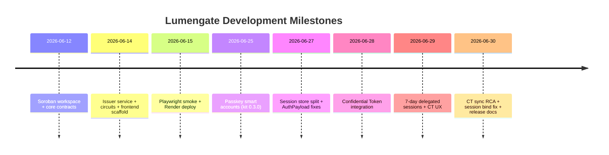

# Lumengate — Project History

**Document class:** Milestone and evolution timeline  
**Repository:** [goat-dev8/Lumengate](https://github.com/goat-dev8/Lumengate)  
**Span:** 2026-06-12 → 2026-06-30 (204 commits on `main`)  
**Network:** Stellar Soroban testnet

Every entry maps to git commits or documented reports in the repository.

---

## Timeline Overview

---

## Phase 1 — Foundation (2026-06-12 – 2026-06-14)

### 2026-06-12 — Repository initialization

| Commit | Milestone |
|--------|-----------|
| `584ecd2` | Soroban workspace, Rust toolchain |
| `807e301` | Project README |
| `f53b89c` – `fb74eab` | Core contracts: IssuerRegistry, CredentialRegistry, PolicyVerifier, RwaToken, RwaAdapter, ComplianceSacAdmin, AuditorRegistry, CompliantDex/Payroll, CompliancePolicy, SessionStore |
| `4003a96` | LumengateSmartAccount scaffold with context rules |
| `96bfac3`, `70bb8c5` | Noir eligibility + proof-of-funds circuits |
| `b3d0e04`, `0a9cd58` | Vendored UltraHonk verifier |

**Architecture decision:** OpenZeppelin AccessControl + external UltraHonk verifiers instead of in-circuit secp256k1 (`20058fb` later removes secp256k1 from circuits).

### 2026-06-14 — Issuer + frontend bootstrap

| Commit | Milestone |
|--------|-----------|
| `6e30cba` – `e942588` | Express issuer: health, roots, credential, revoke, disclose |
| `4f33b38` – `7736303` | Deploy scripts, testnet contract IDs |
| `8cdb998` – `fd0646e` | Vite/React app: wallet context, prover, journey rail, all institutional pages |
| `283d426` | Playwright smoke tests |
| `11b8799` | Render blueprint |

---

## Phase 2 — Product UX (2026-06-15 – 2026-06-24)

| Commit | Milestone |
|--------|-----------|
| `bcb8087`, `94b6a7b` | Consumer fintech UX across routes |
| `deeef02`, `01b722e` | Proof receipt + replay protection |
| `d1ada93` | V3: passkeys, note roots, smart account session binding |
| `ebfa241` | Dynamic credentials, EURC paths, testnet ops alignment |
| `cc5d56c` | Dashboard UI alignment |

**Bug — consumed proof lock:** `d3d472c` stops treating old settlement tx as permanent consumed lock.

---

## Phase 3 — Passkey Smart Accounts (2026-06-25 – 2026-06-27)

### AuthPayload migration (critical)

| Commit | Fix |
|--------|-----|
| `0fea99b` | stellar-accounts 0.7 AuthPayload for bind_session_proof |
| `9f461f7` | XDR bytes encoding attempt |
| `7cf6c02` | Canonical AuthPayload map order |
| `0d2273e` | Official auth payload signing flow |
| `00b1b11` | Restore passkey-only auth with smart-account-kit 0.3.0 |
| `95baf61`, `15b2f96` | Vendor kit in app for Vercel CI |

### Session store architecture

| Commit | Fix |
|--------|-----|
| `03f436c` | Split SessionStore from CompliancePolicy — eliminate re-entry |
| `a7b47ac` | Skip policy enforce on passkey session-proof bind |
| `b4f01f4` | Require WebAuthn user verification (#3117) |
| `1f80276` | Redeploy compliance policy; `check_passport` not `verify_passport` for session path |

**Production impact:** Passkey settlement restored after custom encoder breakage.

### Relayer for passkey-only deploy

| Commit | Milestone |
|--------|-----------|
| `31a823e` | OpenZeppelin Channels relayer proxy |
| `3503114` | CORS preflight fix |
| `57e0b96`, `9115143` | Relayer XDR re-simulation, FEE_MISMATCH fix |
| `1cac6a4` | Post-relayer deploy policy timing |

---

## Phase 4 — Passport & Receipt Polish (2026-06-27 – 2026-06-28)

| Commit | Milestone |
|--------|-----------|
| `a922741` | Onboarding progress, legacy detection, faucet |
| `4888532` | Premium animated receipt |
| `abb40ee` | Passkey receipt persistence on Compliance page |
| `5b349b6` | Viewing key generation + ZK education |
| `3e0ea77`, `bdcbc39` | Registry sync hardening |
| `8fb6af2`, `9dc12db` | Passkey ceremony serialization; unified send flow |
| `96c5e80`, `ca8dd75`, `e823a07` | Browser prover CRS preload, worker warmup |
| `8651f97`, `8e9a881` | EURC faucet, session bind UX |

**Bug — event parsing:** Raw RPC parsing added in `events.ts` for testnet Soroban meta switch 4 (receipt chain events).

**Bug — receipt privacy:** Confidential amounts hidden in `ProofReceiptHero` (`ccc4110`).

---

## Phase 5 — Confidential Tokens (2026-06-28 – 2026-06-29)

| Commit | Milestone |
|--------|-----------|
| `011a7c4` | Stellar Confidential Token settlement integration |
| `5992f75` | CT recipient validation, complete UI surfaces |
| `0dd80ee` | CT registration + passkey authorization for new accounts |
| `e3656ef` | Confidential EURC send UX for smart accounts |
| `8c86f53` | Product refactor: passkey sessions + confidential flows |
| `e2c2ca4` | Passkey session reuse + CT balance sync |
| `ccc4110` | Delegated session UX + private EURC receipts |

### 7-day delegated session rollout

| Commit | Fix |
|--------|-----|
| `a9e36fd` | CT balance polling + enforce delegated session |
| `f852ea0` | Bypass indexer timeout on rule discovery |
| `81000b9` | OZ Default session rule |
| `af960d1` | Passkey deadlock — remove nested ceremony |
| `6a6951c` | Friendbot fund delegated session signer |

---

## Phase 6 — Sync & Fresh-Account Stability (2026-06-30)

| Commit | Fix |
|--------|-----|
| `b1ad12d` | Optimistic CT sync idempotency |
| `a330eb7` | Send requires spendableSynced only |
| `d588317` | Shield progress UX + smart account guide polish |
| `e35d483` | Marketplace balances + private EURC sync |
| `d66e520` | Forever-syncing private EURC on new accounts |
| `1203920` | Passkey-only CT registration detection |
| `3ef1b76` | Checking… infinite state — unblock balance read |
| `dcb728e` | Repair stale optimistic state from verified events |
| **`cab8dd5`** | **Root-cause CT sync:** IssuerCtIndexerClient, post-register rebuild, event-authoritative flows |
| **`bb1f561`** | **Session enable:** bind proof before add_context_rule |
| **`a8fed62`** | **UX:** two-step session progress + CT register on dashboard |

**Report:** `ROOT_CAUSE_SYNC_REPORT.md` documents first divergence at missing post-register `rebuildFromEvents`.

---

## Architectural Evolution

| Topic | Initial | Current |
|-------|---------|---------|
| Issuer signing | ethers (removed `4fc231d`) | Ed25519 Stellar |
| Proof verification | In-contract BN254 | External UltraHonk Soroban verifiers |
| Settlement signer | Freighter wallet | Passkey smart account (`C…`) |
| Session auth | Passkey every tx | 7-day delegated `G…` signer |
| Session context | N/A | Default + compliance policy |
| CT balance sync | Optimistic skip | Event-authoritative + hybrid indexer |
| CT registration UI | Orphan `ConfidentialEurcPanel` | `ConfidentialBalancePanel` on dashboard |
| Receipt amounts | Plaintext | "Shielded amount" for confidential |
| CI | None | GitHub Actions: test, build, passkey verify |

---

## UX Improvements Timeline

| Date | Improvement | Commit |
|------|-------------|--------|
| 2026-06-27 | Passport request 4-stage progress | `a922741` |
| 2026-06-28 | Settlement receipt hero redesign | `4888532` |
| 2026-06-28 | Marketplace invest progress overlay | `963ace8` |
| 2026-06-29 | Trusted device session panel | `8c86f53` |
| 2026-06-30 | Shield 7-stage progress rail | `d588317` |
| 2026-06-30 | Session enable 2-stage progress | `a8fed62` |
| 2026-06-30 | CT register button on dashboard | `a8fed62` |

---

## Bug Fix Index (by symptom)

| Symptom | First fix commit | Doc reference |
|---------|------------------|---------------|
| Auth InvalidAction on session enable | `bb1f561` | PASSKEY guide Bug 8 |
| CT Syncing… forever (new accounts) | `cab8dd5` | ROOT_CAUSE_SYNC_REPORT |
| Passkey every operation | `a9e36fd`, `ccc4110` | PASSKEY guide Bug 1 |
| Session enable hang | `af960d1`, `f852ea0` | Bugs 9–10 |
| Shield auth fail under session | `6a6951c` | Bug 4 |
| Optimistic double-deposit | `b1ad12d`, `dcb728e` | Bugs 16, 11 |
| Checking…/Reading… stuck | `3ef1b76`, `e35d483` | Bug 12 |
| Receipt shows plaintext CT amount | `ccc4110` | Bug 21 |
| Custom AuthPayload failures | `00b1b11` | Bug 6 |
| Policy re-entry on bind | `a7b47ac`, `1f80276` | Bug 8 |

---

## Deployment Milestones

| Component | Milestone |
|-----------|-----------|
| Testnet contracts | `7736303`, `531fc73`, deploy scripts |
| Production frontend | Vercel — `lumengatex.vercel.app` |
| Production issuer | Render — `lumengate-issuer.onrender.com` |
| Confidential token stack | `deploy_confidential_token.sh`, `deployments.json` confidential_token block |
| CI pipeline | `.github/workflows/ci.yml` |

---

## Documentation Milestones

| Document | Created/Updated |
|----------|-----------------|
| `README.md` | 2026-06-12, updated `3c10167` |
| `docs/CURRENT_ARCHITECTURE.md` | Architecture SOT |
| `docs/PASSKEY_SMART_ACCOUNT_IMPLEMENTATION_GUIDE.md` | Passkey deep dive; rewritten 2026-06-30 |
| `ROOT_CAUSE_SYNC_REPORT.md` | 2026-06-30 CT RCA |
| `docs/FINAL_PROJECT_IMPLEMENTATION_REPORT.md` | 2026-06-30 release |
| `docs/CONFIDENTIAL_TOKENS_ON_STELLAR.md` | 2026-06-30 release |
| `docs/FINAL_TEST_REPORT.md` | 2026-06-30 release |
| `docs/PROJECT_HISTORY.md` | This document |

---

## User Acceptance — 2026-06-30

Fresh passkey account verified full lifecycle on production:

1. Passkey registration + smart account
2. Passport issuance (4-stage progress)
3. 7-day session (2 passkey prompts + progress UI)
4. CT registration on dashboard
5. Shield 0.2 EURC with progress
6. Spendable balance 0.2 EURC synced
7. Confidential send to registered recipient
8. Receipt with shielded amount privacy
9. Viewing key generation
10. Auditor portal record retrieval

User confirmation: *"all flow work now with new account."*

---

## Future Milestones (planned, not implemented)

- Migrate session rules from Default to CallContract per contract
- Playwright e2e in CI
- Mainnet deployment
- Wire `session_key_policy` spending limits
- Confidential USDC UI parity

---

*History compiled from `git log --reverse`, commit messages, ROOT_CAUSE_SYNC_REPORT.md, and release audit @ `a8fed62`.*
